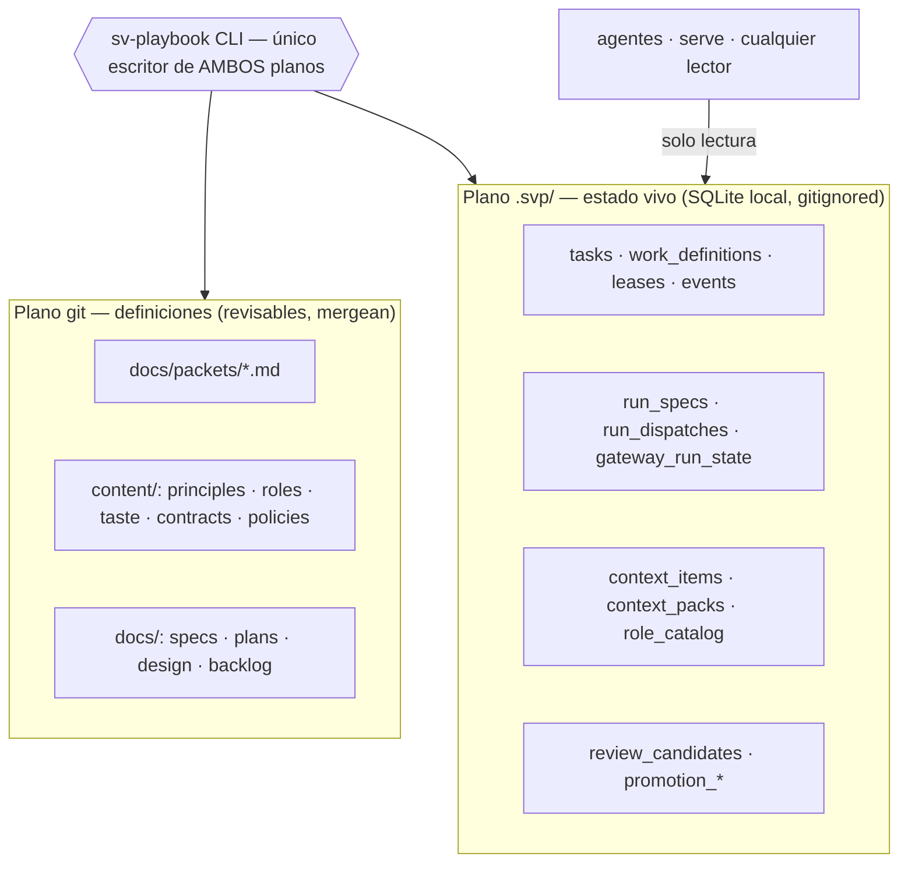

# Anatomía de sv-playbook: qué pasa en cada segundo

> Este documento cuenta, en orden cronológico y sin omitir pasos, qué hace el sistema desde que una idea entra hasta que el trabajo queda en `done` — y qué hace cuando cada cosa falla. Es el complemento cronológico de `how-it-works.md` (que es el mapa de referencia). Todo lo descripto acá existe y corre hoy; lo que está planeado se marca `PLANNED`.

---

## Antes de empezar: qué es esto y el vocabulario mínimo

Si nunca viste sv-playbook: es un sistema para que **agentes de IA construyan software con garantías verificables**. Un humano define el trabajo y los criterios de aceptación; agentes lo ejecutan; y un CLI valida cada paso con evidencia propia — nada se da por cierto solo porque un agente lo declare. Este documento cuenta cómo funciona eso en la práctica.

Con esta tabla alcanza para leer el resto; cada término se profundiza cuando aparece:

| Término | Qué es |
|---|---|
| **packet** | La unidad de trabajo: un documento con qué hacer, qué archivos se pueden tocar y cuándo frenar. Como un ticket, pero validado por máquina. |
| **write_set** | La lista de archivos (patrones glob) que el packet autoriza a modificar. Su "radio de explosión". |
| **lease** | La reserva con vencimiento que un worker toma sobre un packet. Evita trabajo duplicado; expira sola si el worker muere. |
| **RED test** | El test que falla *antes* de implementar, demostrando que el problema existe. Se escribe primero, siempre. |
| **verify** | El comando que corre typecheck, lint y tests de una vez. "Verde" = pasa todo. |
| **gate / rail** | Una regla mecanizada: la enforcea el CLI, no depende de que alguien la recuerde. |
| **dispatch / run** | El acto de lanzar un agente a ejecutar algo, y esa ejecución en sí. |
| **harness / adapter** | La herramienta de agente concreta (OpenCode, Claude Code, Codex…) y la pieza de código que habla con ella. |
| **gateway** | La parte del CLI que lanza runs a través de un adapter y los observa hasta que terminan. |
| **promotion** | La única puerta a `done`: re-verifica todo en limpio y recién entonces cierra la tarea. |
| **store (`.svp/`)** | La base SQLite local con el estado vivo. No se versiona en git. |

---

## 0. Las tres reglas que explican todas las demás

Casi todas las decisiones de diseño bajan de estas tres:

1. **El CLI es el único escritor de estado.** Ningún agente — ni el orquestador — toca el store ni los artifacts directamente. Si el CLI no puede hacer algo, eso es un gap (se abre un packet), nunca un atajo.
2. **Verify, never trust.** El CLI captura la evidencia y corre los chequeos él mismo. El autoreporte de un agente no vale nada; vale la salida literal de un comando.
3. **No dead ends.** Todo error tiene una salida no destructiva. Si un agente improvisa destructivamente, el bug es *del sistema* (falta un rail), no del agente.

Con eso en la cabeza, el resto del documento es una consecuencia.

---

## 1. Los actores y dónde vive cada cosa



- **Plano git:** el *qué* — definiciones de trabajo, principios, roles, contratos. Markdown, porque debe revisarse en PR y mergear limpio.
- **Plano `.svp/`:** el *estado* — quién tiene qué lease, qué pasó cuándo, qué run está observando. SQLite, porque cambia constantemente y no puede mergear.
- **Por qué dos planos:** mezclarlos fue el error clásico (un "rebuild from files" que se retractó por violar single-source). La separación es la espina dorsal.
- **Nota sobre "único escritor":** más adelante (§4) aparece el daemon como "single blessed writer". No es un segundo escritor: el daemon *es* el CLI corriendo como proceso persistente con lock exclusivo; cualquier otro CLI en el mismo repo le forwardea sus comandos.

El reparto de roles (cada uno es un agente con una *charter* en `content/roles/`, escrita "a prueba de modelos tontos": tablas EXEC para lo mecánico, secciones JUDGMENT para razonar):

| Rol | Hace | No hace |
|---|---|---|
| product | idea → requerimientos `REQ-xxx` | código |
| planner | authora packets (write_set, RED, stop conditions) | implementar |
| orchestrator | maneja el board (el tablero kanban de trabajo), despacha, releva workers | implementar ni mergear |
| implementer | un packet, una branch, RED-first | tocar `.svp/`, salirse del write_set |
| reviewer | checklist contra el diff, verdict tipado | aprobar por confianza |

---

## 2. Segundo a segundo: la vida de una tarea

### t0 — `task create`: nace el packet (draft)

El planner (agente) invoca `task create`. En ese mismo segundo el CLI:

- exige los campos mínimos del contrato (`--write` no vacío, título, body legible, id único) — las secciones requeridas (`## Task`, `## RED test`, `## Stop conditions`, `## Evidence`) las valida `check`, no `create` (brecha registrada: IDEA-064),
- valida el `write_set` (globs que definen el **blast radius**: los únicos archivos que el worker podrá tocar),
- registra `depends_on` (para serializar packets que tocarían los mismos archivos),
- escribe el markdown canónico en `docs/packets/<ID>.md` (plano git) **y** la fila en `tasks` (plano SQLite).

*Por qué así:* el packet es el contrato entre el juicio humano y la ejecución agente. Si se pudiera escribir a mano, un modelo lo redactaría mal; por eso solo lo authora el CLI, que lo valida al escribirlo.

### t1 — `task move ready`: el chequeo de conflictos

Antes de admitirlo en la cola, el CLI compara el `write_set` contra el de todos los packets en vuelo. Solapamiento → rechazo (`LifecycleError: write_set conflict with <id>`) o encadenamiento vía `depends_on`. Esto es lo que hace que **el trabajo paralelo sea seguro por construcción**, no por coordinación humana.

### t2 — `task start`: el lease

El orchestrator despacha un worker (un agente *headless*: corre solo, sin humano mirando la sesión) con el modelo pineado — *siempre* pineado: heredar el default una vez despachó el modelo más caro al packet más grande; el rail es "todo dispatch registra el modelo pineado"). El worker hace `task start` y en ese instante:

```
¿hay lease sobre el packet?
├─ no hay            → inserta lease (TTL 30 min) + status=active  ✔
├─ mío, mismo session → OK idempotente (reintento tras crash de red) ✔
├─ de otro, vivo     → ✗ "held by session <id>"
└─ de otro, stale    → ✗ → corresponde task takeover
```

Mientras trabaja, el worker emite heartbeats (`task note`) que refrescan el lease. Si el proceso muere, el lease expira solo a los 30 minutos — **el sistema se auto-libera sin intervención**.

### t3 — implementación: RED primero, evidencia siempre

El worker opera sobre una branch propia, dentro del write_set, y el orden importa:

1. escribe el **test que falla** y captura su salida literal (la causa del fallo está pineada a una lista cerrada: el símbolo faltante del compilador, o el nombre del test — un modelo no puede fabricar una causa distinta);
2. implementa hasta tener `verify` verde local (typecheck + lint + tests);
3. commitea WIP periódicamente (checkpoint rule: un worker muerto pierde minutos, no horas).

Si choca con una stop condition, mueve el packet a `blocked` **conservando el lease** (para que la misma sesión retome cuando el rail se arregle) y frena con evidencia. Frenar es éxito; el verde fabricado es el fracaso (PRINCIPLE-006).

### t4 — `task move review`: el CLI captura la evidencia, no el agente

Este es el segundo más importante del pipeline. El CLI **lee él mismo** `git rev-parse HEAD` y la branch, corre el preflight mecánico (chequeos automáticos previos: branch correcta, worktree limpio, evidencia presente), y congela un **candidato de review inmutable**:

```
review_candidate
├─ task + work_definition (id@versión pineada, digest)
├─ SHA + branch capturados por el CLI (no declarados por el agente)
├─ write_set congelado
└─ artifact durable (ART-RC-...) → este es el objeto que se revisa
```

*Por qué:* antes de este rail, un worker fabricó un SHA (incidente D24). Desde entonces, el SHA que se revisa y el que se promueve lo captura el sistema. El agente ya no puede inventarlo — no porque sea honesto, sino porque no hay campo donde escribirlo.

### t5 — `dispatch prepare`: nace el RunSpec inmutable

Para que un agente (reviewer, implementer) ejecute algo a través del gateway, primero se **prepara** un RunSpec: la orden de ejecución completa y congelada. En este paso el CLI:

1. **resuelve la work definition elegible** (la versión pineada del packet; si se enmendó después del prepare → error `STALE`, hay que re-preparar);
2. **compila el contexto**: del catálogo versionado (principles, charters de rol, taste, contratos), filtra por rol + fase + tags + capabilities + referencias, aplica la precedencia declarada y produce un **context pack inmutable** (`CTX-...` con digest). El prompt que verá el agente queda pineado por digest — reproducible y auditable;
3. **resuelve el execution profile**: qué adapter (opencode, claude, codex…), qué modelo, qué tools habilitadas (un reviewer es read-only: `read: true`, todo lo demás `false`);
4. **verifica el contrato de salida** activo (`semantic-work-envelope-v1`);
5. persiste el RunSpec con `specDigest` (huella de todo lo anterior) y su **identidad durable**: la tupla `(dispatchRef, rol, fase)`.

```
Regla de oro de la identidad:
prepare con identidad existente → devuelve el MISMO run. Nunca duplica.
```

Esta idempotencia-por-identidad es la base de toda la recuperación posterior (retry, recovery, re-prepare).

*Fail-closed en la entrada (fail-closed = ante la duda, rechazar; tres compuertas recientes):* el `context add` valida el `kind` contra los kinds con precedencia declarada (antes un kind trucho rompía *todos* los compiles); el `role check` valida el perfil con **el mismo parser del adapter** que usa el runtime (antes declaraba válido un perfil indespachable); y el digest del contexto deniega capabilities marcadas `DENY`.

### t6 — `dispatch start`: terminal-first, después la red

Al arrancar (o re-arrancar) un run, el orden de las operaciones es deliberado:

```
start --run R
│
├─ 1. loadRunSpec       (SQLite durable)
├─ 2. loadRunSnapshot   (SQLite durable: session / turn / completion)
│    ├─ completed        → devuelve el recibo durable. FIN. Cero red.
│    ├─ terminal fallido → ✗ GATEWAY_RUN_ALREADY_TERMINAL. FIN. Cero red.
│    └─ observing        → re-adjunta a la sesión durable y SIGUE observando
│
└─ 3. si nunca arrancó:
     verifyProfile (única llamada de red previa)
       → createSession  → persiste adapter_session_id (durable)
       → submitTurn     → persiste message_id (durable)
       → loop de observación → completion (durable)
```

*Por qué terminal-first* (terminal = el run ya no va a cambiar de estado por sí solo, para bien o para mal): antes se verificaba el perfil (un `fetch` al adapter) **antes** de chequear el estado durable. Al imprimir el error y salir, un handle de red quedaba a medio cerrar y Windows abortaba con un crash de libuv (exit 127). El fix no fue atajar el crash: fue **no crear nunca la condición** — si el run es terminal, la respuesta sale 100% de lo durable y el adapter ni se toca. Sin fetch → sin handle → sin crash.

### t7 — el agente trabaja: qué registra el observador en cada poll

Mientras el run está `observing`, el gateway consulta al adapter cada `observationIntervalMs` y persiste, en cada poll:

- `progress_token`: digest del estado observado — **si cambia, hubo progreso** (y refresca `last_progress_at`);
- `observed_tool_ids`: qué tools invocó el agente (visible en la consola);
- un evento por observación en `gateway_run_events` — cada tool call del agente queda registrado, durable.

Tres relojes corren en paralelo:

- **`noProgressTimeoutMs`**: si el progress token no cambia en ese lapso, el agente está colgado → el gateway lo cancela (con `cancellationGraceMs` para apagado limpio) y el run cae terminal `timed-out`. Nadie espera forever.
- **`maxRunDurationMs`** (techo duro; default del engine: 30 min): un provider puede hacer "progreso" infinito sin entregar nada — caso real: una sesión glm-5.2 entregó el verdict a los 30s y siguió auto-generándose por 40 min, y ese churn de busy-evidence refrescaba el progreso, así que el no-progress jamás disparaba. El techo se mide desde el `created_at` durable del turn (sobrevive resumes) y al disparar cancela con el mismo grace → `timed-out` + `RUN_DURATION_EXCEEDED`.
- **heartbeat del lease** (si el run viene de un packet): mantiene el claim vivo.

### t8 — completion y el contrato de salida

`completed` tiene dos caminos, y ambos pasan por la MISMA validación de contrato:

1. **terminal**: la sesión del provider queda idle con una respuesta final;
2. **candidate in-flight**: el provider ya entregó una respuesta terminada (finish reason presente) pero la sesión sigue busy auto-generando ruido — el adapter expone esa PRIMERA respuesta terminada como `candidateOutput`; si pasa el contrato, el gateway persiste la completion y recién después cancela el provider como higiene best-effort. Un candidate que no pasa el contrato se ignora: el run sigue observando.

Y la validación misma:

- output conforme (verdict `APPROVED`/`REQUEST_CHANGES` dentro del *envelope* tipado — el JSON estructurado que el contrato exige como salida) → run `completed`, con `outputDigest`;
- output malformado (ej. `approved` en minúsculas) → run terminal `output-invalid`, con el detalle durable.

Nada de esto vive en la memoria de un proceso: si el CLI observador muere en cualquier punto de t6–t8, el siguiente `dispatch start --run <id>` lee el snapshot durable y **continúa exactamente donde quedó** (probado en vivo: CLI muerto a los 15 min con el agente activo; el resume re-adjuntó la sesión y siguió observando).

### t9 — si el run terminó mal: `dispatch retry` (la cadena de intentos)

Antes de este rail, un run terminal fallido **brickeaba el subject para siempre**: re-prepare devolvía el mismo run terminal (regla de oro) y start lo rechazaba. Hoy:

```
RUN-A  intento 1   manual:BUG-002@1:ART-RC-x          output-invalid ✗
  ▲ retryOfRunSpecId
RUN-B  intento 2   manual:BUG-002@1:ART-RC-x:retry:2  observing…
```

`dispatch retry --run <id>`, con el árbol cerrado:

| Caso | Resultado |
|---|---|
| run de workflow | ✗ `WORKFLOW_RUN_RETRY_IS_ENGINE_OWNED` (el engine reintenta esos) |
| sin snapshot terminal / vivo | ✗ `RUN_RETRY_NOT_TERMINAL` |
| completado con éxito | ✗ `RUN_RETRY_COMPLETED` |
| enmendaron el packet entre medio | ✗ `STALE` → re-prepare primero |
| todo ok | mintea sucesor encadenado; **idempotente** (re-retry del mismo original → mismo run) |

El sucesor **recarga el execution profile actual** — si arreglaste la config que causó el fallo, el retry usa el fix. Y `retryOfRunSpecId` entra al digest, así que cada intento es un RunSpec distinto, auditable, con su propia historia.

### t10 — `promotion run`: la única puerta a `done`

Con el candidato aprobado, cerrar la tarea no es un `task move done` manual: es una promoción mecánica, y es **la única operación que produce `done`**:

```
promotion run --candidate <id>
│
├─ 1. valida candidato + verdict del reviewer LIGADOS al mismo SHA/artefacto
│     (aprobar otra cosa no sirve)
├─ 2. re-verifica en limpio: worktree limpio, npm ci + verify completo
├─ 3. integra con fast-forward (la branch avanza sin merge commit;
│     la historia queda lineal)
│     (el INTENT se persiste ANTES del efecto → si muere a mitad,
│      el recovery observa el ref y completa el cierre)
└─ 4. cierra la tarea en una transacción + recibo inmutable
```

`done` deja de ser una declaración ("el agente dice que terminó") y pasa a ser **la consecuencia verificada de una promoción**. Después: el reviewer mergea el PR (CI verde en ubuntu + windows exigido por branch protection) y el board refleja el cierre.

---

## 3. Qué pasa cuando algo falla (cada modo de fallo, su camino)

El sistema se prueba en el fallo, no en el happy path. Tabla completa:

```mermaid
flowchart TB
    fail{¿Qué murió?}
    fail -->|CLI observador| snap[snapshot durable:<br/>siguiente start re-adjunta y sigue]
    fail -->|agente colgado| noprog[noProgressTimeout → cancel con grace<br/>run timed-out → dispatch retry]
    fail -->|provider en self-loop| ceiling[candidate válido in-flight → completed<br/>si no: maxRunDuration → timed-out → dispatch retry]
    fail -->|verdict malformado| oi[run output-invalid<br/>→ dispatch retry: intento 2 encadenado]
    fail -->|worker muerto| lease[lease expira a los 30 min<br/>o takeover explícito / --force]
    fail -->|stop condition| blocked[blocked CON lease<br/>→ se arregla el rail → ready → retry]
    fail -->|store schema vieja| mig[backup automático → migraciones en orden<br/>guard de branch · bypass auditado]
    fail -->|DB corrupta| restore[restore verificado:<br/>integrity + schema + sha256 ANTES de swappear]
    fail -->|error de provider 403/quota| rot[worker muere → salvage → rotate harness → redispatch]
    fail -->|conflicto de write_set| flow[rechazo en move ready<br/>→ depends_on para serializar]
    fail -->|promoción muerta a mitad| intent[intent persistido antes del efecto<br/>→ recovery observa el ref y cierra]
```



Detalles que importan:

- **Takeover ≠ start.** `takeover` reclama deliberadamente un lease stale (crash recovery) o uno vivo con `--force` (reemplazo intencional). `task recover` es inspección read-only para diagnosticar antes de decidir.
- **`blocked` nunca va directo a `done`.** Un packet bloqueado vuelve por `ready → active → review` o se dropea. Sin atajos alrededor del pipeline.
- **Los errores de provider son muerte del worker**, no del trabajo: se salva lo commiteado (checkpoint rule), se rota de harness y se redespacha.
- **Migraciones con red de seguridad:** detectan schema vieja → backup primero → aplican el manifiesto en orden → y si estás en una feature branch, se niegan (el bypass `migrateLive` existe solo como opción de librería y deja evento de auditoría; el mensaje de error menciona un flag `--migrate-live` que el CLI aún no expone — hallazgo registrado: IDEA-071).

---

## 4. La maquinaria siempre encendida

### El daemon: un solo escritor bendecido

Cuando corre `sv-playbook daemon` (o `serve`, que lo levanta), el daemon toma el store con **lock exclusivo**. Desde ese momento:

- cualquier proceso que importa el módulo de store en ese repo detecta al daemon vivo y **forwardea su comando** vía IPC (con token), convirtiéndose en cliente — el patrón "single blessed writer" se enforcea solo;
- expone `/api/v1/health`, `/api/v1/exec`, `/api/v1/shutdown` (con clasificación de workspace y shutdown administrado);
- los worktrees *requieren* daemon (sin daemon → error con guía, no corrupción).

### Serve: la consola de transparencia

`sv-playbook serve` levanta la consola operativa (`http://127.0.0.1:3131`) alimentada del plano SQLite: board kanban de trabajo, feed cronológico de eventos de **todos** los actores (los roles efímeros aparecen como *autores* de eventos, no como filas), lane de revisión, dispatches y promociones. La premisa: **la confianza viene de la visibilidad, no de la fe** — "necesito saber en todo momento qué está pasando" es un requerimiento de primer clase.

### Los eventos: la memoria única

Todo actor (humano, orchestrator, worker, reviewer, engine) escribe en el mismo log de eventos tipados. De ahí se alimentan la consola, `status`, `doctor` (salud: Node, git, schema, leases frescos/stale, edad de backups) y la telemetría de dispatches (harness, modelo) → la matriz de routing se alimenta sola al rotar harnesses.

### Backups por evento

Ciertos eventos (`done`, force-takeover, edad stale) disparan backup automático: snapshot consistente (`VACUUM INTO`) con metadata (schema, branch, SHA, sha256), en un directorio configurable que puede vivir **fuera** de `.svp/` (perder `.svp/` no se lleva los backups). El restore valida integridad + schema + checksum **antes** de swappear y rechaza un candidato malo sin tocar el vivo. `PLANNED` para v2: destino remoto real (adapter sobre el destino de backups — nunca una branch de git).

---

## 5. Por qué está hecho así (las razones, una por una)

| Decisión | Razón |
|---|---|
| Dos planos (git + SQLite) | Definiciones deben mergear y revisarse; estado vivo no puede mergear. Mezclarlos viola single-source. |
| CLI único escritor | Si un agente puede escribir estado por fuera, toda garantía es cosmética. El gap se resuelve con un packet, no con un atajo. |
| Evidencia capturada por el CLI | Un agente fabricó un SHA una vez (D24). Desde entonces el sistema *lee* la verdad en vez de *recibirla*. |
| RED-first con causa pineada | Un test que falla por la causa esperada no se puede fabricar; un "tests verdes ✓" dicho en prosa, sí. |
| Identidad `(dispatchRef, rol, fase)` | Idempotencia gratis: re-preparar, reintentar y recuperar convergen al mismo run en vez de duplicar trabajo. |
| RunSpecs/context packs/candidatos inmutables, todo con digest | Reproducibilidad y auditoría: se puede probar *exactamente* qué vio y qué aprobó cada actor. |
| Terminal-first en el gateway | El estado durable se consulta antes que la red. Elimina una clase entera de crash (handle colgado al salir) y hace la recovery trivial. |
| Retry como cadena de intentos nuevos | La historia no se reescribe: el run terminal queda como evidencia; el intento nuevo hereda lo bueno (candidato, subject) y pisa lo arreglable (perfil). |
| Promoción como única vía a `done` | Si existe un atajo manual, alguien lo toma bajo presión. `done` es consecuencia verificada, no declaración. |
| Intent persistido antes del efecto | Un crash a mitad de promoción no deja estado ambiguo: el recovery sabe qué estaba pasando y lo termina. |
| Workflows con retry del engine | Los pipelines multi-paso se reintentan con clasificador de fallos configurable (`workflow-policy`); el humano no pisa la maquinaria (`WORKFLOW_RUN_RETRY_IS_ENGINE_OWNED`). |
| Leases con TTL + heartbeat | El sistema se auto-libera de workers muertos sin intervención humana. |
| Opinion-free core + constitution por instancia | Todo lo opinable (columnas, roles, gates, umbrales, tiers, routing) es configuración con fuente única; el engine es compartible. Los invariantes universales no se configuran. |
| Escalera prosa → gate → config | Toda regla empieza como prosa (un agente debe recordarla), se mecaniza en gate (el CLI la enforcea), y si es una opinión, se vuelve config. Donde está una regla te dice su próximo movimiento. |

---

## 6. El juicio como data: constitution, taste, decisions

Lo que hace que el sistema *mejore* con el tiempo en vez de solo correr:

- **Constitution:** visión, producto y principios de la instancia, gobernados como artifacts versionados (`constitution`).
- **Taste ledger:** lo que el builder acepta/rechaza, capturado como preferencia reutilizable — nunca se pregunta dos veces, y la review lo enforcea.
- **Decisions:** preguntas de arquitectura con ciclo de vida durable (`decision ask/answer/list`) — el razonamiento queda en el repo, no en un chat.
- **Backlog de ideas** (`docs/backlog.md`): cada dolor real entra como IDEA con su origen; sale graduado a packet. El propio sistema se mejora con su pipeline.

El north star: **toques humanos por unidad de trabajo → 0** (medido por escalaciones a la baja). El proving ground: aplicar el engine a TIER-3 (máxima estrictez, cero excepciones) sobre un producto real (Aurora).

---

## 7. Estado honesto de la máquina (hoy)

- **Verify canónico verde en una pasada:** typecheck · lint (con baselines de deuda que solo bajan) · la suite completa de tests · checks propios del playbook.
- **Corriendo en vivo:** consola en `:3131`, daemon con lock exclusivo en `:4141`, dispatches reales contra OpenCode (y recetas probadas para 5 harnesses).
- **Exit codes con contrato:** `0` ok · `1` gate failure (cita la regla) · `2` usage · `3` sistema.
- **Se construye a sí mismo:** cada feature de esta página pasó por el pipeline que describe (dogfooding TIER-2).
- **Hallazgos abiertos** (registro vivo en `docs/backlog.md`): `--migrate-live` no expuesto en el CLI (IDEA-071), aprobación independiente mecanizada (bot/CODEOWNERS), `init` greenfield, durabilidad remota v2.

---

*Documento cronológico de funcionamiento. Lo normativo vive en `content/` (principles, roles, taste, contracts); el mapa de referencia es `docs/how-it-works.md`; esto es la película, segundo a segundo.*
