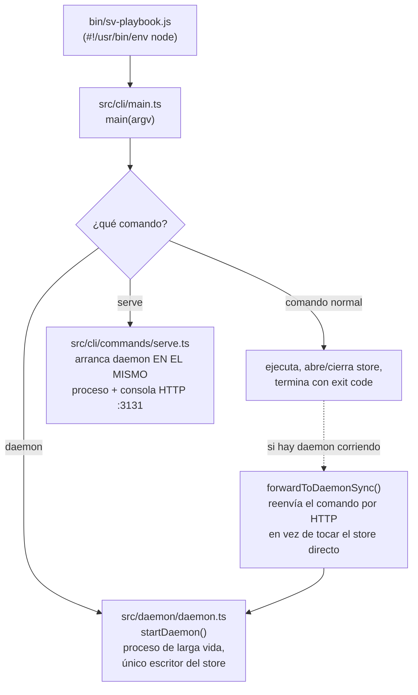
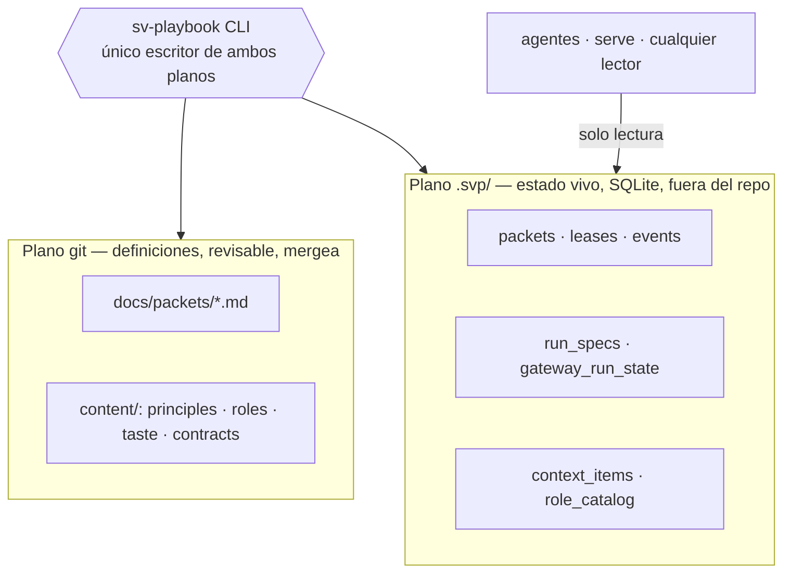
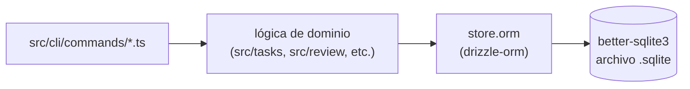

# Arquitectura general

## Qué es esto, en una frase

Un CLI de Node.js/TypeScript que implementa una metodología de desarrollo
guiada por agentes de IA: persiste su propio estado operativo en SQLite,
valida cada paso mecánicamente, y opcionalmente expone una consola HTTP
de solo lectura (`serve`). No es una aplicación web con frontend/backend
separados — es una herramienta de línea de comandos con un modo "servidor"
opcional.

## Stack

| Categoría | Tecnología | Dónde se ve |
|---|---|---|
| Runtime | Node.js ≥22.13, ESM (`"type": "module"`) | `package.json:11` |
| Lenguaje | TypeScript estricto | `tsconfig.json`, compila a `dist/` |
| Persistencia | SQLite vía `better-sqlite3` (driver nativo, síncrono) | `src/db/` |
| Acceso a datos | `drizzle-orm` (query builder tipado) | `store.orm` en cada dominio |
| Validación de schema | `ajv` + `ajv-formats` | `src/schema/` |
| Testing | `node:test` nativo, corre sobre `dist/` compilado | `*.test.ts` junto a cada archivo |
| Lint | ESLint + reglas custom del propio repo | `eslint.config.js` |
| UI de `serve` | HTML/JS estático, sin build de frontend | `src/serve/assets/` |

No hay: framework de frontend (React/Vue/etc.), ORM con migraciones
automáticas (las migraciones de `src/db/store.migrations.ts` están escritas
a mano), cola de mensajes, base de datos externa, sistema de autenticación
de usuarios (hay un token local para el daemon, no usuarios).

## Los tres puntos de entrada reales



Detalle verificado en vivo esta semana: `serve` **no** lanza un daemon
como proceso hijo separado — `startDaemon()` corre in-process, dentro del
mismo proceso Node que sirve la consola HTTP. Ver
`flows/flow-06-daemon-lifecycle.md` (pendiente) para el detalle completo.

## Los dos planos de estado (ya documentado en `docs/anatomy.md §1`)



El store SQLite vive **fuera** del árbol git desde esta semana
(`src/db/store-location.ts`, `resolveStoreRoot()`) — antes vivía en
`.svp/` dentro del repo; se movió tras un incidente real de pérdida de
datos (ver `docs/backlog.md` IDEA-033).

## Patrón repetido por dominio

`src/` tiene 24 carpetas de dominio (ver `repository-map.md` para el
detalle). Ninguna sigue el patrón `controllers/services/repositories` —
en cambio, cada dominio agrupa todo lo suyo junto:

```
src/<dominio>/
├── <dominio>.ts            # lógica: funciones puras + I/O al store
├── <dominio>.types.ts      # tipos TS del dominio
├── <dominio>.constants.ts  # constantes, SQL strings, IDs de evento
├── <dominio>.errors.ts     # clases de error tipadas
├── schema.constants.ts     # (si el dominio tiene tablas propias) schema Drizzle
└── <dominio>.test.ts       # tests, al lado del código, no en carpeta separada
```

Esto es una convención mecanizada, no un accidente: hay un gate de lint
(`playbook/module-layout`, visible en `eslint.config.js`) que lo exige.

## La única capa transversal real: `store.orm`

No hay capa de "repositorio" separada de la lógica de negocio. La regla
del proyecto (verificada, no solo declarada — hay un gate de lint que
cuenta violaciones y no permite que suban) es: todo acceso a datos pasa
por `store.orm` (Drizzle). SQL crudo (`store.db.prepare(...)`) sólo está
permitido para DDL dentro de `src/db/`.



## Comandos del CLI

45 comandos (`src/cli/commands/*.ts`, sin contar tests), cada uno un
módulo que exporta un objeto `Command` (`{ name, summary, usage, run }`).
El registro central es `src/cli/registry.ts`. Detalle completo del
despacho en `flows/flow-01-cli-entry-dispatch.md`.

## Un patrón que se repite en 3 lugares distintos: "comparar y reemplazar" en vez de locks explícitos

Detectado al cruzar dominios (no visible leyendo un solo archivo): cada
vez que dos actores podrían intentar la misma operación al mismo tiempo,
el sistema NO usa un lock de aplicación (mutex, semáforo) — usa una
operación atómica de la capa de abajo (SQLite o git) que sólo tiene éxito
si el estado sigue siendo el que el actor vio por última vez, y falla
limpio si otro actor se adelantó.

| Dónde | Qué compara | Qué usa |
|---|---|---|
| `promotion/promotion.git.ts` (`fastForwardRef`, flujo 4/11) | "¿`targetRef` sigue apuntando al SHA que vi?" | `git update-ref <ref> <new> <old>` |
| `orchestration/repository.claims.ts` (`persistClaim`, flujo 8) | "¿este efecto de workflow sigue `PENDING`?" | `UPDATE ... WHERE status = PENDING` + chequeo de `changes === 1` |
| `daemon/daemon.lock.ts` (`acquireLock`, flujo 6) | "¿el archivo de lock todavía no existe?" | `openSync(path, 'wx')` — falla si ya existe |

Ningún módulo importa lógica de otro para esto — cada uno lo resuelve por
su cuenta, con la primitiva atómica que tiene más a mano (git, SQL,
filesystem). No es necesariamente un problema (no hay una dependencia
obvia que unificaría los tres, viven en capas distintas), pero vale
saberlo: si alguna vez aparece una CUARTA necesidad de "sólo uno gana",
este es el patrón a seguir, no inventar un lock nuevo.

## Integraciones externas

| Integración | Cómo | Dónde |
|---|---|---|
| Agentes de IA (hoy: OpenCode) | subprocess CLI del agente, observado vía polling | `src/gateway/adapters/opencode*.ts` |
| Git | subprocess `git`, para SHAs, diffs, worktrees, ramas | `src/git.ts` |

No hay APIs REST de terceros, colas de mensajes, ni bases de datos
externas — todo el estado es local (SQLite + filesystem + subprocesos).

## Fuentes verificadas

Este documento se escribió leyendo `package.json`, `src/cli/main.ts`,
`src/cli/registry.ts`, `src/db/store-location.ts`, y cruzando contra
`docs/anatomy.md` (documentación previa ya verificada del mismo repo).
Fecha: 2026-07-20.
