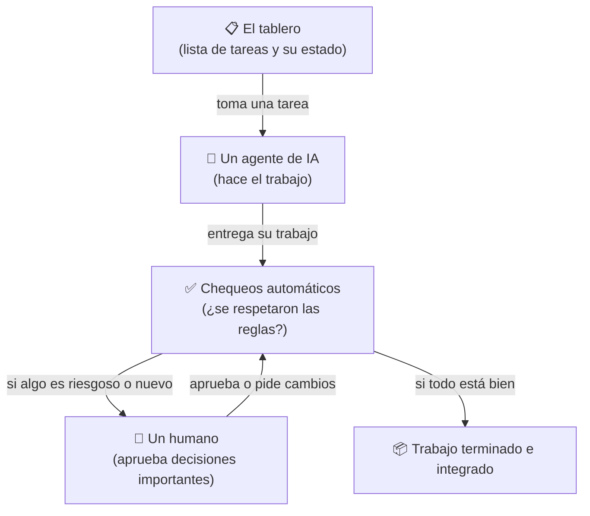
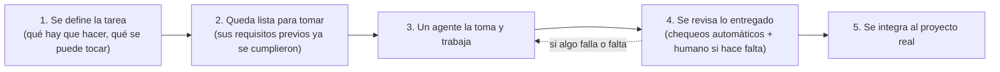

# sv-playbook explicado simple (para cualquiera, no sólo devs)

> Este documento no asume que sepas programar. Si en algún momento no
> entendés una palabra, es un bug de este documento — avisá y se corrige.
> La versión técnica y detallada está en el resto de `docs/codebase-guide/`;
> ésta es la puerta de entrada.

## ¿Qué es esto, en una frase?

Es un programa que se instala en un proyecto de software y actúa como
**un capataz de obra**: define qué trabajo hay que hacer, quién lo está
haciendo, revisa que se haya hecho bien, y no deja avanzar nada a la
siguiente etapa hasta que se cumplan ciertas condiciones — todo esto sin
que un humano tenga que estar mirando cada paso.

La particularidad es que quienes hacen el trabajo (escribir código,
revisarlo) suelen ser **agentes de inteligencia artificial**, no
personas — y este sistema es el que les da instrucciones, verifica lo que
entregan, y decide si pasa a la siguiente etapa.

## La analogía completa: una obra en construcción

Imaginate una obra de construcción:

- Hay una **lista de tareas** pendientes (poner los cimientos, levantar
  una pared, instalar la electricidad). En este sistema, cada tarea se
  llama **"packet"**.
- Cada tarea tiene un **plano** que dice exactamente qué se puede tocar
  y qué no (no podés tocar la pared del vecino mientras hacés la tuya).
  Acá eso se llama **"write_set"** — la lista de archivos que esa tarea
  tiene permiso de modificar.
- Un **capataz** (este sistema) no deja que dos obreros trabajen la misma
  pared a la vez, ni que alguien empiece una tarea sin que estén listos
  los materiales (las tareas de las que depende).
- Cuando un obrero termina, no se da por bueno automáticamente: hay una
  **inspección** (tests, revisión) antes de dar el visto bueno.
- Si alguien quiere tocar algo estructuralmente importante (mover una
  columna, no sólo pintar una pared), el capataz exige que un **humano
  responsable** lo apruebe primero — no alcanza con que el obrero decida
  solo.
- Todo lo que pasa queda **anotado en una bitácora** — quién hizo qué,
  cuándo, y qué se decidió. Nada se pierde ni se puede inventar después.

Eso es, en esencia, lo que hace este sistema. Los "obreros" son agentes
de IA, el "plano de la obra" es el código del proyecto, y la "bitácora"
es una base de datos.

## Las piezas principales, explicadas sin jerga

- **El tablero**: una lista de tareas, cada una en un estado (`por
  hacer`, `en curso`, `en revisión`, `terminada`, etc.). Es literalmente
  lo que ves cuando corrés `sv-playbook status`.
- **Un agente de IA**: toma una tarea del tablero, la trabaja (escribe
  código), y entrega el resultado.
- **Chequeos automáticos**: antes de aceptar el trabajo, el sistema
  corre pruebas automáticas — ¿el agente tocó sólo lo que tenía permiso
  de tocar? ¿los tests pasan? ¿no rompió nada que ya andaba? Nada de
  esto lo decide una persona a ojo — son programas que corren solos y dan
  un resultado objetivo (sí/no).
- **Un humano**: para las decisiones que importan de verdad (¿este
  cambio toca algo nuevo y riesgoso? ¿hay que borrar datos?), el sistema
  se detiene y espera que una persona responda — un agente de IA nunca
  puede aprobarse a sí mismo en esos casos.
- **Trabajo terminado**: cuando todo lo anterior dio bien, el trabajo se
  integra de verdad al proyecto (lo que en el mundo de programadores se
  llama "mergear a la rama principal").

## El viaje completo de una tarea, paso a paso

En cada flecha de este dibujo hay reglas que se verifican solas — por
ejemplo, no se puede pasar de "lista para tomar" a "en curso" si otra
tarea ya está tocando los mismos archivos, o si la tarea de la que
depende todavía no terminó.

## ¿Por qué existe todo esto? El problema que resuelve

Cuando varios agentes de IA trabajan en un mismo proyecto de software al
mismo tiempo, pueden pasar cosas malas si nadie coordina:

- Dos agentes editando el mismo archivo a la vez → se pisan el trabajo.
- Un agente "dice" que probó algo pero en realidad no lo hizo → nadie se
  entera hasta que se rompe en producción.
- Un cambio grande y riesgoso se aprueba sin que ningún humano lo haya
  visto → sorpresas desagradables.
- Nadie sabe qué se hizo, cuándo, ni por qué → imposible auditar después.

Este sistema existe para que **nada de eso dependa de que el agente "se
porte bien"** — las reglas se verifican mecánicamente, no se le pide de
buena fe al agente que las cumpla. Es la diferencia entre "confiar" y
"verificar".

## Los agentes de IA: ¿qué pueden y qué no pueden hacer solos?

| Pueden hacer solos | Necesitan aprobación humana |
|---|---|
| Escribir código dentro de lo que su tarea permite | Aprobar decisiones que tocan algo nuevo/riesgoso |
| Correr sus propios tests | Confirmar operaciones que podrían borrar información |
| Pedir ayuda o hacer una pregunta | Responder esa pregunta |
| Entregar su trabajo para revisión | Dar el visto bueno final en casos sensibles |

La idea es: todo lo que se puede verificar con un programa, se verifica
con un programa (más rápido, más consistente, nunca se cansa). Todo lo
que requiere criterio humano de verdad, se lo lleva a un humano — y el
sistema no deja que un agente se salte ese paso.

## ¿Dónde queda registrado todo esto?

Todo el estado vivo del sistema (qué tareas hay, en qué estado están,
quién las tomó, qué se decidió) se guarda en una base de datos local
(no en la nube, no en un servidor externo). Los documentos que describen
CÓMO debe comportarse el sistema (principios, reglas, criterios) están
en archivos de texto simple dentro del propio proyecto, para que
cualquiera los pueda leer y proponer cambios como con cualquier otro
documento del proyecto.

## Un ejemplo concreto, de punta a punta

1. Alguien (humano o agente) define una tarea: "arreglar el botón de
   login que no responde en móvil", y declara que sólo va a tocar el
   archivo del botón de login.
2. La tarea queda en el tablero, esperando a que sea su turno.
3. Un agente de IA la toma, escribe el arreglo, y avisa que terminó.
4. El sistema revisa: ¿tocó sólo el archivo que dijo que iba a tocar?
   ¿los tests pasan? ¿hay evidencia real de que probó el arreglo (no
   sólo la palabra del agente)?
5. Si todo esto da bien, y no hay nada que requiera aprobación humana
   especial, el cambio se integra al proyecto real.
6. Queda registrado: quién lo hizo, cuándo, qué se cambió, y con qué
   evidencia.

## Glosario sin jerga (equivalencias)

| Si ves este término técnico... | ...significa esto en criollo |
|---|---|
| packet | una tarea |
| write_set | la lista de archivos que esa tarea puede tocar |
| lease | "esta tarea la está trabajando fulano ahora mismo" |
| gate | una regla que se verifica automáticamente, no a mano |
| verify | "correr todas las pruebas para confirmar que nada se rompió" |
| daemon | el proceso que queda corriendo de fondo cuidando que no haya conflictos |
| checkpoint de complejidad | el momento en que el sistema para y pide aprobación humana porque algo es nuevo o riesgoso |
| promotion | el paso final: integrar el trabajo aprobado al proyecto real |
| context pack | las instrucciones + reglas que se le arman a un agente antes de que empiece a trabajar |

## Si querés ir más profundo

- `README.md` (en esta misma carpeta) es el índice técnico completo, con
  11 documentos que explican cada mecanismo con detalle de código real.
- `architecture.md` tiene el mapa técnico de las piezas del sistema.
- `glossary.md` tiene el glosario técnico completo (con nombres de
  archivos y tablas reales, para quien programa).
- `findings.md` tiene los problemas reales detectados mientras se armaba
  esta documentación — cosas que valdría la pena corregir, no urgentes.
