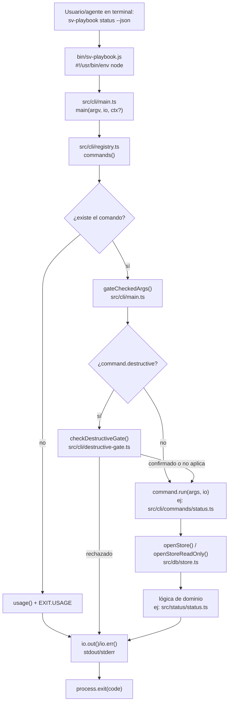

# Flujo 1: punto de entrada y despacho de comandos

> Etapa 2 de la guía. Verificado contra el código real el 2026-07-20.
> Este es el flujo "esqueleto" — todos los demás flujos empiezan acá.

## Qué vamos a estudiar

Cómo una invocación de terminal (`sv-playbook status`, `sv-playbook task
create ...`, etc.) llega desde el shell hasta que se ejecuta lógica de
negocio real, y qué pasa en el camino: parseo de argumentos, resolución
del comando, gate de operaciones destructivas, apertura del store, y
manejo de errores no capturados.

## Diagrama general



## Recorrido paso a paso

### 1. Acción que lo inicia

Ejecutar el binario desde una terminal, ej: `sv-playbook status --json`,
o ser invocado por otro proceso (el daemon reenviando un comando, un
agente despachado corriendo el CLI).

### 2. Punto de entrada

**`bin/sv-playbook.js`** (4 líneas útiles):

```js
process.removeAllListeners('warning');
process.on('warning', (w) => { if (w.name !== 'ExperimentalWarning') console.error(w.stack ?? w.message); });
const { main } = await import('../dist/cli/main.js');
const code = await main(process.argv.slice(2));
process.exit(code);
```

Nota importante: importa desde `../dist/cli/main.js`, **no** desde
`src/`. El código que corre siempre es el compilado — si editás `src/` y
no corrés `npm run build`, el CLI sigue ejecutando la versión vieja. Esto
es relevante porque más adelante (flujo del daemon) hay un chequeo de
"build digest" que depende exactamente de esto.

Silencia todos los `warning` de Node salvo los que **no** son
`ExperimentalWarning` (el proyecto usa `node:sqlite` experimental en
algunos tests, y no quiere ese ruido en la salida real del CLI).

### 3. Archivo que recibe la ejecución

**`src/cli/main.ts`**, función `main(argv, io = defaultIo, ctx?)`.

- `argv`: el array de argumentos (`process.argv.slice(2)`, ya sin `node` ni el path del script).
- `io`: por defecto escribe a `process.stdout`/`process.stderr`; en tests se inyecta un `Io` falso para capturar la salida sin tocar el terminal real.
- `ctx` (opcional): un `ExecutionContext` (`{ cwd, sessionId }`) — lo usa el daemon cuando reenvía un comando que llegó de OTRO directorio de trabajo (ver `src/runtime/context.ts`).

### 4. Resolución del comando

```ts
const [name, ...args] = argv;
if (name === undefined || name === '--help' || name === '-h') {
  usage(io);
  return EXIT.USAGE;
}
const command = commands().find((c) => c.name === name);
if (command === undefined) {
  io.err(`Unknown command: ${name}`);
  usage(io);
  return EXIT.USAGE;
}
```

`commands()` viene de **`src/cli/registry.ts`** — devuelve un array de
todos los `Command` disponibles. La lista real de comandos se genera en
`src/cli/commands/index.gen.js` (archivo generado, no se edita a mano) y
el registry le agrega tres comandos que están fuera de ese barrido
automático (`config`, `decision`, `packet`) si no vinieron ya incluidos.

### 5. Validaciones antes de ejecutar

Dos gates corren **antes** de que el comando vea sus argumentos:

**a) Gate de operaciones destructivas** (`gateCheckedArgs()`,
`src/cli/main.ts`): si `command.destructive === true` (declarado en el
propio objeto `Command`), extrae el flag `--confirm-destructive` de los
args (`extractConfirmDestructive()`, `src/cli/command.ts`) y llama
`checkDestructiveGate()` (`src/cli/destructive-gate.ts`). Ese gate:
- lee cuántos packets `done` y cuántos eventos hay en el store
  (`queryDestructiveCounts()`, cuenta filas reales vía SQL directo — es
  una excepción deliberada a "SQL sólo en src/db", vive en `src/db/*` de
  forma indirecta a través de `resolveStoreDir`/`DB_FILE`);
- si hay estado real que se perdería y no vino `--confirm-destructive`,
  rechaza sin ejecutar nada.

**b) El propio `command.run()`** hace sus propias validaciones de
argumentos (parseo con `node:util`'s `parseArgs`, chequeo de flags
desconocidos, etc.) — no hay un validador genérico, cada comando valida
lo suyo al principio de su `run()`.

### 6. Transformación / apertura de estado

La mayoría de los comandos (no todos — `status`, por ejemplo, sí) siguen
este patrón dentro de `run()`:

```ts
const repoRoot = commonRoot(getCwd());
const store = openStore(repoRoot);      // o openStoreReadOnly()
try {
  // lógica de dominio, usa store.orm
} finally {
  store.close();
}
```

- `getCwd()` (`src/runtime/context.ts`): devuelve `ctx.cwd` si hay un
  contexto seteado (caso del daemon reenviando), si no `process.cwd()`.
- `commonRoot()` (`src/db/store.ts`): resuelve la raíz real del repo
  git (`git rev-parse --git-common-dir`), no simplemente el cwd — importa
  porque un worktree tiene su propio `.git` pero comparte el store con el
  checkout principal.
- `openStore()` vs `openStoreReadOnly()`: la mayoría de los comandos de
  sólo lectura (`status`, `doctor`) usan la variante read-only —
  probablemente para evitar tomar locks de escritura innecesarios, a
  confirmar en el flujo de persistencia (Etapa 3).

### 7. Servicios/módulos invocados

Depende 100% del comando. Ejemplo concreto con `status`
(`src/cli/commands/status.ts`, el comando más simple del repo, 49
líneas):

```ts
const status = readBoardStatus(store, repoRoot);   // src/status/status.ts
if (parsed.values.json === true) io.out(JSON.stringify(status));
else renderStatus(status, io);                      // formatea con
                                                      // formatCountsHeader/
                                                      // formatStatusTable/
                                                      // formatFooter
```

`status` delega toda la lógica real a `src/status/status.ts` — el
comando en sí sólo parsea argumentos, abre el store, llama al dominio, y
formatea la salida. Este es el patrón general: **el archivo en
`cli/commands/` es una fachada delgada, la lógica vive en el dominio**.

### 8. Dependencias externas

Ninguna en este flujo específico (sin red, sin subprocess) — salvo la
propia resolución de `commonRoot()`, que sí invoca `git` como subproceso.

### 9. Manejo de estado

Sin estado compartido entre invocaciones del CLI en este flujo — cada
ejecución abre su propio handle de store y lo cierra al final (`finally`).
El único estado que sobrevive entre invocaciones es lo que quedó escrito
en el archivo SQLite.

### 10. Manejo de errores

Dos niveles:

- **Dentro de `command.run()`**: cada comando decide qué exit code
  devolver para sus propios casos de error (`EXIT.USAGE`, `EXIT.GATE_FAIL`,
  etc.) — no hay un mecanismo automático.
- **Nivel más externo, en `main()`**:
  ```ts
  try {
    return await command.run(gateResult, io);
  } catch (error) {
    io.err(`Error: ${error instanceof Error ? error.message : String(error)}`);
    return EXIT.SYSTEM;
  }
  ```
  Esta es la red de seguridad final — cualquier excepción no capturada
  por el comando mismo cae acá y se reporta como `EXIT.SYSTEM` (3). Este
  boundary se auditó a fondo esta semana (`docs/superpowers/plans/2026-07-19-error-boundary-audit.md`)
  — la conclusión fue que este catch-all externo está bien como red de
  seguridad de último nivel; los problemas reales estaban en catches
  intermedios de comandos específicos que reclasificaban mal el tipo de
  fallo.

### 11. Qué datos se leen/escriben

Depende del comando. `status` sólo lee. Comandos como `task create`
escriben filas nuevas en la tabla `packets` (ver flujo 3, pendiente).

### 12. Resultado que genera el flujo

Un exit code entero (0-3, `EXIT.OK/GATE_FAIL/USAGE/SYSTEM`,
`src/cli/command.constants.ts`) y cero o más líneas escritas vía
`io.out`/`io.err`.

### 13. Qué continúa después

`bin/sv-playbook.js` recibe el código de `main()` y llama
`process.exit(code)` — el proceso termina ahí. No hay callback posterior;
es un modelo estrictamente síncrono desde la perspectiva del shell que lo
invocó (aunque `main()` es `async` internamente, por los `await` a I/O de
SQLite/red).

### 14. Dónde finaliza el recorrido

En el exit code del proceso — quien invocó el CLI (una terminal, un
script, otro proceso Node vía `spawnSync`) lo lee de ahí.

## Archivos involucrados

| Archivo | Responsabilidad |
|---|---|
| `bin/sv-playbook.js` | Entry point ejecutable, importa el `dist/` compilado |
| `src/cli/main.ts` | Despachador central: resuelve comando, aplica gates, ejecuta, atrapa errores no manejados |
| `src/cli/registry.ts` | Arma la lista completa de comandos disponibles |
| `src/cli/commands/index.gen.js` | Lista generada de comandos (no editar a mano) |
| `src/cli/command.types.ts` | Contratos `Command` e `Io` |
| `src/cli/command.constants.ts` | `EXIT` y otras constantes compartidas del CLI |
| `src/cli/command.ts` | Helper `extractConfirmDestructive()` |
| `src/cli/destructive-gate.ts` | Gate de confirmación para operaciones que pierden estado |
| `src/runtime/context.ts` | `getCwd()`/`setContext()` — contexto de ejecución vía `AsyncLocalStorage` |
| `src/db/store.ts` | `commonRoot()`, `openStore()`, `openStoreReadOnly()` |
| `src/cli/commands/status.ts` | Ejemplo concreto usado en este flujo — el comando más simple del repo |
| `src/status/status.ts` | Dominio real detrás de `status` (`readBoardStatus`, formatters) |

## Resultado final

Un exit code y salida de texto/JSON en stdout/stderr. Este flujo es el
"chasis" que comparten los 45 comandos — a partir de acá, cada flujo
posterior (ciclo de vida de un packet, promotion, daemon, etc.) empieza
exactamente en el paso 6 de este documento (`command.run()`), con su
propia lógica de dominio.

## Antes de continuar

Para la próxima etapa (persistencia y store) conviene tener claro:
- La diferencia entre `openStore()` y `openStoreReadOnly()` (no
  confirmada en profundidad acá, es la primera pregunta de la Etapa 3).
- Que `commonRoot()` no es lo mismo que `process.cwd()` — importa para
  worktrees.
- Que el store real puede estar en dos "modos": local directo, o
  reenviado al daemon si hay uno corriendo (mencionado pero no
  desarrollado en este flujo — es el flujo 6).

## Resumen de lo aprendido

- Hay un único despachador (`main.ts`) para los 45 comandos, sin
  excepciones.
- Cada comando es una fachada delgada: parsea args, abre el store,
  delega al dominio, formatea salida, cierra el store.
- Dos gates corren antes de la lógica de negocio: resolución del
  comando y (si aplica) confirmación de operación destructiva.
- El manejo de errores tiene un catch-all de último nivel en `main()`,
  ya auditado esta semana — no es donde están los problemas reales.
- El código que se ejecuta siempre es `dist/`, nunca `src/` directamente.
