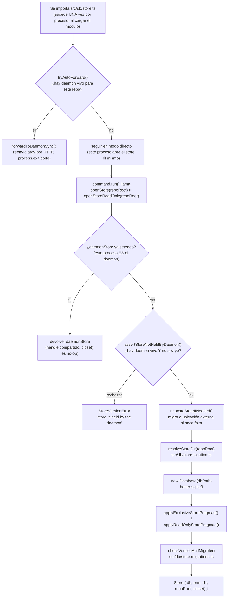

# Flujo 2: persistencia y store

> Etapa 3 de la guía. Verificado contra el código real el 2026-07-20.
> Continúa directamente del paso 6 del flujo 1 (`openStore()`/`openStoreReadOnly()`).

## Qué vamos a estudiar

Qué pasa entre que un comando pide "el store" y que efectivamente tiene una
conexión SQLite utilizable: dónde vive físicamente el archivo, cómo se
decide si este proceso puede escribir directo o tiene que reenviar el
comando al daemon (single-blessed-writer), y la diferencia real entre
`openStore()` y `openStoreReadOnly()`.

## Diagrama general



## Recorrido paso a paso

### 1. Acción que lo inicia

Cualquier comando del CLI que necesita datos persistidos — en la práctica,
casi todos salvo `--help`. Ejemplo continuado del flujo 1: `sv-playbook
status`.

### 2. Punto de entrada real: antes de que un comando pida el store

Lo primero que pasa, incluso antes de que `main()` resuelva qué comando
correr, es un efecto secundario al **importar** `src/db/store.ts`:

```ts
if (!process.env[NODE_TEST_CONTEXT_ENV]) {
  tryAutoForward();
}
```

`tryAutoForward()` (`src/db/store.ts`) decide, para el cwd actual, si hay un
daemon vivo para este repo. Si lo hay, reenvía el proceso CLI **entero**
(todos los `argv`) por HTTP hacia el daemon y termina este proceso con
`process.exit()` usando el exit code que devolvió el daemon
(`forwardToDaemonSync()`, `src/daemon/client.ts`). Esto es lo que hace
cumplir "single blessed writer" sin que cada comando individual tenga que
saber si está hablando con el daemon o no — la decisión se toma acá, una
sola vez, antes de que exista esa ambigüedad. Ver flujo 6 (daemon) para el
lado receptor de este reenvío.

Casos:
- **Raíz del repo sin daemon corriendo**: sigue en modo directo (este mismo
  proceso va a abrir el store).
- **Worktree enlazado sin daemon corriendo**: error explícito
  (`WORKTREE_DAEMON_REQUIRED_TEXT`) y `process.exit(1)` — un worktree nunca
  puede escribir directo, porque colisionaría con otro worktree del mismo
  repo.
- **Hay daemon corriendo y el digest de build coincide**: reenvía y termina.
- **Hay daemon corriendo pero con un build distinto**: error pidiendo
  reiniciar el daemon (`sv-playbook daemon`), para no hablar con un daemon
  desalineado en schema/contratos.
- **Este mismo proceso es el daemon** (`args[0] === 'daemon'`): no reenvía,
  sigue de largo — el daemon abre su propio store más adelante en su propio
  arranque (ver flujo 6).

### 3. Archivo que recibe la llamada real de apertura

**`src/db/store.ts`**, funciones `openStore(repoRoot, options?)` y
`openStoreReadOnly(repoRoot)` — llamadas desde dentro de `command.run()`
(ver flujo 1, paso 6).

### 4. Validaciones antes de abrir

```ts
export function openStore(repoRoot: string, options?: OpenStoreOptions): Store {
  if (daemonStore !== null) {
    return daemonStore;
  }
  assertStoreNotHeldByDaemon(repoRoot);
  relocateStoreIfNeeded(repoRoot, canonicalRootOrRepoRoot(repoRoot));
  return openStoreAt(resolveStoreDir(repoRoot), repoRoot, options);
}
```

- **`daemonStore !== null`**: si este proceso ES el daemon (o un comando
  ejecutándose dentro de él, ver flujo 6), ya existe un handle compartido —
  se devuelve tal cual, sin abrir una segunda conexión.
- **`assertStoreNotHeldByDaemon()`**: segunda línea de defensa del
  single-blessed-writer, para cuando `tryAutoForward` no aplicó (por
  ejemplo, si el forward falló silenciosamente por algún motivo). Si hay un
  daemon vivo y este proceso no es el daemon ni está arrancando uno,
  rechaza con `StoreVersionError` en vez de arriesgar una segunda escritura
  concurrente.

### 5. Transformación de la ubicación

`relocateStoreIfNeeded()` (`src/db/store-migration-relocate.js`) migra el
store a su ubicación externa (fuera del árbol git, ver `store-location.ts`)
si todavía estuviera en la ubicación legacy — se chequea en cada apertura
porque es barato y mantiene la migración transparente sin requerir un
comando manual del usuario.

`resolveStoreDir(repoRoot)` resuelve el directorio físico real:

```ts
export function resolveStoreDir(repoRoot: string): string {
  try {
    return resolveStoreRoot(commonRoot(repoRoot));
  } catch {
    return resolveStoreRoot(repoRoot);
  }
}
```

`resolveStoreRoot()` (`src/db/store-location.ts`, no profundizado en esta
etapa) deriva la carpeta a partir de un hash de la raíz git canonicalizada
— por eso el store hoy vive fuera del árbol del repo en vez de en
`.svp/db.sqlite` como en versiones anteriores.

### 6. Servicios invocados: apertura real de SQLite

```ts
function openStoreAt(dir: string, repoRoot: string, options?: OpenStoreOptions): Store {
  mkdirSync(dir, { recursive: true });
  const dbPath = join(dir, DB_FILE);
  const isNew = !existsSync(dbPath);
  const db = new Database(dbPath);
  applyExclusiveStorePragmas(db);
  db.exec(SCHEMA);
  if (isNew) {
    db.exec(`${STORE_PRAGMA.USER_VERSION} = ${SCHEMA_VERSION}`);
  } else if (!options?.skipVersionCheck) {
    checkVersionAndMigrate(db, repoRoot, options);
  }
  migratePacketColumn(db, 'pr', SQLITE_COLUMN_TYPE.TEXT, false);
  return createStore(db, dir, repoRoot);
}
```

- `better-sqlite3` abre (o crea) el archivo.
- `applyExclusiveStorePragmas()` (`src/db/store.pragmas.ts`, no
  profundizado — pendiente de etapa) configura pragmas de SQLite para
  acceso exclusivo de escritura.
- `db.exec(SCHEMA)` aplica el DDL completo — es idempotente, `CREATE TABLE
  IF NOT EXISTS` para todo el schema.
- Si el archivo es nuevo, se marca directamente con `SCHEMA_VERSION`
  actual (no hay nada que migrar). Si ya existía, `checkVersionAndMigrate()`
  (`src/db/store.migrations.ts`) corre las migraciones pendientes.
- `createStore()` envuelve la conexión cruda en el objeto `Store` que usa
  el resto del código: `{ db, orm, dir, repoRoot, close() }`. `orm` se crea
  con `createStoreOrm(db)` (`src/db/orm.ts`) — es el único punto donde se
  instancia Drizzle; todo acceso a datos fuera de `src/db/` pasa por
  `store.orm`, nunca SQL crudo directo (mecanizado por un gate de lint, ver
  `src/check/orm-boundary.ts`).

### 7. La variante de sólo lectura

`openStoreReadOnly(repoRoot)` sigue el mismo camino de daemon-check, pero
llama a `openStoreReadOnlyAt()`:

```ts
function openStoreReadOnlyAt(dir: string, repoRoot: string): Store {
  const path = join(dir, DB_FILE);
  if (!existsSync(path)) {
    relocateStoreIfNeeded(repoRoot, canonicalRootOrRepoRoot(repoRoot));
    openStore(repoRoot).close();
  }
  const db = new Database(path, { readonly: true, fileMustExist: true });
  applyReadOnlyStorePragmas(db);
  const version = readStoreSchemaVersion(db);
  if (version !== SCHEMA_VERSION) {
    db.close();
    throw new StoreVersionError(...);
  }
  return createStore(db, dir, repoRoot);
}
```

Diferencias clave con `openStore()`:
- Si el archivo todavía no existe, abre y cierra una vez en modo
  escritura sólo para forzar la creación del schema — de ahí en más esta
  conexión puede asumir que el archivo y el schema ya están.
- Abre con `{ readonly: true, fileMustExist: true }` — no puede escribir,
  ni crear el archivo si no existe.
- **No corre migraciones**: si la versión de schema no coincide con
  `SCHEMA_VERSION` esperada, falla directo con `StoreVersionError` en vez de
  intentar migrar (migrar requiere escritura). Esto explica por qué
  `status`/`doctor` (comandos de sólo lectura) usan esta variante: no
  necesitan ni deben poder mutar el schema.

### 8. Dependencias externas

`git` como subproceso (`commonRoot()`, `worktreeRoot()` vía
`execFileSync`) — necesario para ubicar la raíz real del repo antes de
poder resolver dónde vive el store. Nada de red en este flujo salvo el caso
de `tryAutoForward` reenviando al daemon local.

### 9. Manejo de estado

Este es el flujo que **define** el modelo de estado del resto del sistema:
- Un único archivo SQLite por repo (identificado por hash de la raíz git
  canonicalizada), fuera del árbol versionado.
- Un único escritor real en un momento dado: o bien el daemon (si está
  corriendo), o bien un proceso CLI directo en la raíz sin daemon — nunca
  ambos, nunca dos procesos directos simultáneos (bloqueado por
  `assertStoreNotHeldByDaemon` + el propio locking de SQLite).
- `daemonStore`/`setDaemonStore()`/`getDaemonStore()` son el mecanismo para
  que TODOS los comandos que corren dentro del proceso daemon reutilicen la
  misma conexión — es lo que hace al daemon un escritor único real y no
  sólo un proxy que abre N conexiones.

### 10. Manejo de errores

`StoreVersionError` (`src/db/store.errors.ts`) es el tipo de error
específico de este dominio — se usa tanto para "el store está tomado por el
daemon" como para "la versión de schema no coincide". `WORKTREE_DAEMON_REQUIRED_TEXT`
es el mensaje de guía específico cuando un worktree sin daemon intenta
escribir. Ninguno de estos casos deja el store en un estado parcialmente
abierto — o se abre completo y válido, o se lanza antes de tocar nada.

### 11. Qué datos se leen/escriben

El propio archivo SQLite (`db.sqlite`, `DB_FILE`) en el directorio resuelto
por `resolveStoreDir()`. Además, en el árbol del repo (`.svp/`), se leen/
escriben los archivos de lock y token del daemon (`isDaemonRunning()`,
`readDaemonToken()`, `readDaemonPort()`) — ver flujo 6.

### 12. Resultado que produce el flujo

Un objeto `Store` (`{ db, orm, dir, repoRoot, close() }`) listo para que el
comando lo use, o una excepción (`StoreVersionError`) si no se pudo abrir
de forma segura.

### 13. Qué continúa después

El comando usa `store.orm` (o `store.db.prepare(...)` directo, patrón más
antiguo todavía presente en varios dominios) para su lógica real — ver
flujo 3 (ciclo de vida de un packet) como el ejemplo más elaborado. Al
terminar, casi todos los comandos llaman `store.close()` en un `finally`.

### 14. Dónde finaliza el recorrido

En el `close()` del store (no-op si es el store compartido del daemon) al
final del `command.run()`, o en el exit code de `main()` si hubo una
excepción antes de llegar a usarlo.

## Archivos involucrados

| Archivo | Responsabilidad |
|---|---|
| `src/db/store.ts` | Núcleo: `tryAutoForward`, `openStore`, `openStoreReadOnly`, single-blessed-writer |
| `src/db/store-location.ts` | `resolveStoreRoot()` — deriva la ubicación externa del store |
| `src/db/store-migration-relocate.js` | Migra el store desde la ubicación legacy si hace falta |
| `src/db/store.migrations.ts` | `checkVersionAndMigrate()`, `migratePacketColumn()` |
| `src/db/store.pragmas.ts` | Pragmas de SQLite para modo exclusivo vs. sólo lectura |
| `src/db/orm.ts` | `createStoreOrm()` — único punto de instanciación de Drizzle |
| `src/db/store.errors.ts` | `StoreVersionError` |
| `src/db/store.types.ts` | Tipo `Store` |
| `src/daemon/client.ts` | `forwardToDaemonSync()`, `fetchDaemonBuildDigestSync()` — lado cliente del reenvío |
| `src/daemon/daemon.constants.ts` | Nombres de archivos de lock/token, puerto default |

## Resultado final

Un `Store` con conexión SQLite abierta (exclusiva o de sólo lectura) y ORM
listo, o el proceso ya terminó porque el comando se reenvió al daemon. Este
flujo es el que hace cumplir mecánicamente que sólo hay un escritor real
del store en todo momento.

## Antes de continuar

Para la próxima etapa (ciclo de vida de un packet) conviene tener claro:
- La diferencia entre `store.db.prepare(...)` (SQL crudo, patrón más viejo)
  y `store.orm` (Drizzle, patrón exigido para código nuevo) — ambos
  conviven hoy en el código real.
- Que abrir el store NO implica tomar un lease sobre ningún packet — eso es
  un concepto aparte (tabla `leases`, ver flujo 3).
- Que el daemon es sólo una optimización/garantía de single-writer, no un
  requisito para que el CLI funcione — sin daemon, todo sigue andando en
  modo directo en la raíz del repo.

## Resumen de lo aprendido

- El single-blessed-writer se hace cumplir en DOS capas: reenvío
  automático al importar el módulo (`tryAutoForward`) y un assert
  defensivo dentro de `openStore` (`assertStoreNotHeldByDaemon`).
- El store vive fuera del árbol git, en una ubicación derivada por hash de
  la raíz canonicalizada — no en `.svp/`.
- `openStore()` puede migrar el schema; `openStoreReadOnly()` nunca migra,
  falla rápido si la versión no coincide.
- Dentro del proceso daemon, todos los comandos comparten un único handle
  (`daemonStore`) en vez de abrir conexiones propias.
- `store.orm` es el único punto de entrada de Drizzle — mecanizado por un
  gate de lint que impide SQL crudo fuera de `src/db/`.
