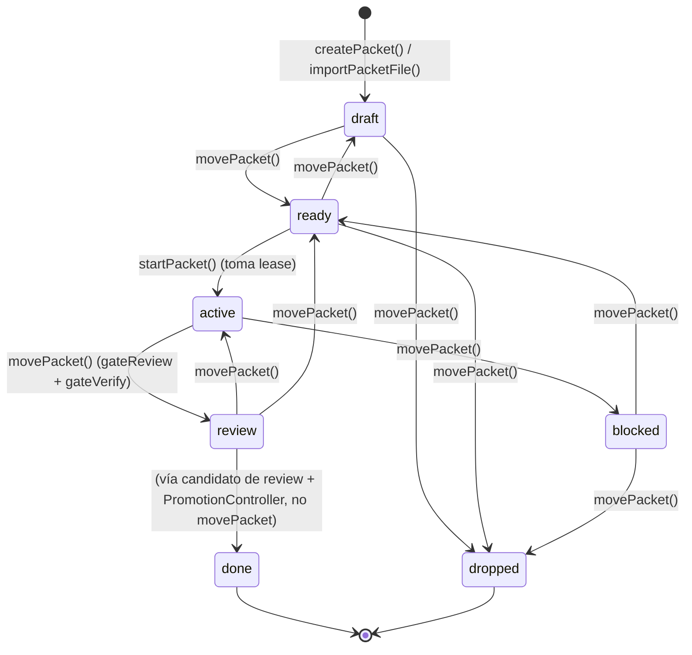
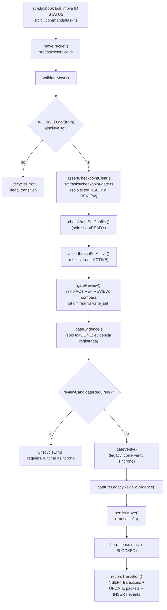

# Flujo 3: ciclo de vida de un packet

> Etapa 4 de la guía. Verificado contra el código real el 2026-07-20.
> Continúa del flujo 2 (persistencia) — acá ya asumimos que `Store` está
> abierto y usamos `store.orm`/`store.db` directamente.

> ⚠️ **Corrección agregada después, ver `findings.md` F-007**: el
> "camino legacy" descrito abajo (`gateVerify()` dentro de `movePacket()`,
> pasos 4 y "antes de continuar") está documentado tal como está escrito
> en el código — pero el comando real `task move <id> review` NO pasa por
> acá. Usa `movePacketToReview()` (`tasks/review-transition.ts`, ver
> flujo 4), que reimplementa la misma verificación de forma independiente.
> `gateVerify()` sólo lo alcanzan tests que llaman `movePacket()`
> directo. Dejalo en mente al leer el resto de este documento.

## Qué vamos a estudiar

Cómo nace un packet (la unidad de trabajo del sistema), cómo se mueve entre
estados (`draft → ready → active → review → done`, con `blocked`/`dropped`
como salidas), qué gates corren en cada transición, y cómo funciona el
mecanismo de lease que evita que dos sesiones trabajen el mismo packet a la
vez.

## Diagrama de estados



## Diagrama del flujo `task move`



## Recorrido paso a paso

### 1. Acción que lo inicia

Tres entradas posibles a la existencia de un packet:
- `sv-playbook task create` → **`createPacket()`** (packet nace directo en
  DB, sin archivo — el camino nativo desde D4).
- `sv-playbook task import <dir>` → **`importPackets()`** →
  `upsertPacketFile()` por cada `.md` en `docs/packets/`.
- `sv-playbook task import <archivo-o-id>` → **`importPacketFile()`**
  (variante singular, encontrada como tercer punto de entrada de
  dependencias durante la auditoría de integridad referencial de esta
  semana).

Después de creado, cualquier `sv-playbook task <start|move|note|takeover>`
opera sobre un packet existente.

### 2. Archivo que recibe la acción

**`src/tasks/service.ts`** — es el archivo central de todo el dominio
`tasks/` (22 archivos en total; éste concentra la máquina de estados).
Comandos CLI en `src/cli/commands/task.ts` (no detallado línea por línea en
esta etapa) son fachadas delgadas sobre estas funciones, igual que `status`
en el flujo 1.

### 3. Función ejecutada: creación

```ts
export function createPacket(store: Store, _docRoot: string, def: PacketDefinition, body: string, type?: string): void {
  const exists = store.db.prepare(EXISTS_SQL).get(def.id);
  if (exists !== undefined) throw new LifecycleError(`packet already exists: ${def.id}`, ...);
  transact(store, () => {
    store.db.prepare(INSERT_PACKET_SQL).run(def.id, def.title, null, STATUS.DRAFT, body, JSON.stringify(def.writeSet), type ?? '', now(), now());
    for (const depId of def.dependsOn) {
      store.db.prepare('INSERT INTO packet_deps ...').run(def.id, depId);
    }
    recordWorkDefinition(store, workDefinitionValue(def, body, type));
    recordTransition(store, def.id, 'none', STATUS.DRAFT);
  });
}
```

Todo nace en `STATUS.DRAFT`. `path` se inserta como `null` (no hay archivo
— comparar con `upsertPacketFile`/`importPacketFile`, que sí guardan un
`path` real cuando el packet vino de un `.md`). `recordWorkDefinition()`
(`src/tasks/work-definitions.js`, no profundizado acá) persiste una
versión inmutable de la definición — es lo que después usa
`PromotionController` para detectar si el packet cambió bajo los pies del
candidato (ver flujo 4).

### 4. Validaciones antes de mover: `validateMove()`

```ts
export function validateMove(store: Store, sessionId: string | undefined, packetId: string, to: PacketStatus): string {
  if (sessionId !== undefined) refreshHeartbeat(store, sessionId);
  const from = currentPacketStatus(store, packetId);
  if (to === STATUS.ACTIVE) throw new LifecycleError('use task start to activate a packet');
  const allowed = ALLOWED.get(from) ?? [];
  if (!allowed.includes(to)) throw new LifecycleError(`illegal transition ${from} -> ${to}`);
  if (to === STATUS.READY || to === STATUS.REVIEW) assertCheckpointClear(store, packetId);
  if (to === STATUS.READY) checkWriteSetConflict(store, packetId);
  if (from === STATUS.ACTIVE) assertLeaseForActive(store, sessionId, packetId);
  gateReview(store, packetId, from, to);
  gateEvidence(store, packetId, to);
  return from;
}
```

`ALLOWED` (`src/tasks/service.constants.ts`) es la tabla completa de
transiciones legales:

| Desde | Puede ir a |
|---|---|
| `draft` | `ready`, `dropped` |
| `ready` | `active`, `dropped`, `draft` |
| `active` | `review`, `blocked` |
| `blocked` | `ready`, `dropped` |
| `review` | `active`, `ready` |

`to === ACTIVE` está prohibido a propósito en `movePacket` genérico —
activar siempre pasa por `startPacket()` (que toma un lease), nunca por
`move`, porque activar sin lease dejaría dos sesiones trabajando el mismo
packet sin dueño claro. El orden de los gates importa: el checkpoint de
complejidad corre primero porque es la puerta más cara de saltar
(requiere aprobación humana, ver `src/tasks/checkpoint-gate.ts`, dominio
no profundizado en esta etapa).

Gates específicos:
- **`checkWriteSetConflict`** (sólo al entrar a `READY`): compara el
  `write_set` de este packet contra el de todo packet ya `READY`/`ACTIVE`.
  Dos packets con globs superpuestos no pueden avanzar en paralelo — evita
  que dos agentes reciban permiso de tocar el mismo archivo al mismo tiempo.
- **`gateReview`** (sólo `ACTIVE -> REVIEW`): compara los archivos
  REALMENTE cambiados en la rama (git diff contra la base configurada, vía
  `changedFilesForBase()`) contra el `write_set` declarado. El `write_set`
  es una promesa hecha al crear el packet; este gate es la verificación
  mecánica de que se cumplió — un agente no puede autodeclarar
  cumplimiento.
- **`gateEvidence`** (sólo al entrar a `DONE`): si el tipo de packet
  declara evidencia obligatoria, exige que exista al menos un evento
  `EVENT_EVIDENCE` registrado — la evidencia se registra con un comando
  real del CLI, nunca se fabrica a mano.

### 5. Toma de lease: `startPacket()`

```ts
export function startPacket(store: Store, sessionId: string, worktree: string, packetId: string): void {
  refreshHeartbeat(store, sessionId);
  const status = currentPacketStatus(store, packetId);
  const lease = leaseOf(store, packetId);
  if (lease !== undefined) {
    if (lease.sessionId === sessionId) return;
    throw new LifecycleError(`held by session ${lease.sessionId}`, ...);
  }
  if (status !== STATUS.READY) throw new LifecycleError(`wrong state ${status}`, ...);
  checkSprintWipLimit(store, packetId);
  transact(store, () => {
    assertDependenciesTerminal(store, packetId);
    store.db.prepare(INSERT_LEASE_SQL).run(packetId, sessionId, worktree, now(), now());
    recordTransition(store, packetId, STATUS.READY, STATUS.ACTIVE, sessionId);
  });
}
```

Sólo se puede activar un packet en `READY`, sin lease existente de otra
sesión, sin exceder el WIP limit del sprint (si tiene uno, ver
`src/sprints/service.ts`), y con todas sus dependencias en estado terminal
(`assertDependenciesTerminal()`, `src/tasks/dependencies.ts` — el mismo
archivo que se corrigió esta semana para cubrir los tres puntos de entrada
de creación de packets).

### 6. Recuperación tras un worker muerto: `takeoverPacket()`

Un lease tiene TTL vía heartbeat (`leaseOf()` calcula `stale` comparando
`heartbeat_at` contra `config.tasks.leaseTtlMs`). Un lease **stale** se
puede tomar sin `--force`; uno **live** requiere `--force` explícito —
evita que un segundo agente le robe el packet a uno que sigue trabajando
activamente sólo porque hubo un heartbeat lento.

### 7. Servicios/módulos invocados

- `src/sprints/service.ts` — `checkSprintWipLimit`, `getActiveCount`,
  `sprintWipLimit`, `taskSprintId` (límite de trabajo en paralelo por
  sprint).
- `src/tasks/dependencies.ts` — `assertDependenciesTerminal`,
  `currentPacketStatus`.
- `src/tasks/checkpoint-gate.ts` — `assertCheckpointClear` (checkpoint de
  complejidad, ver glosario; flujo dedicado pendiente).
- `src/tasks/work-definitions.ts` — snapshot inmutable de la definición.
- `src/review/review-candidate.ts` — `reviewCandidateRequired`,
  `persistReviewCandidate` (el puente hacia el flujo de promotion, ver
  flujo 4).
- `src/tasks/legacy-review-evidence.ts`,
  `src/tasks/legacy-review-verification.ts` — camino más viejo, previo a
  candidatos de review, todavía activo cuando `reviewCandidateRequired`
  devuelve `false`.

### 8. Dependencias externas

`git diff` (vía `changedFilesForBase()`, sólo en `gateReview`) para
comparar cambios reales de la rama contra el `write_set` declarado.

### 9. Manejo de estado

Todo cambio de estado pasa por una única función de bajo nivel,
`recordTransition()`:

```ts
function recordTransition(store: Store, packetId: string, from: string, to: string, sessionId?: string): void {
  store.db.prepare('INSERT INTO transitions ...').run(packetId, from, to, sessionId ?? null, now());
  store.db.prepare('UPDATE packets SET status = ?, updated_at = ? WHERE id = ?').run(to, now(), packetId);
  store.db.prepare(INSERT_EVENT_SQL).run(sessionId ?? null, packetId, EVENT_TRANSITION, `${from}->${to}`, now());
}
```

Tres efectos atómicos (siempre dentro de `transact()`, que envuelve en
`BEGIN IMMEDIATE`/`COMMIT`/`ROLLBACK`): fila nueva en `transitions`
(historial completo, nunca se borra), `UPDATE` del `status` actual en
`packets`, y un evento genérico en `events`. El historial de transiciones
es lo que consume `recoverPacket()` para mostrar "últimas 5 transiciones"
cuando alguien pide un diagnóstico de un packet.

### 10. Manejo de errores

`LifecycleError` (`src/tasks/service.errors.ts`) es el tipo específico de
este dominio — casi todos los rechazos de gates lo usan, con un mensaje y
opcionalmente un "hint" de recuperación (ej. `'use takeover once
available; do not delete the lease by hand'`) — coherente con
PRINCIPLE-010 (ningún error sin salida documentada).

### 11. Qué datos se leen/escriben

Tablas involucradas: `packets` (estado actual), `transitions` (historial
inmutable), `events` (bitácora genérica: transición, nota, evidencia,
takeover, importación), `leases` (quién tiene un packet activo y desde
cuándo), `packet_deps` (dependencias declaradas).

### 12. Resultado que produce el flujo

El nuevo `status` (`string`) devuelto por `movePacket()`, o una excepción
`LifecycleError` si algún gate rechazó. `startPacket`/`releaseLease`/
`takeoverPacket`/`notePacket` no devuelven estado (mutan y listo, salvo
`takeoverPacket` que devuelve un `RecoveryReport`).

### 13. Qué continúa después

- `to === REVIEW` con `reviewCandidateRequired() === true`: el `move`
  directo se rechaza — ese camino usa el runtime asíncrono de orquestación
  en su lugar (ver `src/orchestration/`, y el flujo de promotion, flujo 4).
- `to === REVIEW` en el camino legacy: `gateVerify()` corre `verify` de
  forma síncrona ahí mismo.
- `to === DONE`: normalmente llega desde `PromotionController.promote()`
  (flujo 4), no desde un `task move` manual.

### 14. Dónde finaliza el recorrido

En el estado persistido (`packets.status`) y el historial en `transitions`/
`events` — no hay un "final" único, un packet puede ciclar entre
`ready`/`active`/`blocked`/`review` varias veces antes de llegar a
`done`/`dropped`, que son los únicos dos estados sin transiciones de
salida en `ALLOWED`.

## Archivos involucrados

| Archivo | Responsabilidad |
|---|---|
| `src/tasks/service.ts` | Máquina de estados completa: create/move/start/takeover/note |
| `src/tasks/service.constants.ts` | `STATUS`, `ALLOWED` (tabla de transiciones), SQL constants |
| `src/tasks/service.types.ts` | `PacketStatus`, `LeaseInfo`, `RecoveryReport` |
| `src/tasks/service.errors.ts` | `LifecycleError` |
| `src/tasks/dependencies.ts` | `assertDependenciesTerminal`, `currentPacketStatus` |
| `src/tasks/write-set.ts` | `overlaps()` — matching de globs para write_set |
| `src/tasks/checkpoint-gate.ts` | `assertCheckpointClear()` — checkpoint de complejidad |
| `src/tasks/work-definitions.ts` | Snapshot inmutable de la definición de un packet |
| `src/tasks/transaction.ts` | `transact()` — wrapper `BEGIN IMMEDIATE`/`COMMIT`/`ROLLBACK` |
| `src/sprints/service.ts` | WIP limit por sprint |
| `src/packets/document.ts` | Parseo/generación del formato `.md` (sólo para import/export) |
| `src/review/review-candidate.ts` | Puente hacia el flujo asíncrono de promotion |

## Resultado final

Un packet persistido con un estado válido según `ALLOWED`, un historial
completo de transiciones/eventos, y — si corresponde — un lease activo
atado a una sesión. Este flujo es el corazón operativo del sistema: todo
lo demás (review, promotion, sprints, checkpoint) gira alrededor del
estado de un packet.

## Antes de continuar

Para la próxima etapa (preflight + review + promotion) conviene tener
claro:
- Que `movePacket` a `REVIEW`/`DONE` tiene DOS caminos posibles según
  `reviewCandidateRequired()`: el legacy (síncrono, `gateVerify` dentro de
  este mismo archivo) y el moderno (candidato de review +
  `PromotionController`, orquestado por separado).
- Que `write_set` se verifica dos veces con propósitos distintos:
  `checkWriteSetConflict` (evita colisión ENTRE packets) y `gateReview`
  (verifica que la promesa de ESTE packet se cumplió).
- Que el checkpoint de complejidad (`assertCheckpointClear`) es un gate
  aparte, no cubierto en profundidad todavía.

## Resumen de lo aprendido

- La máquina de estados vive en una tabla (`ALLOWED`) más un puñado de
  gates específicos por transición — no hay lógica de estados dispersa.
- `to === ACTIVE` está bloqueado en `move` genérico a propósito:
  activar siempre requiere un lease, tomado sólo por `startPacket`.
- El `write_set` se verifica dos veces, con intención distinta cada vez.
- Todo cambio de estado dispara tres escrituras atómicas: transición,
  update de status, evento — el historial nunca se pierde.
- Hay dos caminos de review/promotion coexistiendo (legacy síncrono y
  moderno asíncrono) según si el packet requiere candidato de review.
