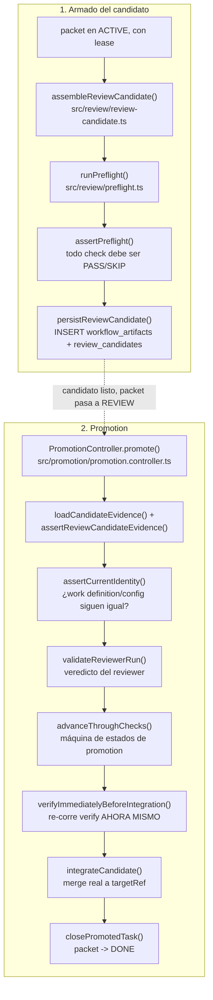

# Flujo 4: preflight + candidato de review + promotion

> Etapa 5 de la guía. Verificado contra el código real el 2026-07-20.
> Continúa del flujo 3 (ciclo de vida de un packet) — cubre específicamente
> el camino MODERNO (`reviewCandidateRequired() === true`), la puerta real
> a `done` en el sistema actual.

## Qué vamos a estudiar

Cómo se arma un "candidato de review" inmutable a partir de un packet
activo, qué evidencia mecánica lo respalda (preflight), y cómo
`PromotionController` re-verifica todo antes de integrar a `main` — la
única forma de que un packet llegue a `done` en el camino moderno.

## Diagrama general



## Recorrido paso a paso

### 1. Acción que lo inicia

Un packet en `ACTIVE` con lease, cuando su rol/fase requiere candidato de
review (`reviewCandidateRequired(store, STATUS.REVIEW)` devuelve `true` —
consulta la tabla `responsibility_input_policies`, configurable por
instancia, no hardcodeada). En ese caso, el `task move ... review` directo
del flujo 3 se rechaza y en su lugar corre el runtime de orquestación que
llama `assembleReviewCandidate()`.

### 2. Archivo que arma el candidato

**`src/review/review-candidate.ts`**, función
`assembleReviewCandidate(store, definition, lease)`.

### 3. Validaciones/evidencia: preflight primero

```ts
const content = candidateContent(lease.worktree, config.reviewPreflight.baseReference, config.reviewCandidateMaxBytes);
const report = await runPreflight(store, definition.packetId, lease.worktree, { pr: undefined, persistEvent: false });
assertPreflight(report);
```

`candidateContent()` (mismo archivo) verifica que el worktree esté limpio
(`git status --porcelain` vacío), calcula el merge-base contra la rama
base configurada, y captura el diff completo + lista de archivos
cambiados. Si HEAD ya está exactamente en el merge-base, es "trabajo ya
integrado" — el candidato certifica el SHA sin diff pendiente
(`REVIEW_CANDIDATE_INTEGRATION.INTEGRATED`).

`runPreflight()` (**`src/review/preflight.ts`**, ver flujo 3 para el
detalle interno) corre los chequeos mecánicos: write_set respetado, HEAD
coincide con lo reportado en el PR, CI en verde, verify limpio en un
checkout aislado (`runCleanVerification`), presencia de la sección "RED
test". `assertPreflight()` exige que **todo** check sea `PASS` o `SKIP` —
cualquier `FAIL`/`UNKNOWN` aborta el armado del candidato antes de
persistir nada.

### 4. Transformación: contenido inmutable del candidato

```ts
const value: ReviewCandidateValue = {
  kind: REVIEW_CANDIDATE_KIND,
  workDefinition: { id: definition.packetId, version: definition.version, digest: definition.digest },
  candidate: { sha: report.headSha, branch, ...content },
  producer: { sessionId: lease.sessionId },
  evidence: { preflight: report, catalog, projections: activeProjections(store, catalog), notes: evidenceNotes(store, definition.packetId) },
  createdAt,
};
validateArtifact(store, REVIEW_CANDIDATE_CONTRACT_REF_V3, value);
```

El candidato ata la work definition (versión + digest inmutable, ver
flujo 3), el SHA/branch real (no declarado por el agente — leído de git),
el catálogo de roles activo y sus proyecciones (evidencia de que el
sistema de roles estaba en un estado consistente al momento de armar el
candidato), y las últimas notas del packet como bitácora. Se valida contra
su contrato JSON Schema (`src/contracts/artifacts.ts`, ver flujo de
contratos, pendiente) antes de aceptarlo.

### 5. Servicios invocados: persistencia

**`persistReviewCandidate()`**: idempotente por identidad
`(packetId, workDefinitionVersion, candidateSha)` — si ya existe un
candidato con esa identidad exacta, no duplica (mismo patrón de
idempotencia que el gateway, ver `docs/codebase-guide/glossary.md`). Si
existe pero con un `workDefinitionDigest` distinto, es un conflicto real
(el packet cambió sin que cambiara la versión) y se rechaza. Inserta en
`workflow_artifacts` (el artifact genérico versionado) y `review_candidates`
(la fila específica de este dominio), y deja un evento `EVENT_EVIDENCE` en
el packet.

### 6. El candidato como input de un reviewer

`resolveManualInput()` es el lado consumidor: cuando un rol (ej.
`reviewer`) necesita el candidato como input para su turno, valida que el
packet esté en el `requiredStatus` esperado por la política del rol
(`assertTaskStatus`), busca el artifact más reciente que coincide con la
identidad exacta de la work definition actual, y vuelve a validar el
artifact contra su contrato antes de dárselo al rol — nunca confía en que
lo persistido siga siendo válido sin re-chequear.

### 7. Promotion: la puerta real a `done`

**`src/promotion/promotion.controller.ts`**, clase `PromotionController`,
método `promote(request)`. Es la única forma en que un candidato aprobado
se convierte en un packet `DONE` real en `main`.

```ts
async promote(request: PromotionRequest): Promise<PromotionReceipt> {
  const targetRef = request.targetRef ?? DEFAULT_GIT_BRANCH.MAIN;
  const evidence = loadCandidateEvidence(this.store, request.reviewCandidateId);
  assertReviewCandidateEvidence(evidence);        // preflight+clean-verification atados al SHA
  assertWorkDefinition(this.store, evidence);      // write_set real vs. declarado
  const candidate = ensurePromotionCandidate(...); // idempotente por identidad
  const completed = findPromotionReceipt(this.store, candidate.id);
  if (completed !== undefined) return completed;   // ya promovido: devuelve el receipt existente
  assertCurrentIdentity(this.store, this.repoRoot, candidate, evidence);
  const verdict = validateReviewerRun(...);
  this.advanceThroughChecks(candidate, evidence, verdict, runtimeDigest);
  const verificationDigest = await this.verifyImmediatelyBeforeIntegration(candidate);
  const resultSha = integrateCandidate(...);
  return closePromotedTask(...);
}
```

Seis etapas, en orden, cada una dejando un receipt persistido:

1. **Evidencia del candidato**: `assertReviewCandidateEvidence` exige que
   preflight y clean-verification hayan pasado, ATADOS al SHA exacto del
   candidato (`cleanVerificationCandidateSha === identity.candidateSha`) —
   no basta con "pasó alguna vez", tiene que ser sobre este commit
   específico.
2. **Identidad actual**: `assertCurrentIdentity` re-confirma que la work
   definition y la config de la instancia no cambiaron desde que se creó
   el candidato — evita promover algo "stale" (packet editado después de
   armar el candidato).
3. **Veredicto del reviewer**: `validateReviewerRun` valida el resultado
   real de la corrida del reviewer (no un veredicto autodeclarado).
4. **Máquina de estados de promotion**: `advanceThroughChecks()` mueve el
   candidato por sus propios estados (`CREATED -> CHECKS_COMPLETED ->
   APPROVED`, o `-> REJECTED` si el reviewer pidió cambios), separados de
   los estados del packet — un candidato rechazado no vuelve a `DRAFT`
   automáticamente, es una decisión aparte.
5. **Re-verificación inmediata**: `verifyImmediatelyBeforeIntegration()` —
   la clave de todo el diseño. No basta con la clean-verification que ya
   pasó al crear el candidato: entre ese momento y ahora, `main` puede
   haber avanzado. Se re-corre verify justo antes de integrar, en un
   worktree separado (por eso cierra y reabre el store alrededor — en
   Windows, mantener la conexión primaria abierta mientras se inicializa
   el store de otro worktree puede producir `SQLITE_BUSY`).
6. **Integración y cierre**: `integrateCandidate()` hace el merge real
   (`src/promotion/promotion.git.ts`, no profundizado en esta etapa) y
   `closePromotedTask()` mueve el packet a `DONE` — este es el ÚNICO
   camino por el que un packet llega a `DONE` en el sistema moderno (fuera
   de `movePacket` directo del camino legacy).

### 8. Dependencias externas

`git` (diff, merge-base, status, rev-parse) en `review-candidate.ts` y
`promotion.git.ts`; un checkout/worktree aislado para
`runCleanVerification` (tanto en preflight como en la re-verificación de
promotion).

### 9. Manejo de estado

Dos máquinas de estados separadas y relacionadas: la del packet (flujo 3:
`draft/ready/active/review/done/blocked/dropped`) y la del candidato de
promotion (`PROMOTION_STATUS`: `created -> checks-completed -> approved ->
integration-pending -> integrated -> closed`, o `rejected`/`blocked` como
salidas). `findPromotionReceipt()` hace que `promote()` sea idempotente:
si ya hay un receipt para este candidato, se devuelve sin reintentar la
integración.

### 10. Manejo de errores

`PromotionError` (`src/promotion/promotion.errors.ts`) con códigos
específicos (`PROMOTION_ERROR`): `CANDIDATE_INVALID`, `CANDIDATE_STALE`,
`CHECK_FAILED`, `REVIEW_REJECTED`, `INTEGRATION_FAILED`, etc. — cada etapa
del pipeline tiene su propio código de fallo identificable.
`ContextError` con `REVIEW_CANDIDATE_ERROR.*` en el armado del candidato
(`EVIDENCE_FAILED`, `CATALOG_MISSING` con self-heal automático vía
`bootstrapBundledRoleCatalog`, `PROJECTION_MISSING`).

### 11. Qué datos se leen/escriben

Tablas: `workflow_artifacts` (candidato serializado genérico),
`review_candidates` (identidad del candidato), `promotion_candidates` +
tablas de checks/veredictos/receipts (no todas listadas en detalle en esta
etapa), `packets` (status final `DONE`), `task_events`.

### 12. Resultado que produce el flujo

Un `PromotionReceipt` persistido — la prueba durable de que este packet
se promovió, con qué SHA se integró, y el digest de la verificación final.

### 13. Qué continúa después

El packet queda `DONE`. Si el reviewer rechazó (`REQUEST_CHANGES`), el
candidato queda `REJECTED` y el packet típicamente vuelve a `ACTIVE` por
fuera de este flujo (intervención humana o de otro rol, no automática).

### 14. Dónde finaliza el recorrido

En el `PromotionReceipt` persistido y el packet en `DONE` en la base de
datos, con el commit real ya mergeado en `targetRef` (`main` por defecto).

## Archivos involucrados

| Archivo | Responsabilidad |
|---|---|
| `src/review/preflight.ts` | Chequeos mecánicos previos a candidato: write_set, CI, verify limpio, RED test |
| `src/review/review-candidate.ts` | Arma y persiste el candidato inmutable (`assembleReviewCandidate`, `persistReviewCandidate`, `resolveManualInput`) |
| `src/review/review-candidate.types.ts` | `ReviewCandidateValue`, `PendingReviewCandidate` |
| `src/promotion/promotion.controller.ts` | `PromotionController.promote()` — las 6 etapas |
| `src/promotion/promotion.constants.ts` | `PROMOTION_STATUS`, `PROMOTION_ERROR`, `PROMOTION_CHECK` |
| `src/promotion/promotion.repository.ts` | Persistencia de candidatos/checks/veredictos de promotion |
| `src/promotion/promotion.review.ts` | `validateReviewerRun()` |
| `src/promotion/promotion.integration.ts` | `integrateCandidate()` |
| `src/promotion/promotion.git.ts` | Puerto de integración real (merge a git) |
| `src/promotion/promotion.receipts.ts` | `closePromotedTask()`, `findPromotionReceipt()` |
| `src/contracts/artifacts.ts` | `validateArtifact()` — valida el candidato contra su JSON Schema |
| `src/tasks/work-definitions.ts` | Snapshot inmutable que ata el candidato a una versión exacta del packet |

## Resultado final

Un packet `DONE` con un `PromotionReceipt` que prueba, con evidencia real
(no declarada), que: el write_set se respetó, verify pasó dos veces (al
armar el candidato y de nuevo justo antes de integrar), el reviewer emitió
un veredicto real, y el merge a `main` sucedió con el SHA exacto
verificado.

## Antes de continuar

Para la próxima etapa (cold-start de contexto) conviene tener claro:
- Que hay DOS verificaciones de verify en este flujo, con propósitos
  distintos: una al armar el candidato (preflight), otra justo antes de
  integrar (promotion) — porque `main` puede haber cambiado entre medio.
- Que el candidato de review es inmutable una vez persistido — cualquier
  cambio posterior al packet invalida el candidato (`assertCurrentIdentity`).
- Que `reviewCandidateRequired()` es configuración por instancia
  (tabla `responsibility_input_policies`), no un flag hardcodeado — dos
  instancias de sv-playbook pueden tener distintos roles/fases requiriendo
  este camino.

## Resumen de lo aprendido

- El candidato de review es un artifact inmutable con SHA/branch reales
  (leídos de git, nunca declarados por el agente).
- `assertPreflight` exige que TODO check sea PASS/SKIP — ningún FAIL
  llega a persistirse como candidato.
- `PromotionController.promote()` es la única puerta a `DONE` en el
  camino moderno, con 6 etapas y receipts en cada una.
- La re-verificación justo antes de integrar (`verifyImmediatelyBeforeIntegration`)
  es la protección contra que `main` haya cambiado entre la aprobación y
  la integración real.
- `promote()` es idempotente: reintentarlo sobre un candidato ya promovido
  devuelve el receipt existente sin volver a integrar.
