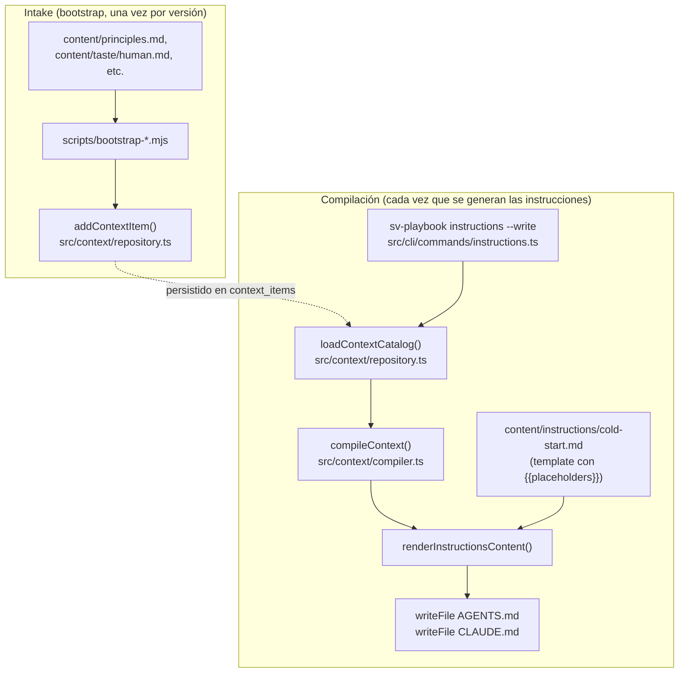

# Flujo 5: cold-start de contexto (`instructions --write`)

> Etapa 6 de la guía. Verificado contra el código real el 2026-07-20.
> Cubre cómo se genera `AGENTS.md`/`CLAUDE.md` a partir de una única
> fuente en DB — el mecanismo detrás de PRINCIPLE-004 (one source, N
> mirrors).

## Qué vamos a estudiar

Cómo un item de contexto (un principio, una regla de taste, el charter de
un rol) entra al catálogo, cómo se compila un "context pack" para un
rol+fase específicos, y cómo ese pack termina proyectado en los archivos
`AGENTS.md`/`CLAUDE.md` que leen los agentes al arrancar.

## Diagrama general



## Recorrido paso a paso

### 1. Acción que lo inicia

Dos disparadores distintos:
- **Intake**: al bootstrapear una instancia (o al modificar
  `content/principles.md`/`content/taste/*.md`), los scripts
  `scripts/bootstrap-principles.mjs`/`bootstrap-taste-human.mjs` corren y
  llaman `bootstrapVersionedContextItem()` para sincronizar el archivo
  markdown con la tabla `context_items`.
- **Compilación/proyección**: `sv-playbook instructions --write` (o
  `check instructions`, que compara sin escribir) — se corre en cada
  `npm run verify` y cada vez que un humano quiere refrescar el cold-start.

### 2. Archivo que recibe la acción de intake

**`src/context/repository.ts`**, función `addContextItem(store, item)`.

```ts
export function addContextItem(store: Store, item: ContextItemInput): void {
  validateInput(item);
  validateSelectorRoles(item);
  ...
  store.db.exec(BEGIN_WRITE);
  try {
    validateKindPrecedence(store, item);
    validateSupersessions(store, item, supersessionTargets);
    store.db.prepare(`INSERT INTO context_items (...) VALUES (...)`).run(...);
    insertValues(store, 'INSERT INTO context_item_tags ...', tags);
    insertValues(store, 'INSERT INTO context_item_selectors ...', selectors);
    insertValues(store, 'INSERT INTO context_item_dependencies ...', dependencies);
    insertValues(store, 'INSERT INTO context_item_supersessions ...', supersessions);
    insertValues(store, 'INSERT INTO context_item_capabilities ...', capabilities);
    supersedeTargets(store, supersessionTargets, now);
    store.db.exec('COMMIT');
  } catch (error) { store.db.exec('ROLLBACK'); throw error; }
}
```

Validaciones antes de insertar: campos requeridos no vacíos
(`validateInput`), selectores de rol conocidos (`validateSelectorRoles` —
un typo en un selector de rol falla en intake, no en tiempo de compilación
donde sería más difícil de rastrear), **`validateKindPrecedence`**: un
`kind` sin precedencia configurada envenenaría cualquier compilación
futura (`rankOf` en el compiler explota sobre él), así que se rechaza acá,
en el momento de intake, en vez de fallar más tarde y en otro lugar. Si el
item declara `supersedes`, `validateSupersessions` confirma que los
targets existen, están `ACTIVE`, y comparten el mismo `semanticKey` — y
`supersedeTargets` los marca `SUPERSEDED` en la misma transacción.

### 3. Idempotencia por contenido: `bootstrapVersionedContextItem()`

Este es el mecanismo que se corrigió esta semana (root cause de un CI-vs-
local drift). Los scripts de bootstrap anteriormente eran idempotentes
sólo **por ID** — si un item con ese ID ya estaba `ACTIVE`, no volvían a
insertar nada, sin importar si el body había cambiado en
`content/principles.md`. Eso significaba que editar un principio ya
cargado no se propagaba al store en un entorno con estado persistido
previo (a diferencia de CI, que siempre arranca con store limpio).

La corrección compara `digest(active.body)` contra `digest(item.body)`: si
difieren, crea una nueva versión con `supersedes` apuntando a la anterior
— reutilizando el mecanismo de versionado que ya existía, no un camino
paralelo de "update in place".

### 4. Compilación: `loadContextCatalog()` + `compileContext()`

**`renderInstructionsContent()`** (`src/cli/commands/instructions.ts`) es
el punto de entrada real:

```ts
const store = openStore(commonRoot(root));
const catalog = loadContextCatalog(store);
const pack = compileContext(catalog, {
  role: BUNDLED_ROLE_ID.HUMAN_INTERFACE,
  phase: 'intake',
  requestedCapabilities: [],
});
humanInterfaceContext = pack.items.map((item) => item.body).join('\n\n---\n\n');
```

`loadContextCatalog()` (`src/context/repository.ts`) reconstruye el
`ContextCatalog` completo desde las tablas normalizadas (`context_items` +
tags/selectors/dependencies/supersessions/capabilities), agrupando cada
tabla auxiliar por `item_id@item_version` antes de ensamblar los objetos
`StoredContextItem`.

`compileContext()` (`src/context/compiler.ts`, ver flujo de arquitectura
para el detalle del pipeline interno) resuelve, para
`role=human-interface, phase=intake`: qué items aplican por selector, sus
dependencias transitivas, gana el de mayor precedencia en cada conflicto
semántico, y arma un `CompiledContextPack` con `packId` reproducible
(derivado del digest semántico del resultado — mismo input, mismo
`packId`, siempre).

### 5. Transformación: template con placeholders

**`content/instructions/cold-start.md`** es el template fuente (markdown
con `{{productName}}`, `{{tier}}`, `{{verifyCommand}}`,
`{{humanInterfaceContext}}`). `renderInstructionsContent()` hace un
reemplazo literal de esos cuatro placeholders — no hay motor de templates,
es `String.replace` con regex global.

### 6. Servicios invocados

- `src/config.ts` — `loadConfig(root)`: `productName`, `tier`,
  `verifyCommand` vienen de la config de la instancia, no del contexto
  compilado.
- `src/content.ts` — `contentDir()`: resuelve dónde vive `content/` (útil
  tanto en el propio repo de sv-playbook como en un proyecto que lo
  adoptó).

### 7. Escritura de los mirrors

```ts
export async function renderInstructions(opts: RenderOptions): Promise<void> {
  const rendered = await renderInstructionsContent(opts.root);
  if (opts.write) {
    for (const harness of HARNESSES) {  // [{file:'AGENTS.md'}, {file:'CLAUDE.md'}]
      await writeFile(join(opts.root, harness.file), rendered, 'utf8');
    }
    opts.io.out('Instructions generated successfully.');
  } else {
    opts.io.out(rendered);
  }
}
```

Sin `--write`, el comando imprime el resultado a stdout (dry-run — útil
para revisar antes de aplicar). Con `--write`, escribe el MISMO contenido
renderizado a ambos archivos (`AGENTS.md` y `CLAUDE.md`) — son mirrors
idénticos del mismo origen (PRINCIPLE-004: canónico en una fuente, N
harness-specific files emitidos).

### 8. El gate que detecta drift: `check instructions`

**`src/cli/commands/check.ts`** compara el contenido actual de
`AGENTS.md`/`CLAUDE.md` contra lo que `renderInstructionsContent()`
generaría ahora mismo — si difieren, falla (`check` es parte de `npm run
verify`). Esta semana se le agregó una línea de diagnóstico
(`gitHead()` + digest renderizado) para poder diagnosticar más rápido
cuándo el drift viene de un commit sin regenerar vs. de un store
desalineado.

### 9. Manejo de estado

El catálogo de contexto es versionado, nunca editado in-place: cada cambio
de contenido crea una nueva versión activa y marca la anterior
`SUPERSEDED` (nunca se borra). Esto significa que el historial completo de
"qué decía este principio en cada momento" queda en la DB.

### 10. Manejo de errores

`ContextError` (`src/context/context.errors.ts`) con códigos específicos:
`MISSING_PRECEDENCE`, `INVALID_SUPERSESSION`, `UNKNOWN_ROLE_SELECTOR`,
`DEPENDENCY_CYCLE`, `CONTEXT_CONFLICT`, `CAPABILITY_CONFLICT` — cada uno
mapea a un motivo específico por el que la compilación (o el intake) no
puede producir un resultado inequívoco. Ninguno se resuelve
arbitrariamente: todos son fail-closed.

### 11. Qué datos se leen/escriben

Tablas: `context_items`, `context_item_tags`, `context_item_selectors`,
`context_item_dependencies`, `context_item_supersessions`,
`context_item_capabilities`, `context_precedence`. Archivos: `content/*.md`
(fuente, versionada en git), `AGENTS.md`/`CLAUDE.md` en la raíz del repo
(generados, también versionados en git — el gate de `check` es lo que
mantiene ambos sincronizados).

### 12. Resultado que produce el flujo

`AGENTS.md` y `CLAUDE.md` actualizados con contenido idéntico, listos para
que cualquier harness de agente (Claude Code, otros) los lea al arrancar
una sesión en este repo.

### 13. Qué continúa después

Un agente que arranca en este repo lee `AGENTS.md`/`CLAUDE.md` como su
cold-start — es literalmente el contenido que el propio lector de esta
guía tiene cargado como contexto de sistema en este momento.

### 14. Dónde finaliza el recorrido

En los dos archivos markdown escritos en la raíz del repo, más el
resultado de `check instructions` en la próxima corrida de `verify`
confirmando que siguen sincronizados con la fuente.

## Archivos involucrados

| Archivo | Responsabilidad |
|---|---|
| `content/principles.md`, `content/taste/*.md` | Fuente autoral en markdown |
| `content/instructions/cold-start.md` | Template con placeholders |
| `scripts/bootstrap-principles.mjs`, `scripts/bootstrap-taste-human.mjs` | Sincronizan markdown -> `context_items` |
| `src/context/repository.ts` | `addContextItem`, `bootstrapVersionedContextItem`, `loadContextCatalog` |
| `src/context/compiler.ts` | `compileContext()` — selección, dependencias, resolución de conflictos |
| `src/context/digest.ts` | `digest()`, `compareOrdinal()` |
| `src/cli/commands/instructions.ts` | `renderInstructionsContent`, `renderInstructions`, comando `instructions` |
| `src/cli/commands/check.ts` | Gate `check instructions` — detecta drift |
| `src/config.ts` | `productName`, `tier`, `verifyCommand` de la instancia |

## Resultado final

Dos archivos (`AGENTS.md`, `CLAUDE.md`) generados desde una única fuente
versionada en DB, con un gate mecánico que impide que diverjan del
contenido real de `content/`.

## Antes de continuar

Para la próxima etapa (lifecycle del daemon) conviene tener claro:
- Que el contexto es un catálogo versionado con resolución de conflictos
  por precedencia — el mismo mecanismo (`compileContext`) sirve tanto para
  el cold-start humano como para el contexto que recibe un agente
  despachado por el gateway (ver flujo 8, pendiente).
- Que la idempotencia por digest (no sólo por ID) es lo que evita el drift
  entre un store con estado previo y uno recién creado.

## Resumen de lo aprendido

- `AGENTS.md`/`CLAUDE.md` no se editan a mano — son proyecciones de un
  catálogo de contexto versionado en DB, regeneradas por
  `instructions --write`.
- El intake (`addContextItem`) valida invariantes ANTES de persistir
  (precedencia configurada, supersessions válidas) para que ningún item
  inválido pueda envenenar una compilación futura.
- La idempotencia del bootstrap es por contenido (digest del body), no
  sólo por ID — así una edición de `content/principles.md` siempre se
  propaga, tenga o no el store estado previo.
- `check instructions` es el gate mecánico que mantiene los mirrors
  sincronizados con la fuente — parte de `npm run verify`.
