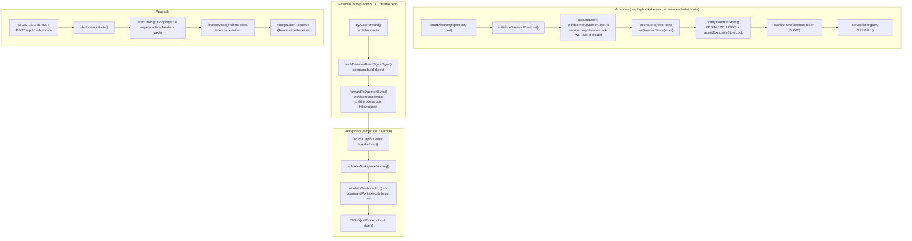

# Flujo 6: lifecycle del daemon (ownership, forwarding, shutdown)

> Etapa 7 de la guía. Verificado contra el código real el 2026-07-20.
> Profundiza el flujo 2 (persistencia) del lado del daemon: cómo arranca,
> cómo recibe comandos reenviados, y cómo se apaga.

> ⚠️ **Gap detectado durante esta etapa**: mientras se escribía esta
> sección se encontró un comentario ya agregado en `daemon.ts` que
> afirmaba (incorrectamente) que `serve.ts` escucha `daemon.done` para
> cerrarse cuando el daemon se apaga solo. Verificado contra el código
> real: **no lo hace**. El fix real vive sin mergear en la rama
> `fix/serve-shutdown-lifecycle-v2` (commit `3f2f0f5`). El comentario ya
> se corrigió; este documento describe el estado REAL de `main`, no el
> estado deseado. Ver "Antes de continuar" al final.

## Qué vamos a estudiar

Cómo arranca el proceso daemon (lock, store, token), cómo un CLI directo
detecta que hay un daemon vivo y le reenvía el comando entero por HTTP, y
qué pasa exactamente al apagarse (drenado, limpieza, y el gap real de
`serve` no enterándose de un apagado iniciado por el propio daemon).

## Diagrama general



## Recorrido paso a paso

### 1. Acción que lo inicia

`sv-playbook daemon` (proceso daemon dedicado) o `sv-playbook serve`
(arranca el daemon EN EL MISMO PROCESO, sin `spawn`/`fork` — confirmado por
grep, no hay child_process cerca de `startDaemon()`). Del otro lado,
cualquier invocación normal del CLI que detecta un daemon vivo también
"inicia" este flujo, del lado del reenvío.

### 2. Archivo que recibe la acción de arranque

**`src/daemon/daemon.ts`**, función `startDaemon(repoRoot, port)`:

```ts
export async function startDaemon(repoRoot: string, port: number): Promise<DaemonInstance> {
  const { main } = await import('../cli/main.js');
  const commandPort: CommandPort = { execute: (argv, io) => main(argv, io) };
  return createDaemon(repoRoot, port, createProductionDaemonDeps(commandPort));
}
```

El `commandPort` delega en el MISMO `main()` que corre un CLI directo (ver
flujo 1) — el daemon no reimplementa el despacho de comandos, sólo le da
un transporte HTTP y garantiza que corre en un único proceso con el store
ya abierto.

### 3. Validaciones/orden de arranque: `initializeDaemonRuntime()`

```ts
function initializeDaemonRuntime(repoRoot: string, port: number): DaemonRuntime {
  const svpDir = join(repoRoot, SVP_DIR);
  mkdirSync(svpDir, { recursive: true, mode: 0o700 });
  const lockPath = join(svpDir, DAEMON_LOCK_FILE);
  const tokenPath = join(svpDir, DAEMON_TOKEN_FILE);
  if (isDaemonRunning(repoRoot)) throw new Error('daemon is already running for this repo');
  const token = generateToken();
  const state = createTerminationState(lockPath, tokenPath);
  acquireLock(lockPath, process.pid, port, token);
  const store = openDaemonStore(repoRoot, lockPath);
  setDaemonStore(store);
  state.store = store;
  verifyDaemonStore(store, join(resolveStoreDir(repoRoot), DB_FILE), lockPath);
  ...
  writeSync(tokenFd, `${token}\n`);
}
```

El orden importa:
1. **Lock de PID primero** (`acquireLock`, `src/daemon/daemon.lock.ts`):
   `openSync(lockPath, 'wx', ...)` — el flag `wx` falla si el archivo ya
   existe, así que dos daemons arrancando en carrera nunca pisan el lock
   del otro (uno gana, el otro recibe `'daemon is already running for
   this repo (lock file race)'`).
2. **Abrir el store** (`openStore` + `setDaemonStore`): deja el store
   disponible para TODO el proceso vía el handle compartido (ver flujo 2)
   — cualquier comando que corra dentro de este proceso daemon lo reutiliza
   en vez de abrir su propia conexión.
3. **Verificar el lock exclusivo real** (`verifyDaemonStore`): `BEGIN
   EXCLUSIVE` + `COMMIT` fuerza a SQLite a tomar y liberar el lock una vez,
   para que `assertExclusiveStoreLock()` (`src/db/inspection.ts`, no
   profundizado) pueda confirmar contra el archivo de lock del SO que este
   proceso realmente tiene el lock exclusivo — no sólo que
   `better-sqlite3` no tiró error. Si falla, se deshace todo lo anterior
   (store, lock file).
4. **Recién ahí, el token nuevo** (0o600, sólo el dueño del proceso puede
   leerlo) — ningún cliente HTTP puede autenticar `exec`/`shutdown` sin él.

El archivo de lock guarda 4 líneas: `pid\nport\ntimestamp\nnonce` — el
nonce (mismo valor que el token) es lo que usa `checkDaemonIdentity()`
(`src/db/store.ts`, ver flujo 2) para detectar reutilización de PID: si el
PID del lock sigue vivo pero el nonce no coincide con el token actual, es
un proceso distinto que heredó el mismo PID por casualidad del SO, no el
daemon real.

### 4. El lado del reenvío: `tryAutoForward()` + `forwardToDaemonSync()`

Ya cubierto en el flujo 2 el disparo de `tryAutoForward()`. El transporte
real (`src/daemon/client.ts`, `forwardToDaemonSync()`) corre en un
**child process de Node separado** (`spawnSync` con un script generado
inline vía `NODE_EVAL_FLAG`) — necesario para poder esperar el resultado
de forma **síncrona** desde código que se ejecuta al importar un módulo
(`store.ts`), donde no hay forma de `await` una promesa nativa. El child
hace el POST HTTP real, refleja stdout/stderr, y sale con el exit code
reportado por el daemon (o `1` en cualquier falla de transporte/parseo).

`readSessionId()` en el mismo archivo camina hacia arriba desde el cwd
buscando `.svp/session` sin cruzar el límite `.git` del worktree — así una
invocación desde un subdirectorio sigue encontrando la sesión persistida
del worktree.

### 5. Recepción del comando reenviado: `handleExec()`

Ver flujo 1 para el despacho interno (`main()` vía `commandPort`). Lo
específico de este flujo:

```ts
function handleExec(token, state, commandPort, req, res, repoRoot): void {
  if (state.stopping) { jsonResponse(res, 503, { error: ERR_SHUTTING_DOWN }); return; }
  const p = readBody(req).then((raw) => {
    if (state.stopping) { ...503...; return; }
    const parsed = parseExecRequest(raw, token, res);   // valida token
    ...
    enforceWorkspaceBinding(store, repoRoot, parsed.ctx); // valida que el cwd remoto pertenece a este repo
    const execP = Promise.resolve().then(() => runWithContext(parsed.ctx, () => commandPort.execute(parsed.argv, execIo)));
    ...
  });
  trackHandler(state, p);
}
```

`trackHandler()` registra la promesa en `state.activeHandlers` — es lo que
permite al apagado saber cuándo ya no queda trabajo en curso (ver paso 7).
Cada request trae su propio `ExecutionContext` (cwd/sessionId de quien lo
originó) y se ejecuta con `runWithContext` para que `getCwd()` (ver flujo
2, `src/runtime/context.ts`) resuelva al cwd del cliente remoto, no al del
proceso daemon.

### 6. Servicios invocados

- `src/daemon/daemon.context.ts` — `enforceWorkspaceBinding`,
  `parseExecContext`.
- `src/daemon/daemon.production.ts` — `createProductionDaemonDeps()`
  (inyecta el `SignalPort` real de `process.on`, no profundizado).
- `src/db/inspection.ts` — `assertExclusiveStoreLock()`.

### 7. Manejo de estado: apagado con drenado

```ts
function createShutdownControl(state, backgroundWorker) {
  const initiate = () => {
    if (state.stopping) return;
    backgroundWorker?.stop()...
    startDrain(state);              // state.stopping = true
    state.server?.close((error) => { ...; finalizeAfterDrain(state); });
  };
  ...
}
```

`startDrain()` (`src/daemon/daemon.lifecycle.ts`) marca `stopping = true`
y resuelve `drainLatch` inmediatamente SI no hay handlers activos; si los
hay, `drainLatch` queda pendiente hasta que el último handler trackeado
termine (`trackHandler`'s `.finally()` llama `resolveDrainIfReady`).
`finalizeOnce()` corre la limpieza real UNA sola vez (protegido por
`state.finalized`): desuscribe señales, cierra el store, borra lock y
token — cada paso envuelto para que un fallo en uno no impida los
siguientes (`collectCleanupError`, primer error capturado, no oculta los
demás intentos).

Dos disparadores de apagado: señales del SO (`SIGINT`/`SIGTERM`, vía
`subscribeToSignals`) y la ruta HTTP `POST /api/v1/shutdown`
(`handleShutdown`, requiere el mismo token) — así el daemon se puede parar
tanto desde la terminal donde corre como remotamente vía HTTP autenticado.

### 8. El gap real: `serve` y un apagado iniciado por el daemon

`sv-playbook serve` (`src/cli/commands/serve.ts`) arranca el daemon
EN-PROCESO y expone además su propia consola HTTP. Su función `stop()`
está conectada a `SIGINT`/`SIGTERM` y al evento `error` del PROPIO server
HTTP de la consola:

```ts
const stop = async (code: number): Promise<void> => {
  ...
  server.close();
  await daemon.stop();
  ...
};
process.on('SIGINT', onSignal);
process.on('SIGTERM', onSignal);
server.on(PROCESS_EVENT.ERROR, (error) => { ...; void stop(EXIT.SYSTEM); });
```

**No hay ningún listener sobre `daemon.done`** (la promesa que resuelve
cuando el daemon termina por su cuenta, ej. vía su propia ruta HTTP
`/shutdown`). Si algo apaga el daemon sin pasar por el `stop()` de
`serve`, la consola operativa queda corriendo con un daemon muerto debajo.
El fix (suscribir `daemon.done.then(() => stop())`) existe en la rama
`fix/serve-shutdown-lifecycle-v2` (commit `3f2f0f5`) pero **no está
mergeado a `main`** — confirmado con `git merge-base --is-ancestor` durante
la redacción de esta etapa.

### 9. Manejo de errores

`DaemonListenError` (`src/daemon/daemon.errors.ts`) si el `listen()` falla
(puerto ocupado, etc.) — se espera a que la limpieza de terminación
complete (`receiptLatch`) antes de rechazar, así el error que se propaga
ya incluye el resultado final de la limpieza. `StoreVersionError` si
`verifyDaemonStore` falla.

### 10. Qué datos se leen/escriben

`.svp/daemon.lock` (pid/port/timestamp/nonce), `.svp/daemon-token`
(secreto de autenticación HTTP), y el store SQLite completo (el daemon es
el único que lo tiene abierto en modo exclusivo mientras corre).

### 11. Resultado que produce el flujo

Del lado arranque: un `DaemonInstance` (`{ port, token, store, done,
stop() }`) — `done` es `state.receiptLatch`, la promesa que resuelve con
el `TerminationReceipt` cuando el daemon termina, sea cual sea la causa.
Del lado reenvío: el exit code + stdout/stderr del comando ejecutado
remotamente, indistinguible (para quien invocó el CLI) de haberlo corrido
localmente.

### 12. Qué continúa después

Si `serve` inició el daemon, sigue sirviendo la consola operativa (flujo
7) usando `daemon.store` directamente hasta que algo dispare su propio
`stop()`.

### 13. Dónde finaliza el recorrido

En el `TerminationReceipt` (`{ cause, causal, clean }`) que resuelve
`daemon.done` — `clean: true` si no hubo ningún error causal ni de
limpieza, `false` en caso contrario.

## Archivos involucrados

| Archivo | Responsabilidad |
|---|---|
| `src/daemon/daemon.ts` | `startDaemon`, `createDaemon`, `handleExec`, `handleShutdown`, arranque completo |
| `src/daemon/daemon.lock.ts` | `generateToken`, `acquireLock` (wx atómico), `removeLock` |
| `src/daemon/daemon.lifecycle.ts` | `createTerminationState`, `startDrain`, `trackHandler`, `finalizeOnce` |
| `src/daemon/client.ts` | `forwardToDaemonSync`, `fetchDaemonBuildDigestSync` — lado cliente |
| `src/daemon/daemon.context.ts` | `enforceWorkspaceBinding`, `parseExecContext` |
| `src/daemon/daemon.production.ts` | `createProductionDaemonDeps` — wiring de dependencias reales |
| `src/daemon/daemon.constants.ts` | Nombres de archivos, puerto default, rutas HTTP |
| `src/cli/commands/serve.ts` | Arranca el daemon en-proceso + consola HTTP — el gap de shutdown vive acá |
| `src/db/store.ts` | `isDaemonRunning`, `checkDaemonIdentity`, `setDaemonStore` |

## Resultado final

Un proceso daemon con lock exclusivo real (verificado, no sólo asumido),
un store compartido por todo comando que corre dentro de él, y un
transporte HTTP autenticado por token para recibir comandos reenviados
desde cualquier otro proceso CLI del mismo repo.

## Antes de continuar

Para la próxima etapa (consola serve) conviene tener claro:
- **El gap de shutdown documentado arriba sigue sin resolver en `main`** —
  si en algún momento se mergea `fix/serve-shutdown-lifecycle-v2`, este
  documento necesita actualizarse.
- Que `daemon.store` es el MISMO objeto que usa la consola de `serve`
  directamente (no abre su propia conexión) — ver flujo 7.
- Que el token vive en un archivo con permisos 0o600 — la autenticación
  HTTP del daemon depende enteramente de acceso al filesystem local, no
  hay ningún otro mecanismo de auth.

## Resumen de lo aprendido

- El arranque tiene un orden estricto: lock -> store -> verificación real
  del lock exclusivo -> token — cada paso puede deshacer los anteriores si
  falla.
- El reenvío corre en un child process separado para poder esperarse de
  forma síncrona desde código de import-time.
- El apagado drena trabajo en curso (`activeHandlers`) antes de limpiar,
  y la limpieza en sí nunca se salta un paso por el fallo de otro.
- Hay un gap real y confirmado: `serve` no reacciona a un apagado del
  daemon que no haya iniciado él mismo — el fix existe pero no está en
  `main`.
