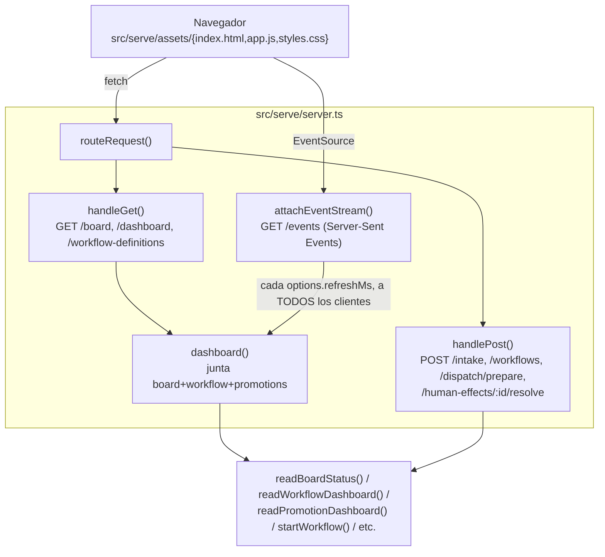

# Flujo 7: consola operativa HTTP (`serve`)

> Etapa 8 de la guía. Verificado contra el código real el 2026-07-20.
> Complementa el flujo 6 (daemon lifecycle) — acá el foco es la consola
> HTTP en sí, no el daemon que arranca debajo.

> ⚠️ **Hallazgo real encontrado en esta etapa**: el push periódico por SSE
> reenvía el historial COMPLETO de eventos de workflow en cada tick, sin
> acotar — documentado como F-002 en `findings.md`. Ver sección 7 abajo.

## Qué vamos a estudiar

Cómo `sv-playbook serve` expone una API REST + un stream de eventos
(Server-Sent Events) sobre el mismo store que usa el daemon, para que
varios clientes puedan ver — y en algunos casos accionar — el estado del
sistema en vivo, sin tener que invocar el CLI repetidamente.

## Diagrama general



## Recorrido paso a paso

### 1. Acción que lo inicia

`sv-playbook serve` (ver flujo 6 para el arranque del daemon embebido) o,
una vez arrancado, cualquier request HTTP a `http://127.0.0.1:<port>`
(default `SERVE_DEFAULT.PORT`) — desde un navegador abriendo la consola,
o cualquier cliente HTTP.

### 2. Archivo que recibe la ejecución

**`src/serve/server.ts`**, función `createOperationalServer(store,
repoRoot, options)` — llamada desde `runServer()` en
`src/cli/commands/serve.ts` con `daemon.store` (el mismo store abierto por
el daemon embebido, ver flujo 6) y `options.refreshMs`.

### 3. Assets estáticos

```ts
const STATIC_ASSETS = new Map([
  [SERVE_ROUTE.ROOT, { path: join(UI_ROOT, 'index.html'), type: CONTENT_TYPE.HTML }],
  [SERVE_ROUTE.APP, { path: join(UI_ROOT, 'app.js'), type: CONTENT_TYPE.JAVASCRIPT }],
  [SERVE_ROUTE.STYLES, { path: join(UI_ROOT, 'styles.css'), type: CONTENT_TYPE.CSS }],
  [SERVE_ROUTE.ICONS, { path: join(UI_ROOT, 'icons.mjs'), type: CONTENT_TYPE.JAVASCRIPT }],
]);
```

`UI_ROOT` se resuelve con `fileURLToPath(new URL('./assets', import.meta.url))`
— relativo al propio módulo compilado en `dist/`, no al cwd del proceso.
Sin frontend framework: HTML/CSS/JS plano, `app.js` es un módulo ES nativo
sin build step propio.

### 4. Rutas GET (lectura)

```ts
function handleGet(store, repoRoot, url, res): boolean {
  if (staticResponse(url, res)) return true;
  if (url.pathname === SERVE_ROUTE.BOARD) { sendJson(res, 200, readBoardStatus(store, repoRoot)); return true; }
  if (url.pathname === SERVE_ROUTE.DASHBOARD) { sendJson(res, 200, dashboard(store, repoRoot)); return true; }
  if (url.pathname === SERVE_ROUTE.WORKFLOW_DEFINITIONS) { sendJson(res, 200, readWorkflowLaunchCatalog(store)); return true; }
  return false;
}
```

`dashboard()` junta tres dominios en un único objeto
(`OperationalDashboard`): `board` (`readBoardStatus`, ver flujo 3 — el
mismo dato que muestra `sv-playbook status`), `workflow`
(`readWorkflowDashboard`, `src/orchestration/observability.ts` — runs de
workflow, efectos, acciones humanas pendientes, eventos, runs de agentes)
y `promotions` (`readPromotionDashboard`, ver flujo 4). Todas son
lecturas de sólo consulta, sin mutar nada.

### 5. Rutas POST (acción)

Cuatro acciones posibles, cada una con su propio parser/validador de body
(`humanIntake`, `workflowStart`, `workRunSpecRequest`, `humanResolution`
— todos funciones puras que lanzan `TypeError` si el shape no es válido,
ANTES de tocar el store):

- `POST /intake` → `startHumanIntake()` (orquestación, no cubierta en
  detalle en esta etapa).
- `POST /workflows` → `startWorkflow()`.
- `POST /dispatch/prepare` → `prepareRunSpec()` (puente hacia el gateway,
  ver flujo 8).
- `POST /human-effects/:id/resolve` → `resolveHumanWorkflowEffect()`
  (resuelve una acción humana pendiente identificada por `effectId`,
  extraído del pathname con `resolutionEffectId()`).

Todos los errores del dominio (`ContextError`, `WorkDefinitionError`) se
mapean a HTTP `409 Conflict` con `{code, error}`; cualquier otro error
(típicamente de parseo/validación) cae en `400 Bad Request` genérico —
ver `routeRequest()`'s `.catch()`.

### 6. Validaciones antes de ejecutar

`readBody()` acumula el body y rechaza si excede
`SERVE_DEFAULT.MAX_BODY_BYTES` (protección básica contra un cliente
enviando un payload enorme). Cada parser de body (`workflowStart`,
`workRunSpecRequest`, etc.) valida campos requeridos y tipos ANTES de
llamar a cualquier función de dominio — igual patrón que el resto del CLI
(validar en el borde, confiar adentro).

### 7. El stream en vivo: `attachEventStream()` — y el hallazgo F-002

```ts
function attachEventStream(store, repoRoot, req, res, clients): void {
  res.writeHead(200, { 'Content-Type': 'text/event-stream', 'Cache-Control': 'no-cache', Connection: 'keep-alive' });
  clients.add(res);
  writeDashboard(store, repoRoot, res);   // push inicial
  req.on('close', () => { clients.delete(res); });
}
// ...
const timer = setInterval(() => {
  if (clients.size === 0) return;
  for (const client of clients) writeDashboard(store, repoRoot, client);
}, options.refreshMs);
```

Cada cliente conectado a `GET /events` recibe un push inicial y luego uno
cada `options.refreshMs`, con el `dashboard()` completo recalculado desde
cero — no hay diffing, cada tick es un snapshot íntegro.

**El problema real**: `dashboard()` llama `readWorkflowDashboard(store)`
sin pasar `afterSeq` — y esa función tiene un default de `0`. Eso
significa que **cada tick, para cada cliente, se recalculan y reenvían
TODOS los eventos de workflow desde el inicio del proyecto**, no sólo los
nuevos. El campo `lastEventSeq` que la función devuelve (pensado,
aparentemente, para paginación incremental) no lo consume nadie: ni el
server lo persiste por cliente, ni el cliente (`app.js`) lo lee — sólo
hace `state.dashboard = value` a lo bruto en cada mensaje SSE. Confirmado
con grep: ningún llamador de producción de `readWorkflowDashboard` pasa
`afterSeq` distinto de `0`. Documentado como **F-002** en `findings.md` —
no corregido acá, sólo señalado.

### 8. Servicios invocados

- `src/status/status.ts` — `readBoardStatus` (flujo 3).
- `src/orchestration/observability.ts` — `readWorkflowDashboard`.
- `src/orchestration/launch-catalog.ts` — `readWorkflowLaunchCatalog`.
- `src/orchestration/service.ts` — `startWorkflow`.
- `src/orchestration/human-intake.ts` — `startHumanIntake`.
- `src/orchestration/effect-completion.ts` — `resolveHumanWorkflowEffect`.
- `src/gateway/run-spec.ts` — `prepareRunSpec` (ver flujo 8).
- `src/promotion/promotion.receipts.ts` — `readPromotionDashboard`.

### 9. Dependencias externas

Ninguna — todo el estado sale del mismo `store` que ya tiene abierto el
daemon embebido (ver flujo 6). No hay llamadas de red salientes desde este
archivo.

### 10. Manejo de estado

`clients: Set<ServerResponse>` es el único estado propio de este módulo —
vive en memoria del proceso, se pierde si el servidor se reinicia (cada
cliente simplemente reconecta su `EventSource` y recibe un push inicial
nuevo). `setInterval` se limpia en el evento `close` del server
(`clearInterval(timer)`), evitando que el timer siga corriendo tras un
`server.close()`.

### 11. Manejo de errores

`routeRequest()` envuelve toda la lógica async en un único `.catch()`
que clasifica el error (típico vs. desconocido) y responde con el status
HTTP correspondiente — nunca deja una promesa rechazada sin manejar
colgando el request.

### 12. Qué datos se leen/escriben

Sólo lectura en las rutas `GET`. Las rutas `POST` escriben en las tablas
de `src/orchestration/` (workflows, efectos, artifacts) según la acción —
no se detalla acá, corresponde al flujo de orquestación (no cubierto en
profundidad todavía).

### 13. Qué continúa después

El navegador recibe el dashboard actualizado y re-renderiza (`app.js`,
`renderDashboard()` y funciones asociadas — no detallado línea por línea
en esta etapa). Las acciones `POST` disparan efectos en el motor de
workflows durables (ver flujo 2 del backlog de flujos: orchestration,
`docs/codebase-guide/glossary.md`).

### 14. Dónde finaliza el recorrido

En la respuesta HTTP (para `GET`/`POST` puntuales) o en el flujo continuo
de mensajes SSE mientras el cliente mantenga la conexión `/events`
abierta.

## Archivos involucrados

| Archivo | Responsabilidad |
|---|---|
| `src/serve/server.ts` | `createOperationalServer`, ruteo REST + SSE |
| `src/serve/server.types.ts` | `OperationalDashboard`, tipos de request bodies |
| `src/serve/server.constants.ts` | `CONTENT_TYPE`, `SSE_EVENT`, límites |
| `src/serve/assets/index.html`, `app.js`, `styles.css`, `icons.mjs` | Frontend plano, sin build step |
| `src/cli/commands/serve.ts` | Arranca daemon + esta consola, maneja señales |
| `src/cli/commands/serve.constants.ts` | `SERVE_ROUTE`, `SERVE_DEFAULT` |
| `src/orchestration/observability.ts` | `readWorkflowDashboard` — el origen del hallazgo F-002 |
| `src/status/status.ts` | `readBoardStatus` |
| `src/promotion/promotion.receipts.ts` | `readPromotionDashboard` |

## Resultado final

Una consola HTTP de sólo-lectura-más-algunas-acciones sobre el mismo
estado que ve el CLI, con un canal en vivo (SSE) — útil para observar el
sistema sin repetir `sv-playbook status` a mano, aunque con el problema de
escalabilidad de F-002 sin resolver.

## Antes de continuar

Para la próxima etapa (dispatch a agentes vía gateway) conviene tener
claro:
- Que `POST /dispatch/prepare` es el puente real hacia el gateway
  (`prepareRunSpec`) — es donde termina este flujo y empieza el flujo 8.
- Que F-002 es un problema de crecimiento no acotado, no un bug que rompa
  funcionalmente hoy — pero empeora con el tiempo a medida que el
  proyecto acumula eventos de workflow.

## Resumen de lo aprendido

- La consola no tiene estado propio persistente — todo sale del store
  compartido con el daemon en cada request.
- El SSE reenvía un snapshot completo en cada tick, no un diff — y ese
  snapshot incluye, sin querer, TODO el historial de eventos de workflow
  desde el origen (F-002).
- Los parsers de body validan estrictamente antes de tocar cualquier
  función de dominio — mismo patrón "validar en el borde" que el resto
  del CLI.
- No hay autenticación en esta consola (a diferencia del daemon, que
  exige token) — sólo escucha en `127.0.0.1`, confía en que el acceso a
  ese puerto ya implica confianza local.
