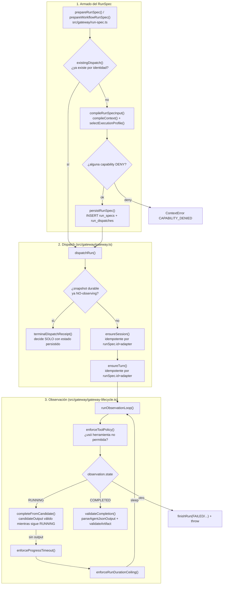

# Flujo 8: dispatch a agentes externos (gateway)

> Etapa 9 de la guía. Verificado contra el código real el 2026-07-20.
> Cubre cómo un rol+fase termina convertido en una corrida real de un
> agente de IA externo (hoy sólo el adapter `opencode`), observada hasta
> su finalización, con el resultado validado contra un contrato.

## Qué vamos a estudiar

Cómo se arma un `RunSpec` (la "orden de trabajo" completa para un agente:
rol, contexto compilado, contrato de salida esperado, perfil de
ejecución), cómo se idempotiza por identidad para no duplicar dispatches,
y el loop de observación que vigila el turno hasta que termina —
incluyendo los tres mecanismos de corte (política de herramientas, timeout
de progreso, techo de duración).

## Diagrama general



## Recorrido paso a paso

### 1. Acción que lo inicia

Dos caminos de entrada: `prepareRunSpec()` (dispatch manual, ej. desde
`POST /dispatch/prepare` en la consola serve, flujo 7 — para un
`workDefinitionRef` concreto) o `prepareWorkflowRunSpec()` (dispatch
automático, disparado por el motor de orquestación cuando un
`WorkflowEffect` con `executor = AGENT` necesita correr).

### 2. Archivo que arma el `RunSpec`

**`src/gateway/run-spec.ts`**. Ambas entradas convergen en
`prepareResolved(store, request, snapshot?)`.

### 3. Validación de idempotencia: `existingDispatch()`

```ts
function existingDispatch(store, request, snapshot) {
  const row = store.orm.select(...).from(runDispatches).where(and(
    eq(runDispatches.dispatchRef, request.storageDispatchRef),
    eq(runDispatches.roleId, request.roleId),
    eq(runDispatches.phase, request.phase),
  )).get();
  if (row === undefined) return undefined;
  if (row.subjectRef !== request.storageSubjectRef) throw ...;  // cross-bind
  const existing = loadRunSpec(store, row.id);
  if (existing.inputArtifactId !== request.inputArtifactId) throw ...;   // identidad cambió
  if (snapshot !== undefined && existing.outputContractRef !== snapshot.outputContractRef) throw ...;
  validateExistingBindings(existing, request);   // work definition digest, workflow effect id
  return existing;
}
```

La clave de idempotencia es `(dispatchRef, roleId, phase)` — si ya existe
un dispatch con esa identidad exacta, se devuelve el `RunSpec` existente
SIN volver a compilar nada. Si algún campo que debería ser estable
(artifact de input, contrato de salida, digest de work definition) cambió
respecto al dispatch original, se rechaza como error en vez de crear una
identidad ambigua — "preparar" el mismo trabajo dos veces nunca duplica,
pero tampoco permite reusar la identidad para algo distinto.

### 4. Compilación: `compileRunSpecInput()`

Si no existe, se compila desde cero:

```ts
const profile = request.executionProfileId === undefined
  ? selectExecutionProfile(store, request.roleId)
  : loadExecutionProfile(store, request.executionProfileId);
validateProfile(request, profile);   // enabled + roleId coincide
...
const pack = compileContext(loadContextCatalog(store), contextInput);   // ver flujo 5
const denied = pack.capabilities.filter((c) => c.effect === CAPABILITY_EFFECT.DENY);
if (denied.length > 0) throw new ContextError(RUN_SPEC_ERROR.CAPABILITY_DENIED, ...);
persistContextPack(store, contextInput, pack);
```

El mismo `compileContext()` del flujo 5 (cold-start) se reutiliza acá para
resolver qué contexto le corresponde a este rol+fase+tarea — con
`contextAttributes()` agregando atributos específicos de la tarea (el
work definition o el workflow effect referenciado) para que los
selectores de contexto puedan apuntar a "este tipo de trabajo
específicamente". Si el pack resultante deniega alguna capability
solicitada, el dispatch se rechaza ANTES de gastar un turno de agente real
— un rol nunca puede terminar corriendo con una capability que su
contexto compilado le niega.

### 5. Persistencia: identidad + duplicado por contenido

```ts
function persistRunSpec(store, request, input, executionProfile) {
  const specDigest = digest(input);
  const duplicate = store.orm.select(...).where(eq(runSpecs.specDigest, specDigest)).get();
  if (duplicate !== undefined) throw new ContextError(RUN_SPEC_ERROR.INVALID, `run spec exists without durable dispatch identity: ${duplicate.id}`);
  ...
}
```

Dos capas de deduplicación: por identidad de dispatch (paso 3, la
esperada) y por contenido exacto del spec (`specDigest`, una red de
seguridad — si dos identidades de dispatch distintas producen exactamente
el mismo contenido compilado, algo está mal en cómo se construyó la
identidad, y se rechaza en vez de crear dos `RunSpec` indistinguibles).

### 6. Dispatch real: patrón terminal-first

**`src/gateway/gateway.ts`**, `dispatchRun(store, runSpecId, adapters,
directory, runtime?)`:

```ts
const snapshot = loadRunSnapshot(store, runSpec.id);
if (snapshot !== undefined && !isRunObserving(snapshot)) {
  return terminalDispatchReceipt(store, runSpec, adapter);   // decide SOLO con estado persistido
}
...
const profile = await adapter.verifyProfile(runSpec, directory);
const session = await ensureSession(store, runSpec, adapter, profile, directory);
const turn = await ensureTurn(store, runSpec, adapter, session, directory);
const persisted = durableCompletion(store, runSpec, turn);
const completion = persisted ?? await observeTurnToCompletion(store, runSpec, adapter, turn.receipt, ...);
```

Si el run ya tiene un snapshot durable que no está `OBSERVING`, la
decisión se toma enteramente desde ese estado persistido — nunca se
vuelve a contactar al adapter externo. Sólo cuando el run está
genuinamente en curso (o nunca empezó) se paga el costo real de verificar
perfil, sesión y turno.

`ensureSession()`/`ensureTurn()` son también idempotentes por identidad
(`runSpec.id` + `adapter`): si ya hay una sesión/turno durable, se
reutiliza — "preparar" el mismo run nunca duplica trabajo contra el
provider externo. Si el `profileDigest` de la sesión persistida no
coincide con el perfil verificado ahora, se rechaza (la config del rol
cambió bajo los pies del run).

### 7. Servicios invocados

- `src/roles/catalog-activation.ts` — `requireActiveRoleCatalog()`.
- `src/roles/model-capability-evidence.ts` — `requireExecutionProfileModelEvidence()`.
- `src/gateway/prompt.ts` — `renderRunPrompt()` (arma el prompt real que
  recibe el agente).
- `src/contracts/artifacts.ts` — `resolvedArtifactSchema()`,
  `validateArtifact()` (ver flujo de contratos, no cubierto en
  profundidad aún).
- `src/gateway/adapter-registry.ts` — mapea `adapterId` a la
  implementación concreta de `AgentAdapter` (hoy sólo `opencode`).

### 8. El loop de observación: tres mecanismos de corte

**`src/gateway/gateway-lifecycle.ts`**, `runObservationLoop()` — corre
mientras el turno sigue `RUNNING`, en cada iteración:

1. **`enforceToolPolicy()`**: si el agente usó una herramienta no
   permitida por su `executionProfile.tools`, cancela el run
   (`cancelAndAwait`, con un `deadline` de gracia) y termina como
   `POLICY_BLOCKED` (si la cancelación se confirmó) o `FAILED` (si no).
2. **`completeFromCandidate()`**: mientras el run sigue `RUNNING`, si el
   adapter reporta un `candidateOutput` que ya parsea y valida contra el
   contrato de salida, el run se da por completado ANTES de que el
   adapter reporte formalmente `COMPLETED` — optimización para no esperar
   al cierre completo de la sesión del provider si ya hay un output
   válido en tránsito. Intenta cancelar la sesión del provider como buena
   práctica (best-effort, no bloquea si falla).
3. **`enforceProgressTimeout()`**: si no hubo cambio de `progressToken`
   en más de `runSpec.noProgressTimeoutMs`, cancela y termina
   `TIMED_OUT`/`FAILED`.
4. **`enforceRunDurationCeiling()`**: techo absoluto de duración
   (`maxRunDurationMs` del perfil, o `DEFAULT_MAX_RUN_DURATION_MS`),
   anclado al `turnStartedMs` PERSISTIDO (no al reloj del proceso actual)
   — así el techo sobrevive si el proceso que observaba el run se
   reinicia a mitad de camino.

Si ninguno corta, duerme `executionProfile.observationIntervalMs` y
vuelve a consultar al adapter.

### 9. Validación final: `validateCompletion()`

```ts
const parsed = parseAgentJsonOutput(observation.output);
if (hasReviewVerdictKind(parsed.value)) parseReviewVerdict(parsed.value);   // fail fast en envelopes estrictos
validateArtifact(context.store, context.runSpec.outputContractRef, parsed.value);
finishRun(context.store, context.runSpec, GATEWAY_RUN_STATUS.COMPLETED, ...);
```

Un veredicto de review malformado falla ACÁ, en el momento del run, no
más tarde en `PromotionController` (flujo 4) — detectar el problema lo
antes posible en la cadena. El output se valida contra
`runSpec.outputContractRef` con el mismo `validateArtifact()` que usa el
resto del sistema (ver flujo de contratos).

### 10. Dependencias externas

El adapter (`AgentAdapter`, hoy `opencode`) — llamadas de red/proceso al
provider real del agente. No detallado en esta etapa (dominio
`src/gateway/adapters/`, pendiente de una revisión propia).

### 11. Manejo de estado

Todo el ciclo de vida de un run (`gateway_run_state`, ver
`src/gateway/gateway-repository.ts`) es durable — el loop de observación
puede sobrevivir un reinicio del proceso que lo corre porque cada
iteración persiste su progreso (`recordObservation`) antes de decidir el
próximo paso.

### 12. Manejo de errores

`ContextError` con códigos específicos de `GATEWAY_LIFECYCLE_ERROR`
(`AGENT_RUN_FAILED`, `NO_PROGRESS_TIMEOUT`, `RUN_DURATION_EXCEEDED`,
`CANCELLATION_UNCONFIRMED`, `PROHIBITED_TOOL_USE`, `TERMINAL_RUN`) y de
`RUN_SPEC_ERROR` (`CAPABILITY_DENIED`, `EXECUTION_PROFILE_DISABLED`,
`UNRESOLVED_OUTPUT_CONTRACT`, etc.) — cada motivo de fallo es
identificable programáticamente.

### 13. Qué datos se leen/escriben

Tablas: `run_specs`, `run_dispatches` (identidad de dispatch),
`gateway_run_state` (snapshot del run en curso/terminado), artifacts de
input/output (`workflow_artifacts`), context packs compilados.

### 14. Dónde finaliza el recorrido

En un `GatewayDispatchReceipt` (`{ session, turn, completion }`) con el
output validado, o en una excepción tipada si el run falló, fue bloqueado
por política, o excedió sus límites de tiempo.

## Archivos involucrados

| Archivo | Responsabilidad |
|---|---|
| `src/gateway/run-spec.ts` | `prepareRunSpec`, `prepareWorkflowRunSpec`, `prepareResolved` — armado + idempotencia |
| `src/gateway/gateway.ts` | `dispatchRun` — patrón terminal-first, `ensureSession`, `ensureTurn` |
| `src/gateway/gateway-lifecycle.ts` | `observeTurnToCompletion`, `runObservationLoop`, los 3 mecanismos de corte |
| `src/gateway/gateway-repository.ts` | Lectura de snapshots/sesiones/turnos durables |
| `src/gateway/gateway-run-repository.ts` | Escritura de estado del run (`createObservingGatewayRun`, `finishGatewayRun`, etc.) |
| `src/gateway/profiles.ts` | `selectExecutionProfile`, `loadExecutionProfile` |
| `src/gateway/prompt.ts` | `renderRunPrompt` — arma el prompt real |
| `src/gateway/adapter-registry.ts` | Mapea `adapterId` a la implementación concreta |
| `src/contracts/artifacts.ts` | `resolvedArtifactSchema`, `validateArtifact` |
| `src/contracts/review-verdict.ts` | `hasReviewVerdictKind`, `parseReviewVerdict` — fail-fast de envelopes estrictos |

## Resultado final

Un `GatewayCompletionReceipt` con un output validado contra su contrato,
o un fallo tipado y persistido — nunca un estado ambiguo. El run completo
es reconstruible desde su estado durable en cualquier momento, sin
depender de que el proceso que lo empezó siga vivo.

## Antes de continuar

Para la próxima etapa (manejo de errores transversal) conviene tener
claro:
- Que este flujo reutiliza `compileContext()` (flujo 5) para el contexto
  del agente y `validateArtifact()` (contratos) para su output — no son
  mecanismos aislados, son los mismos usados en cold-start y en el
  candidato de review.
- Que la idempotencia por identidad aparece TRES veces en este flujo
  (dispatch, sesión, turno) — mismo patrón repetido a distintos niveles
  de granularidad.
- Que el techo de duración se ancla al timestamp persistido, no al reloj
  del proceso — importante para cualquier razonamiento sobre resiliencia
  a reinicios.

## Resumen de lo aprendido

- `prepareRunSpec`/`prepareWorkflowRunSpec` convergen en la misma función
  de idempotencia (`prepareResolved`) — dos caminos de entrada, un solo
  mecanismo de deduplicación.
- El patrón terminal-first evita re-contactar al adapter externo una vez
  que un run ya terminó — el estado persistido es autoritativo.
- El loop de observación tiene tres razones de corte independientes
  (política de herramientas, falta de progreso, techo de duración) más
  una optimización (completar desde candidate output).
- Un veredicto de review malformado falla en el gateway, no en
  promotion — el problema se detecta lo antes posible.
