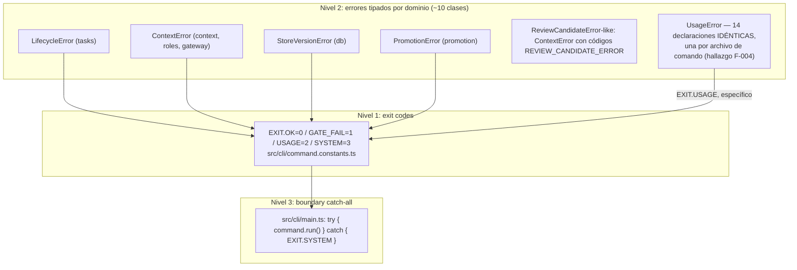

# Flujo 9: manejo de errores (transversal)

> Etapa 10 de la guía. Verificado contra el código real el 2026-07-20.
> No es un flujo lineal como los anteriores — es una síntesis de un
> patrón que ya apareció, parcialmente, en casi todos los flujos previos.

> ⚠️ **Hallazgo real encontrado en esta etapa**: `UsageError` está
> duplicada idéntica en 14 archivos de comandos en vez de tener una
> definición compartida — documentado como F-004 en `findings.md`.

## Qué vamos a estudiar

Los tres niveles de manejo de errores del sistema: los 4 exit codes
estandarizados del CLI, las clases de error tipadas por dominio (~10 en
total), y el boundary catch-all de último nivel — más el hallazgo de
duplicación de `UsageError` encontrado al armar este flujo.

## Diagrama general



## Recorrido paso a paso

### 1. Nivel 1 — los 4 exit codes

```ts
export const EXIT = { OK: 0, GATE_FAIL: 1, USAGE: 2, SYSTEM: 3 } as const;
```

(`src/cli/command.constants.ts`). Semántica de cada uno, según el uso real
observado en todos los flujos anteriores:

| Código | Significa | Ejemplo real |
|---|---|---|
| `OK` (0) | Éxito | Cualquier comando que completa su trabajo |
| `GATE_FAIL` (1) | Rechazo VERIFICABLE — el sistema detectó una condición real que impide continuar | `LifecycleError` de una transición ilegal (flujo 3), `checkDestructiveGate` sin confirmar (flujo 1), WIP limit de sprint excedido |
| `USAGE` (2) | El comando se invocó mal — argumentos faltantes/inválidos | Comando desconocido (flujo 1), `UsageError` en cualquier comando |
| `SYSTEM` (3) | Fallo de INFRAESTRUCTURA — algo que no es un rechazo esperado del dominio | Excepción no capturada por el comando, fallo de I/O, fallo de red |

La distinción `GATE_FAIL` vs. `SYSTEM` es la que se auditó explícitamente
esta semana (`docs/superpowers/plans/2026-07-19-error-boundary-audit.md`,
PR #194, **ahora sí mergeado a `main`** tras el fetch/merge de esta
sesión — ver `findings.md` F-003): un fallo de backup, I/O, store o
migración NUNCA debería reportarse como `GATE_FAIL` (eso implica "esto es
un rechazo esperado, corregí tu input"), porque induce al usuario/agente a
pensar que puede resolverlo ajustando su comando cuando en realidad es un
problema de infraestructura.

### 2. Nivel 2 — clases de error tipadas por dominio

Confirmado por archivo (`grep -rl "extends Error" src --include="*.errors.ts"`):

| Archivo | Clase(s) |
|---|---|
| `src/tasks/service.errors.ts` | `LifecycleError`, `CheckpointPendingDecisionError extends LifecycleError` |
| `src/context/context.errors.ts` | `ContextError` (con código como primer argumento — usado también por `roles/`, `gateway/`, `review/`) |
| `src/db/store.errors.ts` | `StoreVersionError` |
| `src/promotion/promotion.errors.ts` | `PromotionError` |
| `src/config.errors.ts` | (config) |
| `src/daemon/daemon.errors.ts` | `DaemonListenError` |
| `src/db/backup.errors.ts` | (backup) |
| `src/packets/document.errors.ts` | `PacketFormatError` |
| `src/schema/core.errors.ts` | (schema) |
| `src/tasks/work-definition.errors.ts` | `WorkDefinitionError` |

Patrón común observado en `LifecycleError`:

```ts
export class LifecycleError extends Error {
  constructor(message: string, readonly hint?: string) {
    super(message);
  }
}
```

El `hint` opcional es la manifestación concreta de PRINCIPLE-010 ("ningún
error sin salida documentada") — no es sólo un mensaje de qué falló, sino
(cuando aplica) una sugerencia de cómo recuperarse (`'use takeover once
available; do not delete the lease by hand'`, visto en el flujo 3).

`ContextError` es el más reutilizado — no vive sólo en `context/`, se usa
también en `roles/catalog.ts`, `gateway/gateway.ts`,
`gateway/gateway-lifecycle.ts`, `review/review-candidate.ts` — con un
primer argumento de código string (`ROLE_CATALOG_ERROR.*`,
`GATEWAY_LIFECYCLE_ERROR.*`, `REVIEW_CANDIDATE_ERROR.*`) que identifica la
razón específica del fallo dentro de ese dominio, aun compartiendo la
clase.

### 3. El hallazgo: `UsageError` duplicada 14 veces

A diferencia de las clases anteriores (definidas una vez, importadas
donde hacen falta), `UsageError` sigue el patrón OPUESTO:

```ts
// src/cli/commands/task.ts
class UsageError extends Error {}
// src/cli/commands/role.ts
class UsageError extends Error {}
// ...12 archivos más, línea idéntica
```

Ninguna está exportada ni importada de otro lado — cada comando define la
suya, local al archivo. Funcionalmente no rompe nada hoy (cada comando
sólo hace `instanceof` contra SU PROPIA `UsageError`), pero es exactamente
el defecto que PRINCIPLE-011 prohíbe: la misma pieza de conocimiento
(“esto es un error de uso, mapea a `EXIT.USAGE`”) declarada 14 veces en
vez de una. Documentado como **F-004** en `findings.md` — no corregido
acá.

### 4. Nivel 3 — el boundary catch-all

Ya cubierto en detalle en el flujo 1:

```ts
try {
  return await command.run(gateResult, io);
} catch (error) {
  io.err(`Error: ${error instanceof Error ? error.message : String(error)}`);
  return EXIT.SYSTEM;
}
```

Deliberadamente genérico — la clasificación fina (gate vs. usage vs.
sistema) es responsabilidad de cada comando; este catch sólo garantiza
que el proceso nunca termine con un rejection sin manejar. El audit de
esta semana confirmó que este boundary específico está bien diseñado —
los problemas reales estaban en catches intermedios de comandos
puntuales (`constitution.ts`, `rebuild.ts`, `daemon.ts` command — los
tres ya corregidos en PR #194, confirmado en esta etapa tras el merge).

### 5. Servicios invocados

Ninguno nuevo — este flujo es transversal, reutiliza los mismos gates y
clases de error que aparecen en cada flujo de dominio.

### 6. Dependencias externas

Ninguna.

### 7. Manejo de estado

El único estado persistido relacionado con errores es el log de auditoría
de operaciones destructivas (`DESTRUCTIVE_LOG_FILE`, flujo 1) — el resto
de los errores son efímeros, viven sólo en la respuesta del proceso.

### 8. Manejo de errores (de este mismo flujo)

N/A — es el tema del flujo.

### 9. Qué datos se leen/escriben

Ninguno propio, salvo el log de destructive-gate ya mencionado.

### 10. Resultado que produce el flujo

Un exit code (0-3) + un mensaje en `io.err()` — la interfaz uniforme que
cualquier script, agente o humano puede interpretar sin necesitar
conocer los detalles internos de qué comando corrió.

### 11. Qué continúa después

Quien invocó el CLI (terminal, script, otro proceso) lee el exit code y
decide su propia lógica — reintentar, escalar, reportar. El daemon, al
reenviar comandos (flujo 6), propaga el exit code real del comando
ejecutado remotamente, sin reinterpretarlo.

### 12. Dónde finaliza el recorrido

En el exit code del proceso — igual que el flujo 1, del cual este flujo
es, en esencia, una profundización temática.

## Archivos involucrados

| Archivo | Responsabilidad |
|---|---|
| `src/cli/command.constants.ts` | `EXIT` — los 4 códigos |
| `src/cli/main.ts` | Boundary catch-all de último nivel |
| `src/tasks/service.errors.ts` | `LifecycleError`, `CheckpointPendingDecisionError` |
| `src/context/context.errors.ts` | `ContextError` — reutilizada en 4+ dominios |
| `src/db/store.errors.ts` | `StoreVersionError` |
| `src/promotion/promotion.errors.ts` | `PromotionError` |
| `src/daemon/daemon.errors.ts` | `DaemonListenError` |
| `src/packets/document.errors.ts` | `PacketFormatError` |
| `src/tasks/work-definition.errors.ts` | `WorkDefinitionError` |
| `src/cli/commands/*.ts` (14 archivos) | Cada uno con su propia `UsageError` local (F-004) |

## Resultado final

Un esquema de manejo de errores de 3 niveles: exit codes estandarizados,
clases tipadas por dominio con código+hint, y un catch-all de último
nivel — sólido en general, con una discrepancia real de duplicación
(`UsageError`) documentada para corregir cuando se decida.

## Antes de continuar

Para la próxima etapa (procesos asíncronos / secondary flows) conviene
tener claro:
- Que `GATE_FAIL` vs. `SYSTEM` es una distinción de INTENCIÓN, no de
  mecanismo — ambos son sólo números, la diferencia está en si el fallo
  es "corregí tu input" o "algo de infraestructura falló".
- Que `ContextError` es compartida entre dominios distintos vía su
  primer argumento de código — no crear una clase nueva por dominio si
  `ContextError` con un código propio ya cubre el caso.

## Resumen de lo aprendido

- Tres niveles: exit codes uniformes, clases tipadas con hint de
  recuperación, catch-all de último nivel.
- El audit de esta semana (PR #194) sí está mergeado — verificado
  directamente en el código de `constitution.ts`/`rebuild.ts` tras
  reconciliar el `main` local (F-003).
- `UsageError` es un caso real y confirmado de violación de
  PRINCIPLE-011: 14 copias idénticas en vez de una definición compartida
  (F-004).
