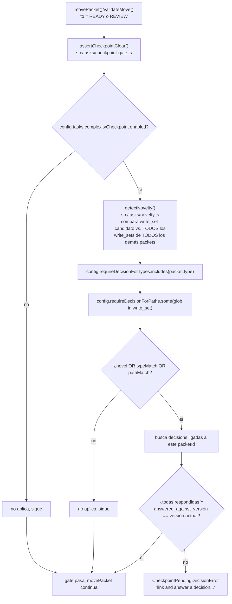

# Flujo 10: checkpoint de complejidad

> Etapa 11 de la guía. Verificado contra el código real el 2026-07-20.
> Profundiza el gate mencionado en el flujo 3 (`assertCheckpointClear`,
> el primer gate que corre en `validateMove`).

> ⚠️ **Hallazgo crítico agregado después de escribir este flujo, CONFIRMADO
> EN VIVO** (ver `findings.md` F-006): el paso 7 de abajo (`decision
> answer`, la parte donde un humano aprueba) probablemente rechaza a
> cualquier humano real por default — invierte el modelo de confianza de
> `destructive-gate.ts`. Repro real en este mismo repo: sesión de
> terminal sin `.svp-session-role` → `decision answer` responde `error:
> decision DEC-001 can only be answered in a human session`. Si esto no
> se corrige, el checkpoint de complejidad completo (no sólo un detalle)
> es un callejón sin salida para el caso de uso más común.

## Qué vamos a estudiar

El mecanismo que obliga a un humano a aprobar explícitamente cuando un
packet toca "territorio arquitectónico nuevo" — write_sets nunca vistos
antes, tipos de packet sensibles, o paths configurados como críticos —
antes de dejarlo avanzar a `READY` o `REVIEW`.

## Diagrama general



## Recorrido paso a paso

### 1. Acción que lo inicia

Cualquier `sv-playbook task move <id> ready` o `... review` — el gate
corre DENTRO de `validateMove()` (flujo 3), antes de cualquier otro
chequeo específico de esa transición.

### 2. Archivo que recibe la acción

**`src/tasks/checkpoint-gate.ts`**, función `assertCheckpointClear(store,
packetId)`.

### 3. Validación de si aplica

```ts
const config = loadConfig(store.repoRoot).tasks.complexityCheckpoint;
if (!config.enabled) return;
```

Todo el mecanismo es opt-in por configuración de instancia
(PRINCIPLE-013: es una opinión, no un invariante universal — cada
instancia decide si lo quiere activo). Si está deshabilitado, el gate no
hace nada.

### 4. Detección de "territorio nuevo": `detectNovelty()`

```ts
export function detectNovelty({ candidateWriteSet, priorWriteSets }: NoveltyCheckInput): NoveltyResult {
  const seen = new Set(priorWriteSets.flat());
  const newPatterns = candidateWriteSet.filter((pattern) => !seen.has(pattern));
  return { isNovel: Boolean(newPatterns.length), newPatterns };
}
```

Compara el `write_set` del packet candidato contra la UNIÓN de los
`write_set` de TODOS los demás packets que alguna vez existieron
(`packetDefinitions`, tabla que guarda cada versión de la definición de
cada packet — no sólo la actual). Un glob que nunca apareció en ningún
otro packet es "territorio nuevo" — la señal de que este packet podría
estar tocando una parte del código que nadie tocó antes bajo el proceso
de sv-playbook.

### 5. Otros dos disparadores, además de novedad

```ts
const typeMatch = config.requireDecisionForTypes.includes(packet.type);
const pathMatch = config.requireDecisionForPaths.some((glob) => candidateWriteSet.includes(glob));
if (!novelty.isNovel && !typeMatch && !pathMatch) return;
```

Además de la detección automática de novedad, la instancia puede
declarar explícitamente: tipos de packet que SIEMPRE requieren decisión
(`requireDecisionForTypes` — ej. `'store'` o `'gate'`, tipos con blast
radius alto por naturaleza) y paths específicos que SIEMPRE requieren
decisión (`requireDecisionForPaths` — ej. `'.github/workflows/**'`).
Cualquiera de los tres (`novelty`, `typeMatch`, `pathMatch`) alcanza para
disparar el gate.

### 6. La condición de "clear": decisiones vinculadas y vigentes

```ts
const linkedDecisions = store.orm.select().from(decisions).where(eq(decisions.packetId, packetId)).all();
const allAnsweredAndCurrent = Boolean(linkedDecisions.length) && linkedDecisions.every(
  (d) => d.answer !== null && d.answeredAgainstVersion === currentDefinition.version,
);
if (!allAnsweredAndCurrent) {
  throw new CheckpointPendingDecisionError(packetId, novelty.newPatterns);
}
```

Tres condiciones simultáneas para que el gate deje pasar: (1) tiene que
existir AL MENOS una decisión vinculada a este packet (`decisions.packetId`,
poblada vía `decision ask --packet <id>`, ver paso 7); (2) TODAS las
decisiones vinculadas tienen que estar respondidas (`answer !== null`);
(3) — la parte más sutil — cada respuesta tiene que estar respondida
**contra la versión actual** de la definición del packet
(`answeredAgainstVersion === currentDefinition.version`). Si el packet se
edita DESPUÉS de que la decisión se respondió, la aprobación queda
invalidada automáticamente — no hace falta un mecanismo separado de
"invalidar decisiones viejas", el chequeo de versión lo hace solo.

### 7. El lado humano: `decision ask` / `decision answer`

**`src/cli/commands/decision.ts`**:

- `decision ask "<pregunta>" --packet <id>`: crea una fila en `decisions`
  con `answer = NULL`, opcionalmente vinculada a un packet vía FK (si el
  packet no existe, SQLite rechaza por constraint FK y el comando lo
  reporta como `GATE_FAIL` con mensaje claro — `isConstraintError()`).
- `decision answer <ID> "<respuesta>"`: **sólo se puede correr en una
  sesión humana** — `readSessionRole(repoRoot) !== WORKFLOW_EXECUTOR.HUMAN`
  rechaza con `GATE_FAIL`. Esto es una réplica del mismo patrón visto en
  `destructive-gate.ts` (flujo 1): un agente puede PEDIR la decisión, pero
  sólo un humano puede RESPONDERLA. Al responder, graba
  `answeredAgainstVersion = currentPacketDefinitionVersion(store, packetId)`
  — la versión de la definición en ESE momento, la que después compara
  `assertCheckpointClear`.

### 8. Servicios invocados

- `src/config.ts` — `loadConfig()`, sección `tasks.complexityCheckpoint`.
- `src/db/work-definition.migrations.ts` —
  `currentPacketDefinitionVersion()`.
- `src/tasks/schema.constants.ts` — tablas `decisions`,
  `packetDefinitions`, `packets`.

### 9. Dependencias externas

Ninguna.

### 10. Manejo de estado

Dos tablas nuevas respecto a lo cubierto en flujos anteriores:
`packet_definitions` (versiones históricas de la definición de cada
packet — lo que permite comparar "contra qué versión se respondió") y
`decisions` (preguntas/respuestas, opcionalmente vinculadas a un packet
vía FK).

### 11. Manejo de errores

`CheckpointPendingDecisionError extends LifecycleError` (ver flujo 9) —
hereda el patrón de `hint`: `'link and answer a decision for this packet
before it can proceed'`. El mensaje principal incluye los patrones
específicos detectados como nuevos (`novelty.newPatterns`), así quien lo
recibe sabe exactamente qué globs dispararon el gate, no sólo que algo lo
disparó.

### 12. Qué datos se leen/escriben

Lectura: `packets`, `packet_definitions` (todas las versiones, de todos
los packets), `decisions`. Escritura (desde `decision.ts`, no desde el
gate en sí — el gate es de sólo lectura): `decisions.answer`,
`decisions.answered_against_version`.

### 13. Qué continúa después

Si el gate pasa, `validateMove()` sigue con sus demás chequeos (write_set
conflict, lease, etc. — flujo 3). Si no pasa, el `task move` completo
falla con `GATE_FAIL` y el mensaje apunta al humano a correr `decision
ask`.

### 14. Dónde finaliza el recorrido

En el estado de `decisions` (respondida y vigente) o en el rechazo de la
transición del packet — no hay un "cierre" propio de este flujo más allá
de eso.

## Archivos involucrados

| Archivo | Responsabilidad |
|---|---|
| `src/tasks/checkpoint-gate.ts` | `assertCheckpointClear()` — el gate en sí |
| `src/tasks/novelty.ts` | `detectNovelty()` — comparación de write_sets |
| `src/tasks/novelty.types.ts` | `NoveltyCheckInput`, `NoveltyResult` |
| `src/cli/commands/decision.ts` | `decision ask/answer/list/show` |
| `src/tasks/service.errors.ts` | `CheckpointPendingDecisionError` |
| `src/db/work-definition.migrations.ts` | `currentPacketDefinitionVersion()` |
| `src/config.ts` | `tasks.complexityCheckpoint.{enabled, requireDecisionForTypes, requireDecisionForPaths}` |
| `docs/superpowers/specs/2026-07-16-complexity-checkpoint-design.md` | Spec de diseño original (no releída línea por línea en esta etapa, sólo referenciada) |

## Resultado final

Un gate que exige aprobación humana explícita, vigente contra la versión
actual del packet, antes de dejar avanzar trabajo que toca territorio
nuevo — con tres disparadores independientes (novedad automática, tipo
configurado, path configurado) y una invalidación automática si el packet
cambia después de la aprobación.

## Antes de continuar

Para la próxima etapa (flujos secundarios: backup/restore/rebuild,
sprints, adopt, reconcile) conviene tener claro:
- Que este gate es el PRIMERO que corre en `validateMove` (antes de
  write_set conflict, antes de lease) — la aprobación de complejidad es
  la puerta más cara de saltar, se verifica primero.
- Que "responder una decisión" y "responder una decisión vigente" son
  cosas distintas — el versionado de `answered_against_version` es lo que
  hace la diferencia.
- Que sólo un humano puede responder (mismo patrón que
  `destructive-gate.ts` del flujo 1) — un agente puede pedir pero no
  autoaprobarse.

## Resumen de lo aprendido

- El checkpoint de complejidad es opt-in por configuración, con tres
  disparadores independientes: novedad de write_set, tipo de packet, o
  path configurado.
- La detección de novedad compara contra el historial COMPLETO de
  write_sets de todos los packets, no sólo los activos.
- Una decisión respondida se invalida automáticamente si el packet se
  edita después — no hace falta lógica adicional, el chequeo de versión
  lo resuelve.
- Mismo patrón de "sólo humano puede aprobar" que el gate de operaciones
  destructivas (flujo 1) — un agente puede iniciar el pedido, nunca
  cerrarlo.
