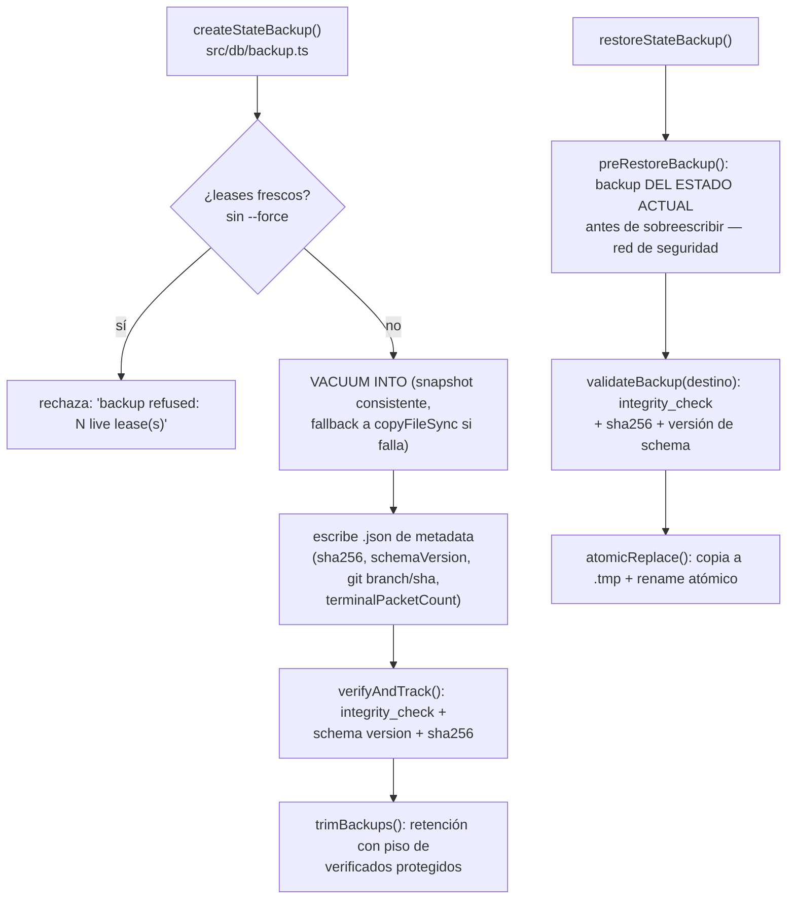
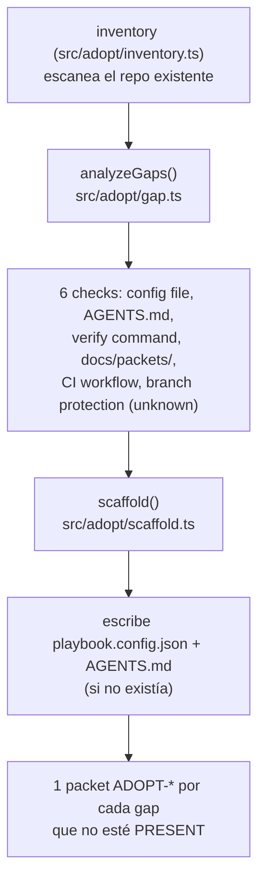

# Flujo 11: flujos secundarios (backup/restore/rebuild, sprints, adopt, reconcile)

> Etapa 12 de la guía, última etapa planificada. Verificado contra el
> código real el 2026-07-20. A diferencia de los flujos 1-10, éste cubre
> CUATRO mecanismos independientes con menor profundidad cada uno — son
> soporte operativo, no el camino principal de un packet.

## Qué vamos a estudiar

Cuatro mecanismos de soporte: cómo se protege y recupera el estado
(backup/restore/rebuild), cómo se agrupa trabajo en sprints con budget y
WIP limit, cómo se instala sv-playbook sobre un repo existente (adopt), y
cómo se detectan y corrigen divergencias entre el estado declarado y el
real (reconcile).

## 11.1 — Backup, restore, rebuild

`createStateBackup()` rechaza backuppear con leases vivos (a menos que se
pase `--force`) — un backup tomado mientras hay trabajo
activo en curso podría capturar un estado a medio transicionar.
`VACUUM INTO` produce un snapshot SQLite consistente sin bloquear
escrituras concurrentes tanto como una copia de archivo cruda; si falla
(ej. corrupción parcial), cae a `copyFileSync` como fallback explícito.

`restoreStateBackup()` es la operación más delicada del sistema: SIEMPRE
toma un backup del estado actual ANTES de sobreescribir
(`preRestoreBackup`, razón `PRE_RESTORE`) — así una restauración
equivocada es en sí misma reversible. Valida el backup destino
(`integrity_check`, sha256 contra la metadata, versión de schema dentro
del rango restaurable) antes de reemplazar, y el reemplazo en sí es
atómico (`copyFileSync` a un `.tmp` + `renameSync`) para que un crash a
mitad de camino nunca deje el archivo live corrupto o truncado.

`sv-playbook rebuild` (`src/cli/commands/rebuild.ts`, mencionado en el
flujo 9) reconstruye el store desde `docs/packets/*.md` — un camino de
recuperación distinto, para cuando el problema no es "quiero volver a un
backup" sino "quiero reconstruir desde los archivos fuente". Rechaza si
hay leases vivos sin `--force`, y rechaza (gate, no sistema) si el
conteo de packets terminales de la reconstrucción es MENOR al del store
vivo — señal de que reconstruir perdería trabajo ya cerrado, mejor
restaurar un backup en ese caso.

## 11.2 — Sprints (agrupación + budget + WIP limit)

Ya cubierto el archivo principal (`src/sprints/service.ts`) al comentarlo
en español esta semana. Resumen: un sprint (`sprints` table) agrupa
packets (`sprint_tasks`, con `sort_order` propio) bajo un `goal`, un
`budget_cap` (comparado contra `task_costs` acumulados vía
`sprintSpent()`), y un `wip_limit` opcional. El WIP limit es lo que
consulta `checkSprintWipLimit()` en `tasks/service.ts` (flujo 3) antes de
activar un packet — si el sprint ya tiene tantos packets `ACTIVE` como su
límite, el `task start` se rechaza. `closeSprint()` exige que todos sus
packets estén en estado terminal (`done`/`dropped`) antes de cerrar — ya
cubierto como ejemplo de invariante en el propio archivo comentado.

## 11.3 — Adopt (instalar sv-playbook sobre un repo existente)

Ya cubiertos `gap.ts`/`scaffold.ts` en la tanda de comentarios en
español. Punto clave: `analyzeGaps()` deja `branch-protection` como
`'unknown'` a propósito — no hay forma de verificarlo sin llamar a la API
de GitHub, así que en vez de fingir una respuesta le pide al humano que
lo confirme manualmente. Cada gap detectado como `missing` se convierte
en un packet real de remediación (`writeRemediationPacket`), trazable en
el board — la adopción nunca deja gaps silenciosos, los convierte en
trabajo.

## 11.4 — Reconcile (divergencia declarado vs. real)

Ya cubierto `reconcile.ts` en la tanda de comentarios en español. Resumen:
`reconcile()` junta tres fuentes de divergencia — PRs `BEHIND` su base
(`behindPrRows`, `SAFE`, auto-corregible con `gh pr update-branch`), PRs
en conflicto (`conflictPrRows`, `UNSAFE`, sólo se reporta), y packets en
`REVIEW` cuyo PR ya se mergeó pero el packet sigue sin cerrar
(`reviewMergedRows`, `SAFE`, auto-corregible con `task close`) — más un
backup stale/regresado (`backupRow`). Sólo las filas `SAFE` se aplican
solas cuando `!options.dryRun`; las `UNSAFE` requieren intervención
humana. Cada fila con un argumento vacío se rechaza en vez de ejecutarse
con datos incompletos (`applyRow`'s `hasEmptyArg` check).

## Archivos involucrados (los cuatro sub-flujos)

| Archivo | Responsabilidad |
|---|---|
| `src/db/backup.ts` | `createStateBackup`, `restoreStateBackup`, `verifyLatestBackup`, `getBackupStatus` |
| `src/cli/commands/rebuild.ts` | Reconstrucción desde `docs/packets/*.md` |
| `src/sprints/service.ts` | Sprints: goal, budget, WIP limit |
| `src/adopt/inventory.ts`, `gap.ts`, `scaffold.ts` | Adopción de un repo existente |
| `src/reconcile/reconcile.ts` | Divergencia declarado vs. real (PRs, packets, backup) |
| `src/db/inspection.ts` | `terminalPacketCountAt`, `assertExclusiveStoreLock` — usado por backup y daemon |

## Resultado final (de esta guía completa)

Con este flujo se cierran los 11 flujos planificados en la Etapa 1. La
guía completa (`README.md` + `architecture.md` + `repository-map.md` +
`glossary.md` + `flows/flow-01..11` + `findings.md`) cubre: entrada/
despacho del CLI, persistencia, ciclo de vida de un packet, preflight/
review/promotion, cold-start de contexto, daemon lifecycle, consola
serve, dispatch a agentes, manejo de errores transversal, checkpoint de
complejidad, y los mecanismos de soporte operativo.

## Hallazgos acumulados durante toda la guía

Ver `findings.md` para el detalle completo — resumen:
- **F-001**: `serve` no reacciona a un apagado del daemon iniciado por sí
  mismo (fix sin mergear, PR #196 `OPEN`).
- **F-002**: la consola `serve` reenvía el historial completo de eventos
  de workflow en cada tick de SSE, sin acotar.
- **F-003** (proceso, ya corregido): el `main` local de la sesión estaba
  desactualizado respecto a `origin/main` — 2 de 4 fixes que se creían
  pendientes en realidad ya estaban mergeados vía squash merge.
- **F-004**: `class UsageError extends Error {}` duplicada idéntica en 14
  archivos de comandos — violación de PRINCIPLE-011.

## Resumen de lo aprendido

- Backup/restore tienen una disciplina fuerte de auto-protección: nunca
  restaurar sin antes backuppear el estado actual, siempre validar
  integridad antes de aceptar un backup como fuente.
- `rebuild` y `restore` son dos caminos de recuperación DISTINTOS
  (reconstruir desde archivos fuente vs. volver a un snapshot) — no
  intercambiables.
- Sprints, adopt y reconcile comparten un patrón: convertir una
  divergencia o un gap detectado en trabajo TRAZABLE (packets de
  remediación, filas de reconciliación) en vez de corregir silenciosamente
  o sólo reportar sin registro.
- Cuatro hallazgos reales quedaron documentados en `findings.md` a lo
  largo de toda la guía, sin implementar ninguno — a la espera de
  decisión del equipo.
