# How sv-playbook works

> **One line:** sv-playbook is a Jira whose whole team — planner, implementer, reviewer, orchestrator — is agentic. It turns an idea into shippable work through a strict, deterministic, dumb-model-proof pipeline, where the CLI is the only writer of state and every claim is backed by literal command output.

This document is the map: every phase, every state, every role, every use case, with flow diagrams. It describes the system **as it actually is today**; pieces that are planned but not yet built are marked `PLANNED`.

- [1. Mental model](#1-mental-model)
- [2. The two planes of state](#2-the-two-planes-of-state)
- [3. The principles that shape everything](#3-the-principles-that-shape-everything)
- [4. The packet — the unit of work](#4-the-packet--the-unit-of-work)
- [5. The lifecycle state machine](#5-the-lifecycle-state-machine)
- [6. Leases: how work is claimed and never double-done](#6-leases-how-work-is-claimed-and-never-double-done)
- [7. The roles](#7-the-roles)
- [8. The end-to-end flow (idea → done)](#8-the-end-to-end-flow-idea--done)
- [9. Dispatch: many cheap workers, one orchestrator](#9-dispatch-many-cheap-workers-one-orchestrator)
- [10. The merge gate](#10-the-merge-gate)
- [11. Durability: backups (not git)](#11-durability-backups-not-git)
- [12. Use cases, step by step](#12-use-cases-step-by-step)
- [13. Command reference](#13-command-reference)

---

## 1. Mental model

A traditional board (Jira/Trello) assumes humans read cards and do the work. sv-playbook assumes **AI agents** read cards and do the work — and agents hallucinate, wander scope, and fabricate success. So the board is not just a tracker: it is a **barrier**. The CLI validates every write, captures evidence itself instead of trusting the agent, and refuses illegal moves. A cheap, error-prone model wrapped in this harness produces trustworthy output.

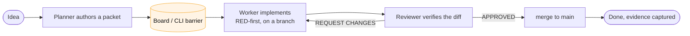

The human is the **product owner**: sets intent, decides architecture, approves direction. Every other role can be an agent — including a cheap one — because the rails, not the model's intelligence, guarantee correctness.

---

## 2. The two planes of state

Everything in sv-playbook lives in exactly one of two planes. Confusing them is the classic mistake; keeping them separate is the design's spine.

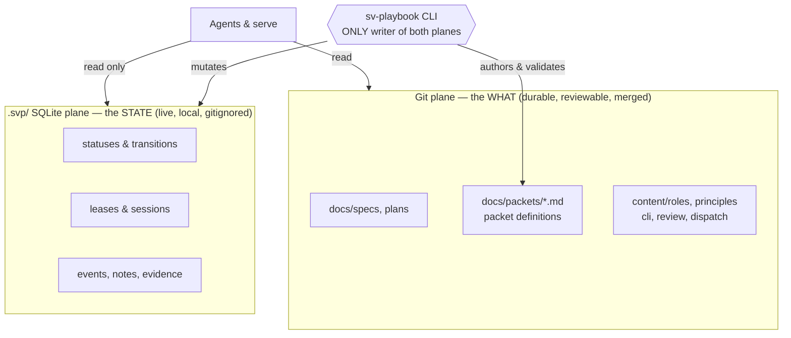

| | Git plane | SQLite plane (`.svp/`) |
|---|---|---|
| **Holds** | Packet definitions, specs, plans, role charters, principles | Status, transitions, leases, sessions, events, notes, evidence |
| **Format** | Markdown (human-reviewable, mergeable) | Binary SQLite (`node:sqlite`) |
| **Committed?** | Yes — reviewed on every PR | **Never** — gitignored; binary can't be merged safely |
| **Written by** | The CLI (`task create` generates canonical markdown) | The CLI only |
| **If lost** | It's in git history | Recover from a **backup** (see §11) |

**Why two planes:** the *definition* of work (the WHAT) must be reviewable and merge cleanly, so it's markdown in git. The *live coordination* of work (who holds what, what happened when) changes constantly and can't merge — so it's a local database. The CLI is the membrane between them and the single author of both.

---

## 3. The principles that shape everything

The full text lives in `content/principles.md` (read via `sv-playbook docs principles`). The load-bearing ones for understanding the flow:

- **PRINCIPLE-001 — Determinism first.** If it can be validated deterministically, it MUST be. Every rule is a `[gate]` (mechanical) or a justified `[criterion]` (review judgment). Every agent claim is backed by literal command output.
- **PRINCIPLE-002 — Spec-driven above, test-driven below.** SDD from idea to packets; TDD *inside* a packet: a failing test (RED) with literal output committed **before** the implementation — the anti-hallucination gate.
- **PRINCIPLE-006 — Stopping is success.** An agent that halts with evidence at a stop condition is the system working. Fabricated green is the failure mode.
- **PRINCIPLE-010 — No dead ends.** Every error an agent can hit has a documented non-destructive exit (a recovery command, a self-heal, or moving to `blocked`). Destructive improvisation is a *system* bug — the fix is a new rail, never a scolding.
- **PRINCIPLE-011 — Single source for every fact.** Any value, type, rule, or fact exists in exactly ONE authored place. Duplication is an instant review failure.

---

## 4. The packet — the unit of work

A **packet** is one atomic, reviewable, mergeable slice of work. It is authored by the CLI (`task create`), which validates it and writes the canonical markdown to `docs/packets/<ID>.md`.

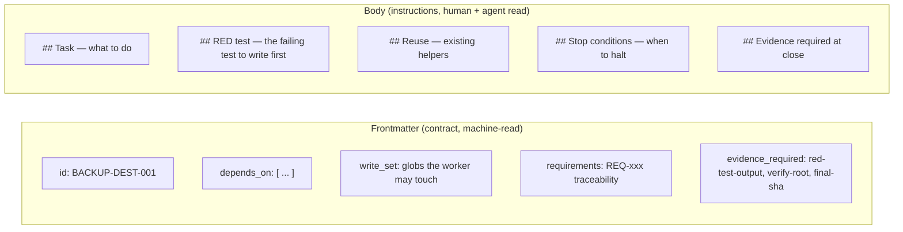

- **`write_set`** is the blast radius: the worker may only touch files matching these globs. The CLI checks conflicts against other in-flight packets at planning time (rejects with `LifecycleError: write_set conflict with <id>`), which is what makes safe **parallel** work possible.
- **`depends_on`** serializes packets that would otherwise collide.
- **RED test** is mandatory: the worker writes the failing test first and captures its literal output. The expected failure cause is pinned to a closed list (the compiler's missing-symbol message, or the test name) so a dumb model can't fabricate it.

---

## 5. The lifecycle state machine

This is the exact transition map enforced by the CLI (`src/tasks/service.constants.ts` → `ALLOWED`). No other transitions are legal.

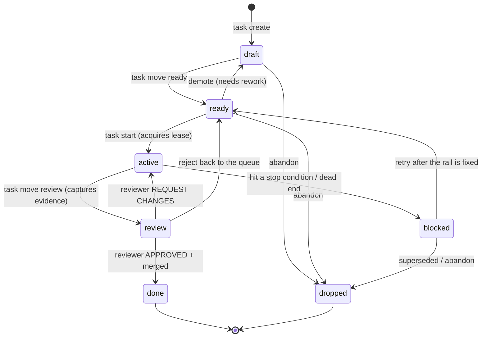

Key facts encoded here:

- **`task start`** is the only path into `active`, and it acquires a lease atomically.
- **`active → review`** is where the CLI **captures evidence itself** (`git rev-parse HEAD`, verify output) rather than trusting a pasted SHA — this killed the fabricated-SHA class of bug (D24).
- **`blocked` never goes straight to `done`.** A blocked packet must go back through `ready → active → review`, or be `dropped`. (This is a deliberate no-dead-end rule — and the reason a packet whose work was done *outside* the flow can get stranded; see §12.7.)
- Every transition **except `active → blocked`** releases the lease. Blocking keeps the lease so the same session can resume after the rail is fixed.

---

## 6. Leases: how work is claimed and never double-done

A **lease** is a claim on a packet by one session. It has a 30-minute TTL kept alive by heartbeats. Leases are what make it safe for many worker processes (across worktrees, even machines sharing the DB) to run at once without stepping on each other.

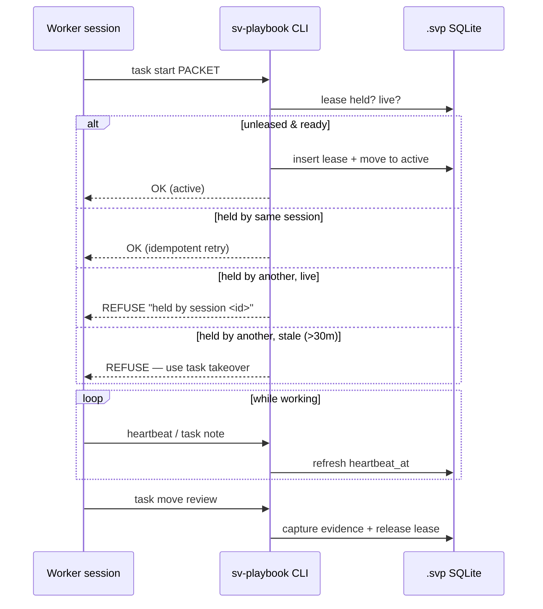

- **`start ≠ takeover`.** `start` only works from `ready` with no live lease. `takeover` deliberately claims a lease — a **stale** one (crash recovery) or a **live** one with `--force` (intentional replacement). This single mechanism unifies relief-of-a-hung-worker and crash-recovery.
- **`task recover`** is a read-only inspection of a packet's lease/state — no mutation, for diagnosing before you decide to take over.
- **Invariant:** merging requires a live lease + green gates. The blast radius of any single worker is one branch.

---

## 7. The roles

Each role is a charter in `content/roles/` written to be **dumb-model-proof**: an EXEC table (command → expected output → action) for mechanical steps, and JUDGMENT sections (with "escalate if low-capability") for the parts that need reasoning. Read any with `sv-playbook docs roles/<role>`.

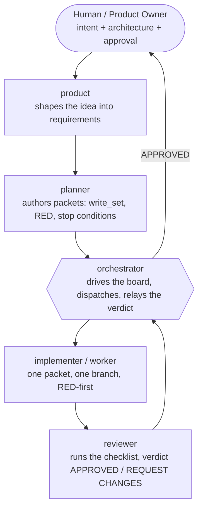

| Role | Charter | Does | Never |
|---|---|---|---|
| **product** | `roles/product` | Turns an idea into requirements (`REQ-xxx`) | Writes code |
| **planner** | `roles/planner` | Authors packets: task, `write_set`, RED with pinned failure cause, stop conditions | Implements |
| **orchestrator** | `roles/orchestrator` | Drives the board, dispatches workers, delegates review, relays the verdict, salvages dead workers | Implements; reviews own dispatches; **merges** (that's the reviewer's job) |
| **implementer** | `roles/implementer` | Claims one packet, RED-first, stays in `write_set`, verify green, opens PR | Touches `.svp/`; widens scope |
| **reviewer** | `roles/reviewer` | Runs the checklist against the diff, gives the verdict (APPROVED / REQUEST CHANGES), then **merges on APPROVED** (per `AGENTS.md`) | Approves on trust |
| **format** | `roles/format` | The EXEC/JUDGMENT contract every charter follows | — |

The `format` charter is the meta-rule: it defines *how* the other charters are written so that even a weak model executes them unambiguously.

> **Who merges?** the **reviewer** merges on APPROVED — `AGENTS.md` is the operative source. `PLANNED`: mechanize the independent approval with a second identity / bot token or CODEOWNERS so it becomes a true `[gate]`.

---

## 8. The end-to-end flow (idea → done)

The full happy path for a single packet, with the gates that guard each hop.

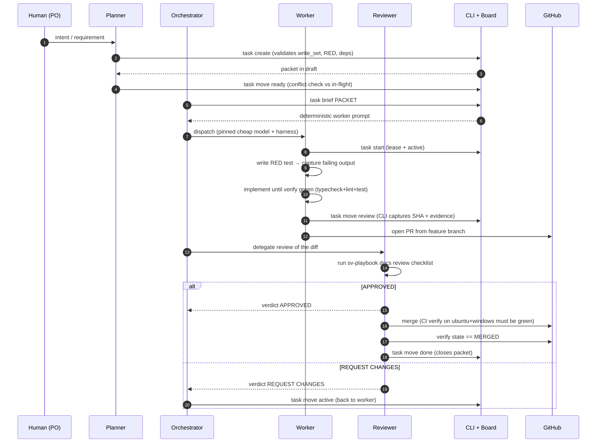

The gates, in order: **write-time validation** (`task create`) → **conflict check** (`move ready`) → **RED-first** (failing output before code) → **verify** (typecheck + lint + test locally) → **CI** (verify on two OSes) → **review checklist** → **merge-then-verify-MERGED** before the packet is allowed to close.

---

## 9. Dispatch: many cheap workers, one orchestrator

The orchestrator runs the whole team by spawning headless agent CLIs, each pinned to a **cheap** model, each given one packet's deterministic brief. Recipes live in `content/dispatch/adapters.md`; the worker template is `content/dispatch/worker.md`.

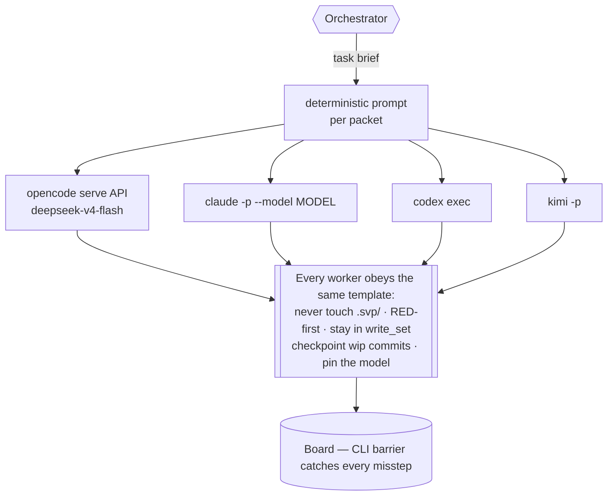

Hard-won dispatch rules (all in `adapters.md`):

- **Pin the model, always.** Inheriting the default once dispatched the most expensive model onto the biggest packet. Every dispatch records the *pinned* model, never an assumption.
- **Boot timeout + polling.** No sign of life in 120s = kill + diagnose. A dispatcher that waits forever is its own dead end.
- **Provider errors = worker death.** A 403/quota error mid-mission → salvage the work, rotate harness, redispatch.
- **Checkpoint rule.** Workers commit WIP so a killed worker loses minutes, not hours.
- **The board is the safety net.** Whatever a worker gets wrong, the CLI barrier + gates + review catch it before it reaches `main`.

---

## 10. The merge gate

Nothing reaches `main` without a PR **and** a delegated reviewer's APPROVED verdict. This is partly mechanized, partly process-enforced — and it's important to be honest about which is which.

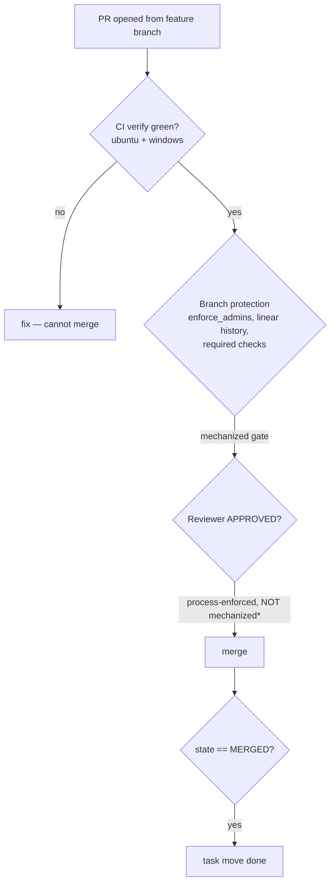

- **Mechanized (GitHub branch protection):** direct pushes to `main` rejected, PR required, `verify` status checks required on ubuntu + windows, linear history, `enforce_admins` on.
- **Process-enforced (`*`):** the *independent review approval* is **not** mechanically required — a single-token repo can't force an independent approval (the author can't self-approve, and `required_approving_review_count=1` would deadlock a solo repo). Today a separate reviewer agent gives the verdict and **performs the merge** on APPROVED (per `AGENTS.md`), then verifies `state == MERGED` and closes the packet. The charters (`AGENTS.md`, `docs review`, `roles/orchestrator`, `roles/reviewer`) are now consistent: the reviewer owns the merge. `PLANNED`: mechanize the independent approval with a second identity / bot token or CODEOWNERS so review becomes a true `[gate]`.

---

## 11. Durability: backups (not git)

SQLite is the operational source of truth, and it is **not** rebuildable from files (an earlier "rebuild from files" model was retracted — it created a second durable state plane and violated single-source). Durability is therefore a **backup** problem, solved with real snapshots, deliberately **not** through git.

> **Current state (honest):** today `backup state` does a `copyFileSync` of the live DB and `restore state` overwrites the live DB **without any verification** — a corrupt backup can silently clobber good data. The diagram below is the **TARGET** being built by `BACKUP-VERIFY-RESTORE-001` and `BACKUP-DEST-001`; it is the destination, not today's code.

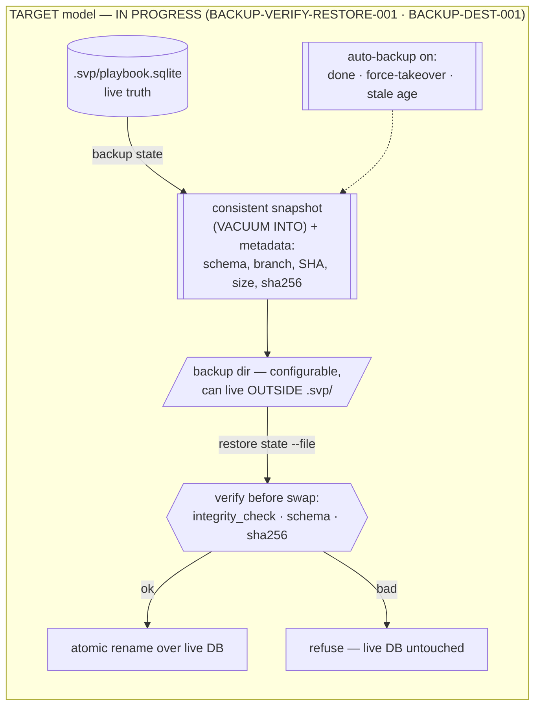

- **Real snapshots (`IN PROGRESS`):** the target takes backups via SQLite's own consistent-snapshot path (`VACUUM INTO`), replacing today's raw `copyFileSync` of a live DB.
- **Verified restore (`IN PROGRESS`):** the target validates the candidate (`integrity_check`, schema version, checksum) and swaps atomically, refusing a bad backup. Today's restore does none of this.
- **Off-`.svp/` destination (`IN PROGRESS`):** a configurable backup directory so backups survive losing the throwaway `.svp/`. Today backups land only in `.svp/backups/`.
- **Shared / off-machine durability is `PLANNED` for v2** — an adapter over the backup destination (a real remote target), **never** a git branch.

---

## 12. Use cases, step by step

### 12.1 Run a single packet (the core loop)

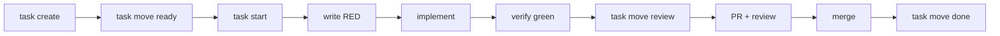

The everyday loop. Every arrow is guarded by a gate (§8).

### 12.2 Parallel workers

Multiple packets with **disjoint `write_set`s** run at once. The conflict check at `move ready` guarantees no two in-flight packets share files; each worker gets its own branch and lease. Packets that *would* collide are chained with `depends_on` (as `BACKUP-DEST-001` depends on `BACKUP-VERIFY-RESTORE-001`, since both touch `backup.ts`).

### 12.3 Takeover / crash recovery

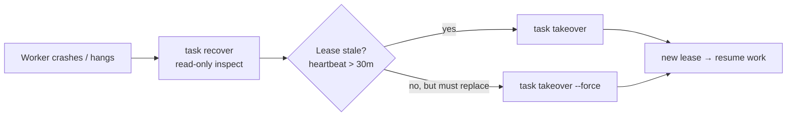

### 12.4 Backup & restore

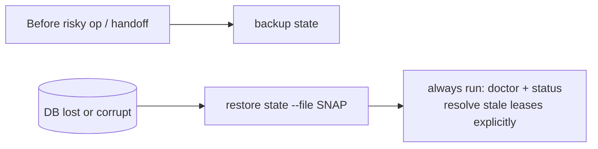

### 12.5 Health check

`sv-playbook doctor` gives one non-destructive readout: Node version, git root, store schema, packet dir, fresh/stale leases, backup age. Run it on any repo you haven't touched recently, before dispatching workers. `--json` feeds `serve` and automation.

### 12.6 Blocked packet / dead-end handling (PRINCIPLE-010)

A worker that hits an unrecoverable error moves the packet to `blocked` (keeping its lease) and halts **with evidence** — it never improvises destructively. The orchestrator then fixes the *rail* (a new gate, a clarified charter) and moves the packet `blocked → ready` to retry, or `blocked → dropped` if it's superseded.

### 12.7 New project / existing project

- **`init`** (`PLANNED`): a new project runs a wizard (interview + research) that produces the foundation doc, tier, config, and first packets.
- **`adopt`**: an existing project gets an inventory + gap analysis + remediation packets with a baseline. (Aurora is the intended first `adopt` client.)

Until `init` ships, packets are authored directly with `task create` (which is exactly how sv-playbook builds itself — it dogfoods its own flow).

---

## 13. Command reference

Full guide: `sv-playbook docs cli`. Implemented today:

<!-- GENERATED:command-reference — do not edit below; regenerate: npx tsx src/cli/generate-command-reference.ts -->
| Command | Purpose |
|---|---|
| `adopt` | Analyze a repo and scaffold playbook artifacts (inventory+gap only by default; --force to scaffold) |
| `backup` | Create local SQLite state snapshots |
| `check` | Validate authored artifacts (structure, instructions drift) |
| `constitution` | Manage the instance constitution (vision, product definition, principles) |
| `context` | Manage and compile durable role-scoped context |
| `contract` | Manage authoritative JSON Schema contracts for typed role handoffs |
| `daemon` | Start the sv-playbook daemon (single blessed writer for the store) |
| `decision` | Ask, answer, list, and inspect architectural decisions |
| `describe` | Print a machine-readable JSON catalog of all commands |
| `dispatch` | Prepare immutable RunSpecs and dispatch only through registered adapters |
| `docs` | Print a playbook process document (list topics when no argument) |
| `doctor` | Diagnose Node, git, store, packet, and lease health |
| `enforce` | Machine-authoritative contract conformance check (read-only) |
| `execution-profile` | Manage provider-neutral execution profiles and adapter-specific projections |
| `handoff` | Generate a deterministic continuation prompt from live state |
| `import` | Import packet definitions from docs/packets/*.md into the DB |
| `instructions` | Generate cold-start agent instructions from a single source |
| `packet` | Inspect packet version history and diffs |
| `promotion` | Verify, integrate, and close one immutable candidate through the runtime controller |
| `rebuild` | Reconstruct operational DB from git packet exports |
| `reconcile` | Compute and apply convergence actions between the board and the world |
| `restore` | Restore local SQLite state from a snapshot |
| `review` | Review preflight: mechanical checks for packets before reviewer dispatch |
| `role` | Manage structured role authority, contracts, handoffs, and escalations |
| `serve` | Start the local workflow runtime and real-time operations console |
| `sprint` | Manage sprints: planning unit between milestone and task |
| `status` | Print board, lease, event, and backup status |
| `task` | Create, list, start, move, inspect, and recover execution packets |
| `workflow-policy` | Configure deterministic workflow failure retry classification |
| `workspace` | Classify dirty paths against task write sets and lifecycle state |
<!-- /GENERATED:command-reference -->

**Exit codes:** `0` OK · `1` gate failure (cites the rule ID) · `2` usage error (fix the invocation) · `3` system error (report it, don't work around it).

`PLANNED` commands (later plans): `init`, `agent`, `upgrade`, plus the auto-generated MCP wrapper (`describe` already emits the catalog it will consume).

---

*This document is written by hand, except §13, which is generated from the CLI registry (drift fails the `command-reference` test). Keep it in sync with `content/` — those charters remain the single source; this page is the map, not a second copy.*
